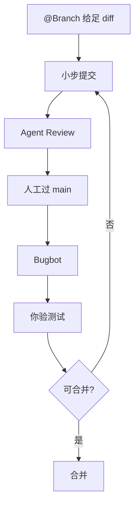

# 网摘范文片段

## 结构示例（无 ## 导读）

```markdown
---
title: "Reviewing and Testing Code with AI"
description: "Cursor：AI 代码能编译不代表没问题。教 junior 如何给足 diff、分层 Review、控制改动范围。"
url: "https://cursor.com/learn/reviewing-testing"
source: "Cursor Learn"
pubDate: 2026-07-05
edition: "2026-07-05"
editionType: daily
tags: ["应用技巧", "Code Review", "Cursor"]
author: "Cursor"
---

### 结论

Cursor 的立场很直接：**把 AI 当成刚入职的 junior**——写得快，但你必须 Review 后才能合并。能编译、测试过，仍可能在边界条件上埋雷。

### 要点

- **能跑 ≠ 正确。** 新手常误以为绿灯就能合并。你要主动问：输入为空、请求失败、并发时会怎样？
- **Review 靠 diff。** `@Branch` 让 Agent 看到相对 `main` 的完整变更；没有 diff，跨文件破坏很难被发现。
- …

### 怎么做

1. **开发前：提示里加 `@Branch`** …
2. **开发中：小步提交** …
3. …

### 关键图表



*从开发到合并——你始终是最终负责人*
```

## 有原图时（示例）

```markdown
### 关键图表


*增强型 LLM（Anthropic 原文）*
```

## 反例（避免）

```markdown
## 导读                    ← 不要用
### 一句话 / 核心论点 / 论据表  ← 与要点重复，已废弃
## 译文 / ## 原文           ← 不要双语
[两张描述同一流程的 Mermaid]  ← 只留一张
```
