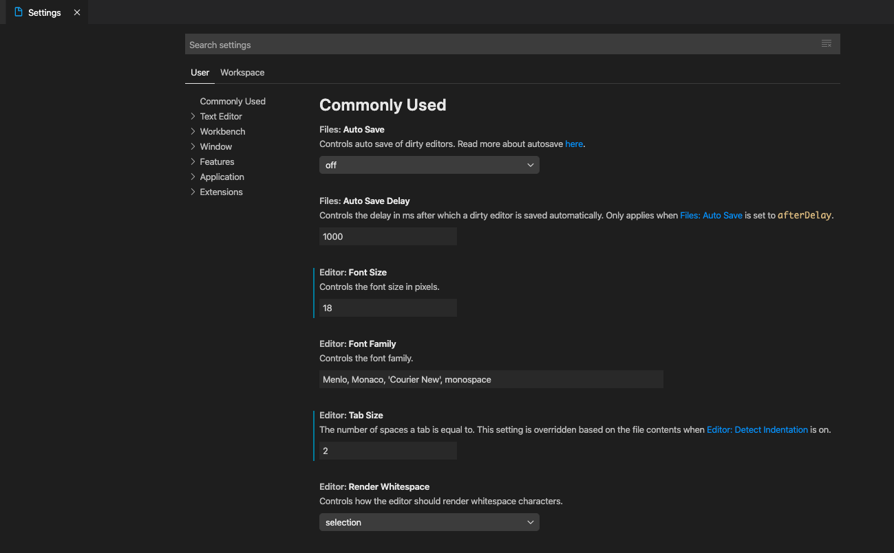
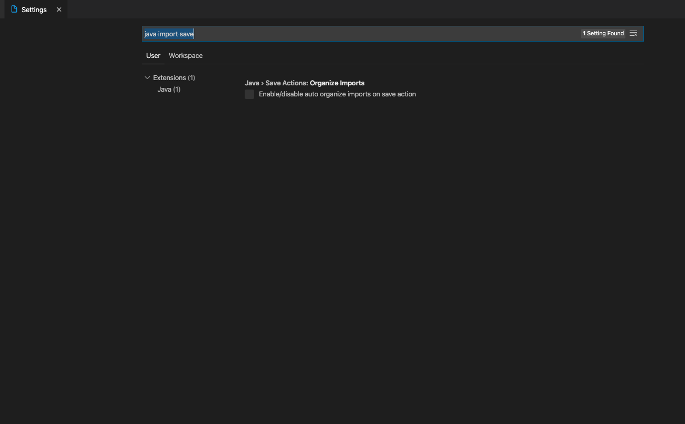
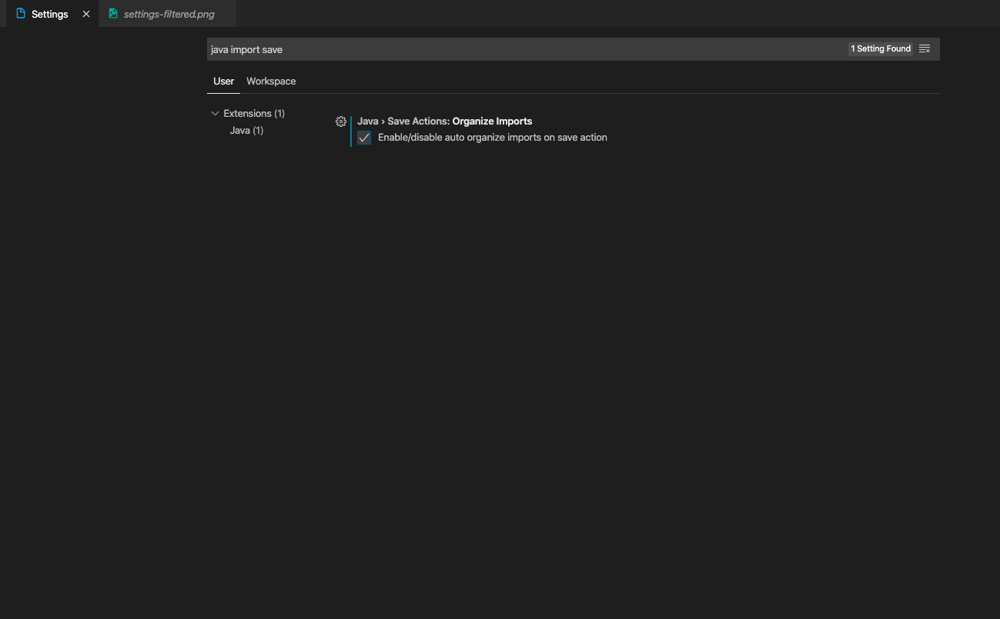
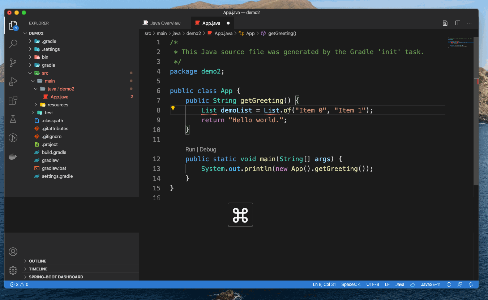

+++ 
draft = false
date = 2022-03-26T14:52:15+08:00
title = "How to Add All Missing Imports Automatically in Java and Visual Studio Code"
description = ""
slug = ""
authors = []
tags = []
categories = []
externalLink = ""
series = []
+++

Sometimes I have to insert `import` statements one by one in Visual Studio Code when I develop a Java program. It’s annoying and a waste of time for me, and if you are facing the same problem, this guide will keep you away from annoying codes and manual operations from `import` statements.

First, open your settings dialog, like this:

Next, type `java import save` in search box to filter options we need.

Finally, check the option *Enable/disable auto organize imports on save action*, like this:

That's it!

You can write your code freely without thinking about `import` statements, and all missing `import` statements can be added when you save the file. Like this:

