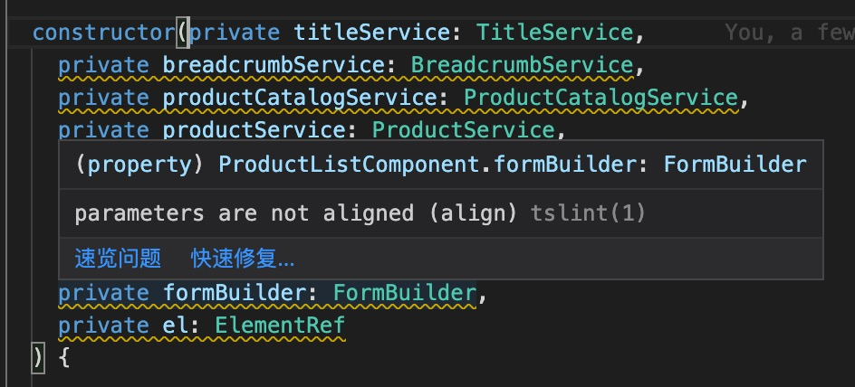

+++ 
draft = false
date = 2022-03-26T14:14:20+08:00
title = "Typescript: How to fix parameters are not aligned warning in VSCode"
description = ""
slug = ""
authors = []
tags = []
categories = []
externalLink = ""
series = []
+++

When I format my Typescript file by clicking *Format Document* in the context menu of VSCode, I get *parameters are not aligned* warning from *tslint*, like this:



The reason for this warning is the *Typescript Language Service* formatting rules are different from the tslint formatting rules on a function that has multiple and long parameters. And developers can not fix this warning by modifying options in *tslint.json*.

In *tslint*, an allowed style is like this:

```typescript
class Demo {
    constructor(private titleService: TitleService,
                private breadcrumbService: BreadcrumbService,
                private productCatalogService: ProductCatalogService,
                private productService: ProductService,
                private countryService: CountryService,
                private manufacturerService: ManufacturerService,
                private regionService: RegionService,
                private permissionUserService: PermissionUserService,
                private formBuilder: FormBuilder,
                private el: ElementRef) {
    }
}
```

In *Typescript Language Service*, an allowed style is like this:

```typescript
class Demo {
    constructor(private titleService: TitleService,
        private breadcrumbService: BreadcrumbService,
        private productCatalogService: ProductCatalogService,
        private productService: ProductService,
        private countryService: CountryService,
        private manufacturerService: ManufacturerService,
        private regionService: RegionService,
        private permissionUserService: PermissionUserService,
        private formBuilder: FormBuilder,
        private el: ElementRef) {
    }
}
```

The only difference is the indent of a parameter in a new line. In *tslint*, the parameter declaration in a new line is must aligned to the left of the parameter declaration in its previous line. But, in *Typescript Language Service*, the parameter in a new line must have an extra indent than its host function.

The solution to fix this warning is changing the code style like this.

```typescript
class Demo {
    constructor(
        private titleService: TitleService,
        private breadcrumbService: BreadcrumbService,
        private productCatalogService: ProductCatalogService,
        private productService: ProductService,
        private countryService: CountryService,
        private manufacturerService: ManufacturerService,
        private regionService: RegionService,
        private permissionUserService: PermissionUserService,
        private formBuilder: FormBuilder,
        private el: ElementRef
    ) {
        // Your code ...
    }
}
```

The first parameter declaration in this function should be in a new line. And I recommend you finish the parameter list in a new line too so that the body of a function is separated from the function name and parameter list.
