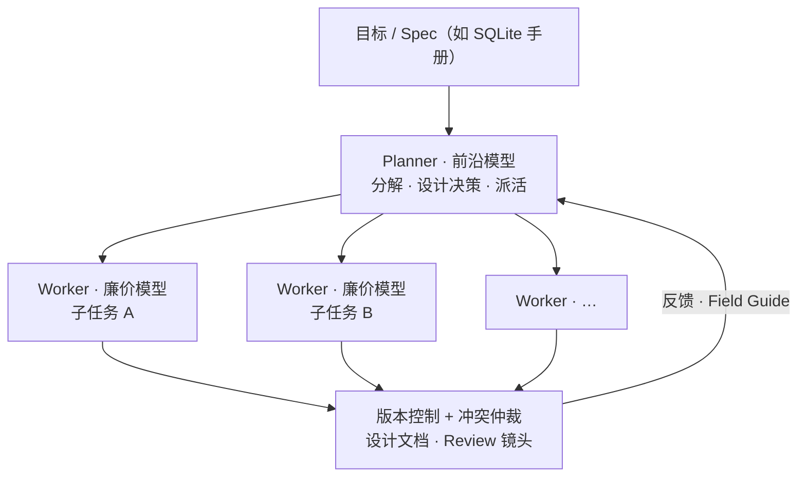

### 结论

Cursor 把多 Agent 协作拆成 **Planner（规划）+ Worker（执行）** 的任务树：强模型负责分解与设计，快而便宜的模型负责落地。在「仅凭 SQLite 文档、用 Rust 从零实现数据库」的基准里，新版蜂群在四种模型组合下都优于旧版，且最终都能跑通完整 SQL 测试集。更关键的是 **模型经济学**：质量相近时，全用前沿模型约 $10,565，而 Opus 规划 + Composer 执行只要约 $1,339——瓶颈不在算力堆叠，而在 **协调与上下文分工**。

### 要点

- **任务天然是树，蜂群按树分工。** 大目标递归拆成子任务：Planner 用最强模型拆目标、派活；Worker 用更快更便宜的模型只做一小块。蜂群形状随问题长出来，算力和上下文随复杂度伸缩，比固定流水线更通用。

- **上下文效率比并行更重要。** 单 Agent 要同时记住全局目标和当前叶子细节，长任务容易「盯细节丢大局」或「守大局做不好细节」。Planner 不写代码，上下文不被实现细节塞满；Worker 不规划，上下文全给当前子任务——中等规模任务也能受益。

- **高并发需要自己的版本控制。** 旧蜂群在 Git 上峰值约每小时 1000 次提交；新系统自研 VCS，峰值约 **每秒 1000 次提交**。所有变更都过 VCS，冲突在这里最先暴露，合并仲裁、设计文档引用等机制也建在这一层。

- **每秒千次提交会放大人类团队少见的失败模式。** 分裂脑（两个 Planner 各做一套 SQL 包）、Planner 互抢同一文件、Worker 不会合并只能覆盖或放弃、热门文件膨胀成 megafile、以及 Agent 不敢动核心代码的「僵化」。对策包括：Planner 自己做设计决策、共享设计文档 + 编译期引用、中立第三方 Agent 解冲突、标记臃肿文件后拆分、允许带注释的「有意破坏」让编译错误传播修正。

- **审查要像叠加传感器，不能指望单一视角。** 试过给审查 Agent 完整 transcript、仅输出、或只看代码库，不同模型、不同「人格」的审查者各有盲区；多种 **去相关** 的审查镜头叠在一起，性价比很高——审查比被审的执行便宜得多。

- **环境即协调：Field Guide。** 借鉴蚁群 **间接协调（stigmergy）**：Agent 自维护共享 `Field Guide`，启动时注入 `index.md`，用行数预算约束。模型权重冻结，值得记下的是「下次少走弯路」的意外发现，而不是重复常识。

- **稀缺的是意图描述，不是代码行。** 蜂群时代，工程抽象从「一行代码 → 一个文件/功能」再升到 **一份 spec**。Cursor 给蜂群 835 页 SQLite 手册 prose，换回可运行的数据库；蜂群像概率性编译器，把意图逐级 lower 成可执行工作，本文所述机制都是为了缩小「每步都可能跑偏」的缺口。

### 怎么做

面向日常用 Cursor / 多 Agent 的工程团队，可以借鉴以下做法（不必自建每秒千次提交的 VCS，但协调原则相通）：

1. **拆角色，别让一个 Agent 又规划又写满仓库。** 复杂需求先让强模型产出任务树、接口约定、设计决策；执行层用更快模型或子 Agent 按叶子节点改代码。Planner 输出要足够具体，让 Worker 只需「照 spec 做」。

2. **用文档当单一事实来源。** 架构抉择写进共享设计 doc，代码里用可检查的引用指向决策（类似 compile-checked link）。两个分支对同一问题各写一套时，先合并文档再让下游改代码，别指望 diff 工具解决「两套现实」。

3. **合并冲突交给专职流程。** Worker 不擅长三方合并时，用 merge queue 式中立 Agent，或限制并行改同一文件的范围；发现某文件被多人反复撞上，触发拆分而不是继续堆行。

4. **模型混搭按「决策点 vs 执行量」花钱。** 数据显示 Worker 常占 69%–90% token，但 Planner token 单价高，可能占成本大头。真正需要前沿判断的通常是：首次分解、架构权衡、模糊需求澄清——其余交给 Composer 类执行模型。参考数据：全 GPT-5.5 仅 Worker 部分约 $9,373；Opus 规划 + Composer 执行，整个 Worker 舰队约 $411。

5. **叠多层 Review，且视角要不同。** 至少分开「看 diff / 看测试 / 看安全 / 看 spec 是否被遵守」；同一模型同一 prompt 审两遍收益递减。

6. **把 spec 写清楚再开 swarm。** 实验里测试集对 Agent 不可见，靠文档驱动；你这边等价物是：需求说明、接口契约、验收标准、禁止事项。投入在 spec 上的时间，通常比事后收拾分裂脑和 megafile 便宜。

7. **看趋势不看瞬时分数。** 有的策略先铺地基、小时级后才暴涨通过率；有的先啃透一块再填坑。评估蜂群/run 时，commits 数量本身可能代表 thrash——旧 Grok 跑两小时 6.8 万次提交、7 万+ 冲突，新系统四小时不足千次冲突。

### 关键图表

*Planner 守全局与架构，Worker 吃 token 大头；协调层决定是有效产出还是提交风暴（Opus+Composer 混合成本约为全前沿的 1/8，质量仍可跑满测试）*
