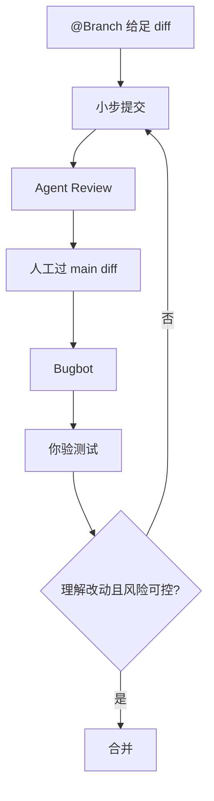

### 结论

Cursor 的立场很直接：**把 AI 当成刚入职的 junior engineer**——它可以写得很快，但你必须 Review 之后才能合并。AI 生成的代码经常「看起来对」：能编译、测试也可能过，却在边界条件、并发或错误处理上埋雷。所以 Review 不是额外步骤，而是 AI 辅助开发里不可跳过的一环。

### 要点

- **能跑 ≠ 正确。** 新手常误以为绿灯就能合并。AI 尤其容易在「happy path」上表现良好，漏掉空值、竞态、权限校验等。你要主动问：如果输入为空、如果请求失败、如果两个人同时操作，会怎样？

- **Review 质量取决于 diff 上下文。** `@Branch` 是 Cursor 里的引用，让 Agent 看到你相对 `main` 分支的**完整变更**，而不是单个文件片段。没有 diff，AI 不知道你改了接口会不会弄坏调用方——跨文件问题就是这样漏过去的。

- **分层查，别指望一个工具兜底。** Linter 管格式和简单规则（命名、缩进）；Bugbot 管**逻辑层**（空指针、竞态、缺错误处理、安全问题）。它们互补。最后一步永远是**人**：业务意图对不对、架构合不合理、敏感操作该不该上。

- **改动越小，越容易查清楚。** 一次 commit 只做一件事（语义化提交）。如果 PR 大到你自己都懒得逐行看，Agent 也会漏。经验法则：15 分钟人工扫不完的 PR，先拆再合。

### 怎么做

按这个顺序走，适合日常在 Cursor 里和 Agent 协作的场景：

1. **开发前：提示里加 `@Branch`**。告诉 Agent 你的任务，并让它看到完整 diff。这样生成的代码更可能遵守项目既有约定，少碰无关文件。

2. **开发中：小步提交。** 每完成一个逻辑点就 commit，别攒一大坨。方便你和 Agent 事后按提交逐个 Review，出问题也好回滚。

3. **任务后：Agent Review。** 点 `Review → Find Issues`，让 Cursor 先标一轮可疑实现。这是初审，不是终审。

4. **合并前：人工对比 `main`。** 在 Source Control 里逐行过一遍，重点看接口变更、数据流、权限。涉及登录、支付、删数据的路径，**必须人签字**，不能全扔给 Agent。

5. **跑 Bugbot。** 别只跑 Linter。Bugbot 抓的是 Linter 看不到的逻辑漏洞。

6. **测试也要你验。** 可以让 Agent 写测试，但你要确认：断言真的在测目标行为吗？失败路径覆盖了吗？「测试全绿但测错东西」是 AI 时代新的坑。

### 关键图表

*从开发到合并的 Review 流程——你始终是最终负责人*
