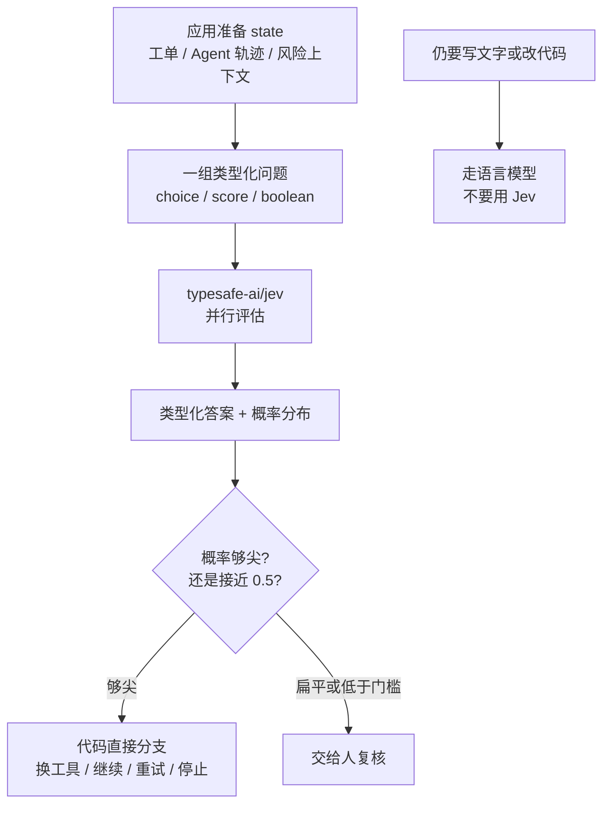

### 结论

Vercel 在 [AI Gateway](https://vercel.com/blog/ai-gateway-jev-model-launch) 上给出一组很硬的采用曲线：**TypeSafe AI** 的 **Jev** 上线 24 小时内，覆盖的付费团队数超过此前任何一次模型发布的两倍，成了 Gateway 历史上采用最快的模型。前 12 小时就超过所有对照模型，18 小时触及一成付费团队；满一天时接近 **13%**——大约是 GPT-5.6 家族的 **2 倍**、Fable 5.1 的 **6 倍以上**。同期其他新模型满一天仍低于 7%。文章把这理解成：专门做**结构化决策**的模型，可以很快在生产里找到位置；下一步要看的是留存，不是首日热闹。

### 要点

- **Jev 不是聊天模型。** 它在 9 月 15 日作为**概率决策模型**推出：应用提交一份共享 **state**（上下文）和一组问题，Jev **并行**评估，返回带概率的类型化结果——选项（choice）、分数（score）或是否（true/false）。[模型页](https://vercel.com/ai-gateway/models/jev)把它标成 evaluation 模型，ID 是 `typesafe-ai/jev`。输出给代码直接用，而不是先让模型写一段话再解析。

- **采用数字来自 Gateway 付费团队，不是排行榜分数。** 「采用」在这里是：有多少付费团队在用它。13% 是上线 24 小时的份额，不是准确率。Vercel 自己也写：首日无人能及，但早期采用能否站住，才是下一场考试。

- **它解决的是「下一步怎么走」，不是「再写一段」。** 原文点名的用法：给 Agent 选下一个工具或子 Agent；决定工作流继续、重试、问用户还是停；行动前给紧急度或风险打分；核验模型输出、加护栏、把不确定的请求交给人。这些都是分支，不是散文。

- **语言模型也能吐 JSON，但概率常常是「写出来的」。** [官方指南](https://vercel.com/kb/guide/typesafe-jev-and-ai-sdk)把差别写清楚：LLM 的结构化输出仍经过文本生成，提示里要的概率多半是生成出来的估计；Jev 的每个答案自带分布，问题彼此独立——多加一题不会改写其他题。schema 约束答案形状，**不保证答案正确**。

- **厂商评测和定价要分开读。** TypeSafe 自己的工作流评测称：相对语言模型最多约 **194 倍**更快、**445 倍**更便宜。这是供应商数字。Gateway 标价是输入 **$0.042 / 百万 token**，不收输出 token；上下文约 32K。调用会进 Gateway 日志和预算，也可按请求开 Zero Data Retention / No Training。

### 怎么做

面向已经在用 Vercel **AI Gateway**（统一模型入口）或 AI SDK 的工程师：先把「决策」从聊天补全里拆出来，再决定要不要换 Jev。

1. **先问自己：这一步要不要生成文字。** 路由队列、要不要重试、要不要人工复核，适合 Jev。写回复、改代码、解释原因，仍走语言模型。不要用 Jev 当 chatbot。

2. **环境：AI SDK ≥ 7.0.105，走 Gateway。** 安装 `ai`，本地 `vercel link` 后 `vercel env pull`，拿到 `VERCEL_OIDC_TOKEN`。把模型写成字符串 `'typesafe-ai/jev'` 时，SDK 会经 Gateway 鉴权。部署在 Vercel 上会自动有 token；本地 token 约 12 小时过期，401 就重新 pull。

3. **用 `experimental_evaluate`，不要走兼容聊天接口。** 一个布尔题的最小形状（官方模型页同款）：

```ts
import { experimental_evaluate as evaluate } from 'ai';

const result = await evaluate({
  model: 'typesafe-ai/jev',
  state: '客服已经给用户办理了全额退款。',
  questions: {
    refunded: {
      type: 'boolean',
      instructions: '是否已经退款？',
    },
  },
});
// result.answers.refunded.probability 接近 1 表示「是」
```

4. **一次请求里混用三种题，靠概率分支，不要只看赢家。** `choice`（1–255 个命名选项）、`score`（2–10 级有序量表）、`boolean`（`probability` 是「为真」的估计：0.98 强是、0.02 强否、0.5 说不准）。`state` 可以是字符串或 JSON。官方建议：选项置信度低或最大概率不够高（文中示例门槛是 confidence 低于 0.6，或选中项概率低于 0.7）就送人工，不要猜。布尔题没有单独的 confidence 字段。

5. **阈值是应用逻辑，用 mock 测，别每次打真模型。** AI SDK 的 `ai/test` 里有 `Experimental_EvaluationMockModelV4`，把固定答案注入 `evaluate` 的 `model`，就能单测「自动分派 / 人工复核」两条路。退款意图（用户有没有要钱）和退款批准（政策允不允许）必须拆开。

6. **先看留存和误分成本，再扩到主路径。** 原文提醒：首日曲线不等于长期份额。从一条低风险分支试点（工单分诊、要不要重试），对照你自己的标注集校准门槛，再接到扣费、删数据这类不可逆动作。

### 关键图表



*Jev 的位置是「评估共享状态、吐出代码能读的决策」；生成文字仍走 LLM。不确定就升级给人类，这是官方指南的默认姿势*
