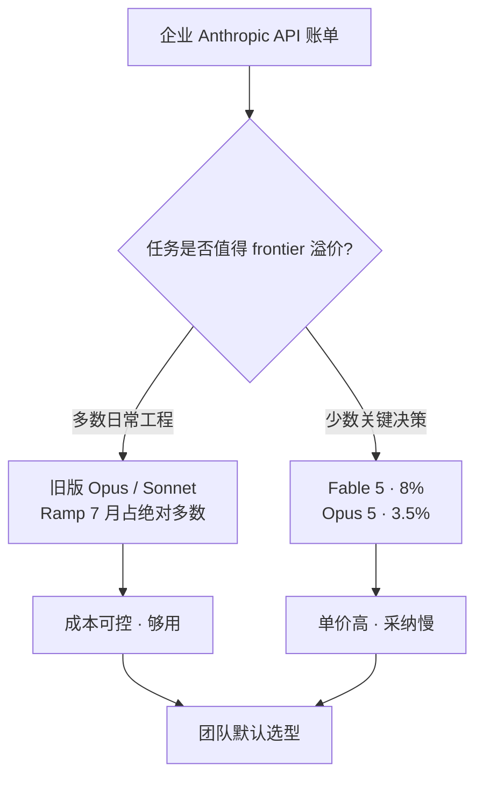

### 结论

《金融时报》援引知情人士称，Anthropic 年化收入已涨到约 **650 亿美元**（5 月约 470 亿），但企业客户在 API 上并不追着最新 frontier 跑。支付平台 **Ramp** 用 7 万家持卡公司的账单估算模型采纳：2026 年 7 月 Anthropic 支出里，**Fable 5 仅 8.0%**，同期刚发布的 **Opus 5 只有 3.5%**；反而是 **Opus 4.8 占 28%**。对工程师来说：厂商最强 ≠ 团队默认模型，**单价和够用程度**才是选型主因。

### 要点

- **年化收入（annualized revenue）** 是把当季收入按 12 个月外推的指标，便于对比增速，不等于已落袋现金。Anthropic 7 月约 650 亿、OpenAI 同期超 400 亿且季内涨约 35%（GPT 5.6 7 月发布后拉动明显）——两家都在涨，但「谁更强」和「谁更常被调用」是两条线。

- **Ramp AI Index** 用真实企业信用卡/API 账单估模型份额，比论坛口碑更接近「钱投在哪」。Simon Willison 认为这份 Anthropic 分项与事实吻合：Fable 5 7 月 24 日才发布，首月占比低不意外；更关键的是 **Fable 定价偏高**，企业更愿意把日常流量留在旧版 Opus/Sonnet。

- **旧版 Opus 仍是现金牛。** 前十名里 Opus 4.8（28%）、Sonnet 4.6（8.3%）、Opus 4.6（6.9%）合计远超 Fable 5 + Opus 5。说明多数团队把「够用的上一代」当主力，把最新旗舰留给少数高难度任务——这和 Cursor Router「前沿规划 + 廉价执行」的经济学一致。

- **「最强模型」的困境是产品策略，不是能力否定。** Anthropic 预计 Q3 按自家口径盈利，且有约 **6000** 家客户年消费 **10 万美元以上**；公司并不缺钱，缺的是让全员默认切到 Fable 的理由。高价 frontier 若不能在日常工程里证明 **边际收益 > 边际成本**，账单就会继续流向旧型号。

- **OpenAI 同期也在抢心智。** GPT 5.6 发布后季度收入跳涨，说明「发布节奏 + 定价」同样影响采纳。横向对比时，别只看 benchmark 冠军，要看你所在栈（Coding Agent、批处理、客服）里 **哪档模型已被工具链和路由默认优化**。

### 怎么做

1. **每月拉一次模型分项账单。** 若用 Claude/OpenAI 企业 API，按 model id 聚合 spend；没有细项时，用 Ramp 类第三方指数或自家 FinOps 标签对照行业结构——若你 90% 流量还在旧 Opus，说明团队已在用钱包投票。

2. **按任务分层，而非全员挂最新旗舰。** 架构设计、复杂调试、安全审查可保留 Fable/Opus 5；格式化、单测补全、例行 CRUD 改路由到 Sonnet 或更便宜档。参考 Ramp 数据：Fable 5 + Opus 5 合计仍是个位数，强行全量升级通常换不来同比产出。

3. **新模型上线设「观察窗」。** Fable 5 7 月下旬才发布，首月占比低正常；但应设 30–60 天试点：选 1–2 个真实项目对比 **质量差、延迟、单价、cache 命中率**，再决定是否改默认——避免追逐发布标题而放大 token 账单。

4. **把路由/Auto 模式当一等公民。** 若 IDE 或网关支持按复杂度选模型（如 Cursor Auto Balance/Intelligence），优先让系统做「难题上前沿、琐事走便宜模型」，而不是人工给每个会话手选 Fable。

5. **和采购对齐「年消费 10 万+」档位。** Anthropic 披露约 6000 家大客户年花 10 万美元以上；若你团队接近这一档，谈判重点应是 **批量价、旧型号留存、混合路由**，而非单一 frontier 的刊例价。

### 关键图表

*Ramp 2026 年 7 月企业支出结构：最强新模型合计仍是个位数，旧版 Opus 4.8 单型号即占 28%——选型跟着账单走，别跟着标题走*
