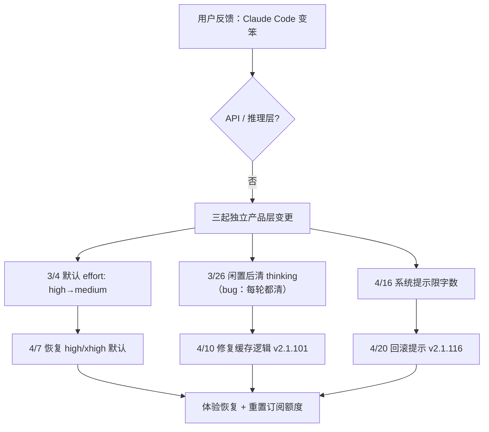

### 结论

2026 年 3–4 月部分用户觉得 Claude Code「变笨」，根因不是 API 或模型本身降级，而是**三起互不相关的工程变更**分别打在 Claude Code、Agent SDK 和 Cowork 上，叠加后看起来像全面退化。截至 4 月 20 日（v2.1.116）三处均已修复；Anthropic 还为全体订阅用户重置了用量额度。对做 Agent 产品的团队来说，这篇复盘的价值在于：**性能优化、缓存策略、系统提示微调，都可能以「智力下降」的形式反馈给用户**——而且很难从单一指标里一眼看出来。

### 要点

- **默认推理档位（effort）动不得太随意。** 3 月 4 日 Claude Code 把默认 reasoning effort 从 `high` 降到 `medium`，本意是缓解 `high` 模式下偶发超长思考导致 UI「假死」、延迟和 token 飙升。内部评测显示 medium 对多数任务略降智力但快很多；用户反馈却相反——宁可慢一点也要默认更聪明。4 月 7 日已改回：Opus 4.7 默认 `xhigh`，其余模型默认 `high`。教训：**产品默认值是用户心智的锚点**，latency 和用量优化不能单方面替用户做「智力换速度」的取舍。

- **清缓存时误删了「为什么这么做」的思考链。** 3 月 26 日上线一项成本优化：会话闲置超 1 小时后，用 API 头 `clear_thinking_20251015` + `keep:1` 清掉旧思考块，因为缓存已失效，少发 uncached token 能省钱。实现有 bug：**一旦跨过闲置阈值，之后每一轮都继续清思考**，而不是只清一次。用户在工具调用中途插话时，连当前轮的推理也被丢掉。表现是健忘、重复、奇怪的工具选择；请求还因持续 cache miss 导致用量掉得更快。4 月 10 日（v2.1.101）修复。

- **一句「少说点」的系统提示，coding 质量掉了 3%。** 为压制 Opus 4.7 偏啰嗦的输出，4 月 16 日在系统提示加了字数上限（工具调用间 ≤25 词、最终回复 ≤100 词）。内部几周测试没发现问题，但事后做 **ablation**（逐行摘掉提示看影响）时发现 Opus 4.6/4.7 评测跌约 3%，4 月 20 日随版本回滚。说明：**verbosity 和 reasoning 在 coding 场景里绑在一起**，压输出长度可能连带伤到解题质量。

- **多起小变更叠在一起，像「全面变差」却难定位。** 三处变更影响不同流量切片、上线时间不同；内部用量和评测起初也没复现用户说的症状。还有两项干扰因素：内部消息队列实验、CLI 展示 thinking 的方式掩盖了缓存 bug。Corner case（闲置后恢复的长会话）+ 多层系统交叉，让根因确认拖了一周多。事后用 Opus 4.7 做 Code Review、喂足仓库上下文，反而能在 offending PR 里揪出缓存 bug——4.6 则没找到。

- **API 层未受影响，问题出在「产品 harness」。** 推理参数默认值、会话上下文管理、系统提示，都属于 Agent 产品层对模型的「包装」。模型权重没变，体验却可以明显变差——排查时要先分清是模型问题还是 harness 问题。

### 怎么做

如果你维护 Claude Code 类 Agent 或自研 coding agent，可按 Anthropic 事后措施对照自检：

1. **改默认 effort / thinking 预算前，先问用户愿不愿意。** 提供 `/effort` 或等价开关，但默认值变更要有明确公告；latency 优化优先做成「简单任务可主动降档」，而不是全员降智。文档里写清：thinking 越久通常输出越好，effort 就是在延迟、用量、智力之间滑动。

2. **动上下文或缓存策略时，画清「只执行一次」的边界。** 清 thinking、截断历史、压缩 tool result 这类优化，必须保证状态机正确：触发条件（如闲置 1 小时）满足后执行一次，下一轮恢复完整行为。为「闲置后恢复」和「工具调用中途被打断」各写一条集成测试。

3. **系统提示改动走 ablation + 分模型门禁。** 不要只看「没报错、评测全集没过线」；对每一行提示做摘除实验，并按模型版本 gate（CLAUDE.md 里标明某条仅作用于 Opus 4.7）。涉及智力与冗长 trade-off 的改动：加长 soak、灰度、扩评测集。

4. **内部 dogfood 尽量用对外同款 build。** Anthropic 承认内部特性分支和展示层差异，让 CLI 外部构建测不出缓存 bug。发布前让一部分人跑**与公开发布物字节级一致**的 artifact。

5. **Code Review 要能给足仓库上下文。** 这次 Opus 4.7 在完整 repo 上下文下能审出 bug，4.6 不能——说明复杂跨文件逻辑审查，Agent 需要读依赖、调用链，不能只看 diff 片段。

6. **收到「变笨」反馈时，列变更时间线而不是先怀疑模型。** 把近期 prompt、默认参数、缓存、路由实验按日期叠在一张表上，看是否有多条变更窗口重叠；用户 `/feedback` 里可复现的会话样本比笼统吐槽更有用。

### 关键图表

*三起变更时间错开、影响人群不同，叠加后像全面退化；排查 Agent 问题时要把 harness 默认值、上下文管理与系统提示和模型本身分开看*
