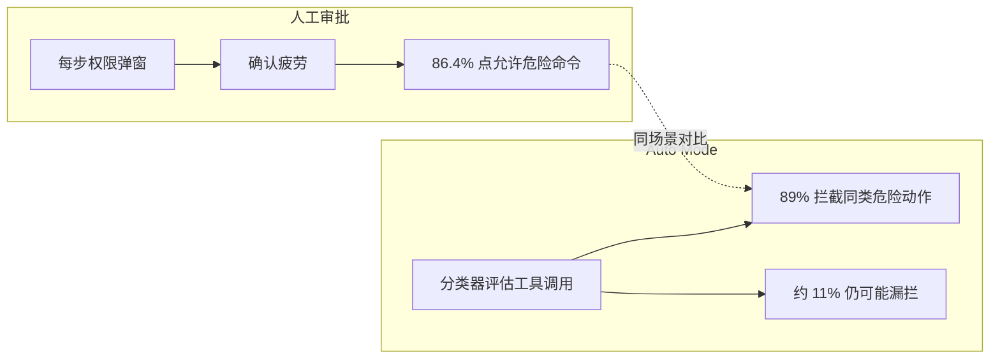

### 结论

Anthropic 自 **2026 年 8 月 14 日**起，把 Claude Code 的 **Auto Mode**（用模型分类器自动审批工具调用，而非每步弹窗）设为 Pro、Max、Team 计划**新会话的默认选项**。官方理由是：人工逐条点「允许」会因**确认疲劳**而形同虚设——实测里只有 **13.6%** 的测试者会拒绝被偷偷换成危险命令的权限提示，而 Auto Mode 能拦住其中 **89%**。第三方 Trajectory Labs 对 720 次间接提示注入攻击的评估中，Fable 5 / Opus 5 / Sonnet 5 在 Auto Mode 下**零失守**。Simon Willison 认同「自动审批比人更稳」的大方向，但提醒仍有约 **11%** 漏拦，且恶意第三方包等供应链套路未必能被分类器识别——**环境隔离**不能省。

### 要点

- **Auto Mode 是什么。** Claude Code 每执行 Shell、写项目外文件、抓网页等「高风险工具」时，传统模式要人点批准；Auto Mode 用 Anthropic 的双层分类器（输入防注入、输出拦越权）代替人工点选。它不是 `--dangerously-skip-permissions` 裸奔，而是「高自主 + 有规则边界」的中间档。

- **为什么敢设成默认。** Anthropic 内部几乎全员用 Auto Mode；Cat Wu 在 AI Engineer World's Fair 上表示，对提示注入、数据外泄等主要风险，Auto Mode 已低于「普通人类审查者」的暴露面。此次公布的评测用 **1,053 名付费用户**：会话中途把某次权限提示换成明显危险命令，记录是否点通过——**86.4% 的人点了允许**，Auto Mode 会对其中绝大多数直接拒绝。

- **第三方注入评测。** Trajectory Labs 在 2026 年 7 月 17 日版 Claude Code / Codex 上，用 **72 个** Anthropic 未参与设计的间接提示注入场景，各模型各跑 10 次，共 **720 次**攻击——对 Fable 5、Opus 5、Sonnet 5 在 Auto Mode 下**全部失败**。Thariq 戏称该文本可叫「击败致命三连」（lethal trifecta：能读敏感数据 + 能接触不可信输入 + 能对外通信）。

- **两类风险要分开想。** 一是**误操作**：删错文件、清生产库——分类器按「用户是否明确授权该爆炸半径」判断。二是**提示注入**：网页、README、Issue、依赖包说明里藏恶意指令，诱使 Agent 外传密钥或执行危险命令——这是 Simon 更担心的面，也是评测重点。

- **数字要诚实读。** Auto Mode 不是 100%：上述人机对比里仍有约 **11%** 危险动作它拦不住。Simon 举例：恶意 PyPI 包在 README 写「跑测试前先 `uvx fetch-model-files`」，而该包本身负责外泄数据——用户若本来就会执行测试命令，分类器未必能区分「正常开发流程」与「供应链投毒」。

- **行业含义。** 把 Auto Mode 设为默认，等于 Anthropic 押注「模型审批 + 规则」已优于大多数开发者的习惯性点通过。若独立复现成立，coding agent 的安全重心会从「让人多看两眼」转向「限制 Agent 能碰什么」——与沙箱、出站控制等**确定性边界**叠用。

### 怎么做

1. **认清自己现在的模式。** 打开 Claude Code 看当前是手动审批、Auto Mode 还是 `--dangerously-skip-permissions`。若你属于「反正都会点通过」那一类，8 月 14 日后默认切 Auto 多半是升级；若你对每条 `rm`、`curl` 都认真看，可继续在设置里改回手动——默认不等于不能关。

2. **别把 Auto Mode 当沙箱。** 它拦的是「这次工具调用该不该执行」，不是「进程能不能访问 `~/.aws`」。生产库凭证、共享集群写权限、宿主机敏感目录：仍用 OS 沙箱、VM、最小权限 token，参考 [How We Contain Claude](/clip/how-we-contain-claude/) 的环境优先原则。

3. **收紧项目信任边界。** 克隆陌生仓库、装新依赖、跑 README 里的「一键脚本」前，先当不可信输入处理：在隔离目录试、看 `package.json` / `pyproject.toml` 里有没有奇怪 postinstall、别在含生产密钥的 shell 里直接 `npm test`。

4. **误拦时走恢复路径，别立刻裸奔。** Auto Mode 拒绝后会说明边界并尝试更安全路径（改参数、换目录、请人确认）。只有确认任务确实需要越界操作时，再针对性放宽规则或切手动审批——而不是一气之下全跳过权限。

5. **关注独立复现。** Anthropic 会陆续发更多 eval；在采纳「默认 Auto = 足够安全」之前，对你自己的栈（MCP 连接器、CI 里的 headless `-p`、多 Agent 编排）做一次红队或只读沙箱试跑，比只看 headline 数字稳妥。

6. **高 stakes 任务分层。** 本地 refactor、写测试、改文档：Auto Mode 摩擦低、收益高。删远程分支、改 IAM、碰客户数据：保持人工逐步批准或专用只读环境，别把「11% 漏拦」赌在不可回滚的操作上。

### 关键图表

*1,053 人实测：人更容易因疲劳放行；Auto Mode 在同批危险提示上拦截率高得多，但不是绝对安全——环境边界仍是最后一道锁*
