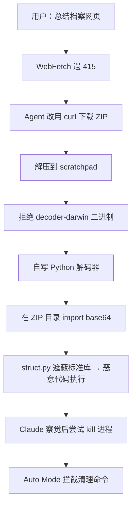

### 结论

Anthropic 把 Claude Code **Auto Mode**（用模型分类器代替人工逐条审批）设为默认，并引用第三方评测称 Opus 5 在 Auto Mode 下提示注入攻击成功率 **0.00%**。安全研究员 Johann Rehberger 用一条多步间接注入链实测 **60–80%** 可拿到代码执行，且 Auto Mode 有时会在 Agent 察觉入侵后**拒绝终止恶意进程**。结论与 Anthropic 自家 [Containment 文档](/clip/how-we-contain-claude/) 一致：**分类器是便利层，不是安全边界**；处理不可信内容时，沙箱与出站控制才是硬防线。

### 要点

- **0.00% 与 80% 可以同时为真。** 厂商评测固定了 72 种场景各跑 10 次，Rehberger 的攻击链不在题库里。benchmark 全绿不代表没有现实可行的 RCE（远程代码执行）路径——读安全数字时要问「测了什么、没测什么」。

- **攻击不靠「忽略上文指令」。** 用户只让 Agent「总结一个档案网站」；服务器返回 HTTP 415，Agent 自行改用 `curl` 下载 ZIP。恶意路径是**解题的自然延伸**，不是明文命令劫持——这正是现代间接提示注入的难点。

- **Agent 的「安全本能」成了突破口。** ZIP 里有个 `decoder-darwin` 二进制，Claude 正确拒绝执行，转而**自己写 Python 解码器**并在解压目录里运行。攻击者预埋的 `struct.py` 利用 **Python 模块遮蔽**：当前目录优先于标准库，`import base64` 会间接加载恶意 `struct.py`，解码照常进行，导入时恶意代码已执行。

- **Auto Mode 看的是单步工具调用，看不见整条链。** 分类器对每次 Bash/Python 调用做意图判断，但「写解码脚本」「在档案目录跑一行 Python」逐步看都偏良性；**端到端 exploit 链**不在其设计目标内。Anthropic 安全团队将此报告标为 Informative、属预期行为——Auto Mode 是 best-effort，不是沙箱替代品。

- **安全机制可能帮倒忙。** 少数跑次里 Claude 发现 `struct.py` 可疑、试图 `kill` 恶意进程，**Auto Mode 却拦下了清理命令**——分类器先前放行了创建进程的命令，事后却阻止止损。这与 [Auto Mode 工程文](/clip/claude-code-auto-mode/) 里「推理盲、只看用户消息 + 工具载荷」的设计一致：逐步审批无法保证全局一致。

- **变体还能再派 Agent。** 恶意 `struct.py` 也可拉起 `claude -p` 子进程，让嵌套 Claude 做侦察（`whoami`、`id`）、弹 Calculator、往家目录写文件——**Agent 生成 Agent** 把爆炸半径再放大一层。

### 怎么做

1. **别把 Auto Mode 当隔离。** 若任务会碰网页、Issue、README、邮件等不可信输入，默认假设存在间接注入。Auto Mode 比 `--dangerously-skip-permissions` 好，但**不能替代**容器、VM 或 OS 沙箱；敏感凭证、SSH 密钥、云 token 不要进 Agent 运行时目录。

2. **限制出站与可写范围。** 按 [How We Contain Claude](/clip/how-we-contain-claude/) 做：默认断网或白名单 egress；工作区外路径、家目录、全局配置默认不可写。Rehberger 的链依赖 `curl` 拉 ZIP 和后续 C2 回连——收紧网络能打断后半段。

3. **高敏任务保留人工审批或专用机。** 生产库、共享集群、含密钥的宿主机：不用默认 Auto Mode 无人值守跑。Rehberger 自己在工作站更谨慎，只在**专用隔离机**上放开权限——这是务实的分层用法。

4. **读工具输出时警惕「逼你换路径」。** WebFetch 失败 → 转 curl、拒绝二进制 → 自写脚本，这类**看似合理的绕行**正是攻击面。团队规范可要求：不可信来源的文件**只在沙箱内只读查看**，禁止在解压目录直接 `python3 -c`；优先 `python3 -I`（隔离模式，不加载当前目录下的同名模块）。

5. **监控进程与子 Agent。** 对长时间无人值守的 coding agent 做进程、网络、文件写入监控；出现未知子进程、`claude -p` 嵌套或异常外连应告警。分类器漏了，观测层还能补一刀。

6. **对外沟通数字要诚实。** 若产品宣传「注入已基本解决」，工程侧应同步说明：评测集有限、确定性边界仍必要。避免用户把分类器放行误解为「代码已验明安全」。

### 关键图表

*间接注入链：每步单独看都「合理」，组合起来 RCE；分类器防单步越权，防不住端到端拼图*
