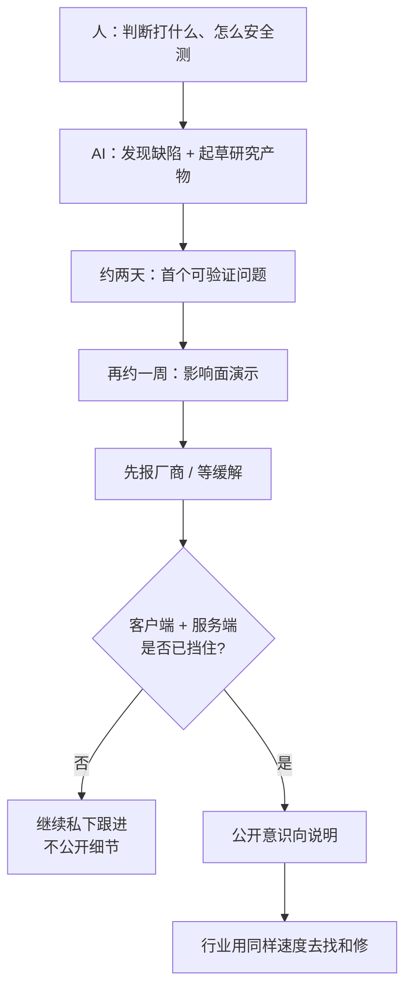

### 结论

Simon Willison 在 9 月 10 日摘了 [Calif Research 的 WeWorm 公告](https://calif.io/research/weworm) 里最刺的几句：**AI 已经能做「蠕虫级」安全研究里的大部分体力活**——找漏洞、写出首个远程代码执行（RCE：在目标设备上跑攻击者代码）大约两天，再一周做成可传播的演示；以前这种规模通常要更大团队做几个月。Calif 自己划的分工是：**人提供判断——打什么、怎么安全地测**；腾讯已在 8 月给全体用户挡住了他们的利用。对工程师，这篇短摘不是教你复现通话攻击，而是同一条新时间表：**攻防两边的窗口都从「月」压到了「天」。**

### 要点

- **Simon 摘出来的，是时间表，不是利用手册。** Calif 公开说：他们发布的是 WeWorm 演示——经微信通话、在 iOS 与 Android 上传播的零点击蠕虫（零点击：对方不用点、不用接，通话振铃阶段就可能中招）。对方接了也听不到声音，利用仍会成功。技术细节他们压着，准备以后在会议上讲；这里只需要记住：**用户交互不再是这道门槛。**

- **「两天 + 一周」对上的是旧世界的「大团队数月」。** 原话几乎被 Simon 整段留下：和 AI 一起，团队约两天找到漏洞并写出首个 RCE，再一周做成蠕虫。这类工作过去要更大编制、按月计。时间被压缩的不是写博客，而是**从发现到可演示利用的整条研究链**。

- **人没被替换，岗位换成了「判断」。** Calif 写得很清楚：AI 已能做大部分活，团队提供的是 **judgment**——打哪个面、如何安全测试。对应到日常：模型可以帮你扫代码、草拟复现思路、整理时间线；**选目标、设隔离、决定何时停手、何时对厂商披露**，不能外包。

- **他们先披露、后发文；厂商已挡住。** 时间线：7 月 AI 发现、7 月 23 日工程团队知情、7 月 24 日报给腾讯；8 月 21 日微信 Android 8.0.77 / iOS 8.0.76 缓解该缺陷，8 月 28 日确认服务端也对全体用户挡住了他们的利用。9 月 8 日才公开文章。窗口已经关上，普通用户不必自己「防一种未公开手法」。

- **Calif 的课不是「停掉 AI」，而是「好人也要同样快」。** 他们提醒：这类能力过去多在资金充足的高手手里；AI 降低了门槛。半成品工具一旦漏出去，会变成 WannaCry 那种「实验室事故」——所以他们反对把教训写成「别再发展 AI」，主张用同样的速度去找和修。对产品团队，这意味着默认假设：**通话、信令、即时通讯这类信任面，已经进入 AI 加速的扫描半径。**

### 怎么做

面向会用编码 Agent、也碰得到即时通讯/通话栈的工程师（防守与负责任披露，不是复现利用）：

1. **把安全研究日历从「月」改成「天」。** 内部或开源组件一旦出现「通话 / VoIP / 信令」相关缺陷，不要再按季度补丁火车排期。先问：若对面也用 Agent，两天能不能从公开信息推到可验证问题？回答是「能」或「不确定」，就走小时级热修，而不是等下周例会。

2. **用 AI 做体力活时，提示里写死「人负责的两件事」。** 选目标、安全测试条件必须由人写进任务单：测的是哪一个隔离环境、能不能碰真实用户、原始样本存在哪、谁有权看。Calif 把这两项单列，不是客套——缺了它们，Agent 只会优化「更快做出能跑的东西」。

3. **先报厂商，再公开叙事。** 学他们的顺序：发现 → 提交 → 等缓解（客户端版本 + 如有必要的服务端挡住）→ 再发意识向文章。公开时只讲影响面与时间表，不讲可复现步骤。本站 8 月 29 日网摘写过：补丁讨论本身就会变成探测信号；今天这篇是同一窗口的另一侧——**研究方也必须默认「公开即加速对手」。**

4. **半成品进攻工具按「会自己跑出去」来保管。** Calif 点了 WannaCry：工具还没准备好就泄漏，会打到医院。你的团队若用 Agent 辅助安全研究，未完成的 harness、样本、演示包默认进权限仓库或离线环境，禁止同步到个人网盘或公开 CI 产物。这是流程，不是技术细节。

5. **产品侧：少给「通讯录里的人」额外特权，而不只是加一句「请升级」。** WeWorm 的公开前提是攻击者已在好友列表——一旦一个人被接管，信任链会替蠕虫开门。做即时通讯或「一切应用」时，把「好友 / 企业通讯录」当成**不可靠的身份**，通话与信令路径按不可信输入做隔离和快速熔断。用户侧：腾讯已缓解；保持微信为 8 月 21 日及之后的版本即可，不必自行实验通话行为。

### 关键图表

*Simon 留下的核心句：AI 能做大部分活；人留下目标和安全测试。公开必须排在厂商挡住之后*
