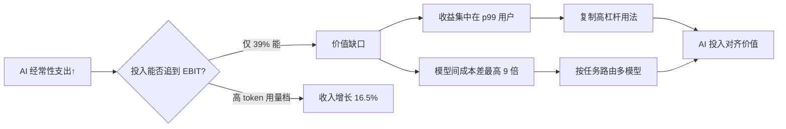

### 结论

全球 AI 支出在 2025 年已达约 **1.5 万亿美元**，已从试点预算变成和云、人力一样的经常性开支。McKinsey 数据显示：88% 的组织已在至少一个业务职能里部署 AI，但只有 **39%** 能把这笔投入追到企业级 EBIT（息税前利润）上。Cursor 因此发起 **CFO Council**——财务负责人季度碰头，共同回答一个问题：**怎么让 AI 花出去的每一块钱，都能对上产出的价值？** 对工程师来说，这不是纯财务话题：你用多少 token、选哪个模型、产出是否被合并，都会直接决定团队 ROI 能不能站得住。

### 要点

- **高用量确实关联增长，但不是人人吃到红利。** BCG 用 Cursor 数据发现：token 用量最高 20% 的公司，收入同比增速中位数 **16.5%**；最低 20% 仅 **5.1%**。2025 年底模型大升级后，员工每周 Agent 消息量平均涨 **44%**，高复杂度任务涨 **68%**——能力越强，大家反而更愿意多试（类似「杰文斯悖论」：效率提高，总用量往往上升）。

- **收益高度集中在少数人手里。** Cursor《开发者习惯报告》显示：用量前 1%（p99）的开发者，每天 AI 辅助产出代码行数是活跃中位用户的 **46 倍**，每周合并 PR 数是 **15 倍**。支出、token 消耗、AI 生成代码也呈现类似分布——按基尼系数算，比全球任何国家的收入不平等还夸张。多数团队的真实问题是：**少数人把杠杆拉满，大多数人还没摸到门道。**

- **同样能干活，成本可以差一个数量级。** 报告里，不同模型家族的「单次 Agent 请求成本」最多差 **9 倍**，「每行被采纳代码的成本」差约 **7 倍**。厂商普遍转向按用量计费，智能变成难预测的变动成本；**把任务路由到合适档次的模型**（规划用强模型、批量执行用便宜模型）才是长期省钱杠杆。Cursor 里 **84%** 的重度用户每周已混用多个模型——单模型一条路走到底，往往又贵又慢。

- **财务侧缺的是统一尺子。** 目前没有成熟学科能把 AI 投入做得可度量、可预测、可优化。CFO Council 计划产出：生产力基准、智能 ROI 衡量框架、模型分配与成本治理的实操方法；首次会议定于 **2025 年 8 月**，后续会向社区公开进展。

### 怎么做

**如果你是工程师或 Tech Lead**，别只盯「模型够不够聪明」：

1. **先定义「单位工作」再谈花多少钱。** 和财务对齐时，用可数指标：合并 PR 数、被采纳代码行、修复 incident 时长、功能上线周期——别只报 token 账单。CFO 关心的是这些数字有没有改善 EBIT，不是谁家模型参数更大。

2. **盘点团队里的用量分布。** 若 80% 价值来自 20% 的人，重点不是砍预算，而是**把高杠杆用法复制给中位用户**：共享 prompt、Review 流程、Agent 工作流模板。少数人 46 倍产出背后通常是任务拆解和验收习惯，不是神秘天赋。

3. **按任务分档选模型。** 规划架构、啃陌生代码库 → 强推理模型；改文案、批量重命名、简单脚本 → 便宜快模型。每周看一眼「单次请求成本」和「每行采纳成本」，把最贵的模型从重复性劳动里挪走。

4. **预期总用量会涨，预算要按「能力升级」留弹性。** 模型变好时，团队会尝试更难的任务（消息量 +44% 就是信号）。和采购谈合同时，按**用量区间 + 产出指标**谈，而不是按固定 seat 数一刀切。

**如果你在参与预算或选型**，可以主动问供应商三件事：能否按职能/export 看 ROI？是否支持多模型路由？有没有行业基准（CFO Council 后续可能会补这一块）？

### 关键图表

*AI 经济学三角：总支出在涨、回报不均、成本因路由而异——治理抓手是度量产出 + 扩散最佳实践 + 分档用模型*
