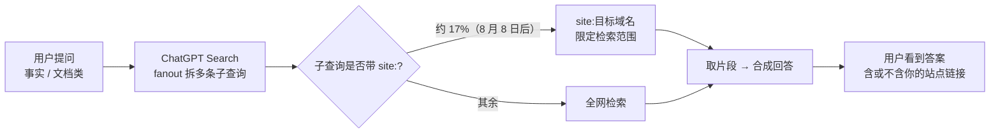

### 结论

Promptwatch 的自动化追踪显示，ChatGPT 搜索在 GPT-5.6  rollout 后**大规模使用 `site:` 运算符**——fanout 子查询里带 `site:` 的比例从长期约 0.3%–0.5% 在 8 月 8 日跳到 16%–17%。这意味着 ChatGPT 回答事实类问题时，会更频繁地把检索范围锁在特定域名上，而不是全网泛搜。对做内容站、文档站的人，这是 **GEO（Generative Engine Optimization，生成式引擎优化）** 的硬信号：你的站点能不能被「点名检索」，直接影响是否出现在 ChatGPT 答案里。

### 要点

- **`site:` 是什么。** 搜索引擎里的站点限定符，写法如 `site:docs.example.com 部署指南`，只在该域名内找结果。ChatGPT 搜索在内部 fanout（一次用户提问拆成多条子查询并行检索）里用它，说明模型在「猜哪个站最可能有答案」。

- **变化有明确时间线。** 8 月 3–5 日占比短暂跌到 0.15%（像 staged rollout 或实验），8 月 6 日 OpenAI 宣布 Plus/Pro 的 GPT-5.6 Sol「事实更可靠、回答更聚焦」，8 月 8 日 `site:` 用量骤升。两者时间对齐，不是偶然波动。

- **数据来自第三方观测，不是 OpenAI 官方。** Promptwatch 用自动化脚本向 ChatGPT、Claude、Gemini 等发固定 prompt 并统计回复与检索行为；样本只覆盖他们启用了追踪的那批 prompt，绝对比例会偏，但**相对趋势**仍有参考价值。

- **工具形态可能是 `search(query, recency, domains)`。** OpenAI 刻意隐藏系统 prompt，Simon 从交互推测：新版搜索工具接受「域名列表」参数，模型不必手写 `site:`，但效果等价——先圈定站再搜。

- **Reddit 权重在下降。** Promptwatch 8 月 18 日跟进称 ChatGPT 搜索里引用 Reddit 的概率大幅下降；是否与 `site:` 策略联动尚不确定，但说明**检索源偏好会变**，不能假设「Reddit 讨论多就能被 AI 引用」。

### 怎么做

1. **把官方文档放到独立、可爬的子域或路径。** 若 ChatGPT 用 `site:yourdocs.com` 检索，子域结构清晰、robots 不挡、页面有稳定 URL，才容易被命中。别把关键说明只放在 JS 渲染或登录墙后。

2. **用 GEO 思路补 SEO 缺口。** 传统 SEO 追关键词排名；GEO 追「用户问 ChatGPT 时，你的站会不会被 fanout 子查询点名」。可定期用 Promptwatch 等工具跑与你产品相关的典型问题，看回复是否引用你的域名。

3. **写「可被摘引」的结构化内容。** 标题含问题、首段直接给答案、小节有明确 H2/H3，方便检索片段匹配。FAQ、changelog、API 参考比营销软文更容易成为 AI 的事实来源。

4. **别押宝单一社区源。** Reddit 权重已在降；自建文档 + 权威二级域（如 `docs.`、`learn.`）比指望论坛帖被 AI 捞到更可控。

5. **观测产品迭代，别一次定策略。** OpenAI 不公开系统 prompt，规则会变。把「AI 搜索可见性」当成季度复盘项，而不是一次性 SEO 项目。

### 关键图表

*GPT-5.6 后 fanout 更常「先圈站再搜」；站点结构清晰、可爬，才更容易进入被圈定的域名*
