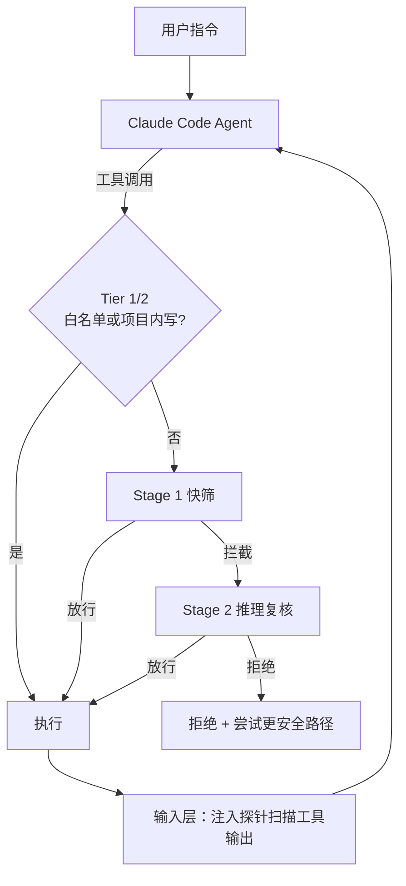

### 结论

Claude Code 默认每个工具调用都要人点批准，实测 **93% 的提示最终都会被通过**——疲劳之后人反而看不仔细。另一条路是 `--dangerously-skip-permissions` 全放行，几乎零维护但毫无保护。**Auto Mode** 是 Anthropic 给出的中间方案：用模型分类器代替人工审批，拦住越权、误操作和注入驱动的危险动作，其余照常执行。它不是「比人更聪明」，而是给已经想跳过审批的人一个**明显比裸奔安全**的选项。

### 要点

- **三种模式各有代价。** 沙箱隔离最安全，但每加一种能力都要配网络/主机权限，维护成本高；全跳过权限零摩擦但无防护；手动审批居中，却挡不住「反正都会点通过」的疲劳。Auto Mode 目标是**高自主 + 低维护**，并随分类器覆盖扩大逐步变安全。

- **双层防线：读什么、做什么分开管。** **输入层**：服务端提示注入探针扫描文件读取、网页抓取、Shell 输出等工具结果，可疑内容进上下文前会附带警告，让 Agent 回到用户原意。**输出层**：转录分类器（Sonnet 4.6）在动作执行前评估是否该拦——两阶段：先快筛单 token yes/no， flagged 再链式推理，大部分良性调用不走慢路径。

- **分类器「推理盲」是刻意设计。** 它只看**用户消息 + 工具调用载荷**，不看 Assistant 自说自话和工具返回。这样 Agent 没法用「用户其实默许了」这类话术说服分类器；POST 环境变量到外部 URL 这类动作，也不必读完整 `.env` 内容就能按意图规则拦截。

- **三级放行，只有「真有风险」才进分类器。** Tier 1：内置只读工具白名单 + 用户窄规则（进入 Auto 时会剥掉 `python *`、`npm run` 等任意代码执行规则）。Tier 2：项目目录内写文件直接放行（可 git review）。Tier 3：Shell、网抓、项目外文件、子 Agent 等才进分类器。

- **拦的是「热心过头」，不只是恶意。** 内部事故日志里的典型模式：用户说「清理旧分支」却批量删远程分支；鉴权失败后自己 grep 环境变量找 token；用户说「取消 job」却按名字相似度删了别人的任务。分类器按**用户是否明确授权该爆炸半径**判断，不是「和目标相关就放行」。

- **数字要诚实读。** 真实越权样本（n=52）上全流程 **17% 漏拦（FNR）**；真实流量误拦率约 **0.4%**。比 `--dangerously-skip-permissions` 好很多，但**不能替代**人在高 stakes 基础设施上逐条审。漏拦多发生在：分类器认出危险，却误判会话里已有「够格的同意信号」。

### 怎么做

1. **先认清自己属于哪类人。** 若你本来就用 `--dangerously-skip-permissions`，Auto Mode 是明确升级；若你对每条命令都认真看，切 Auto 可能是倒退——只在「审批摩擦不值那点边际安全」的任务上用。

2. **启用后检查默认策略。** 跑 `claude auto-mode defaults` 看二十多条默认 block 规则（销毁/外泄、降安全姿态、跨信任边界、绕过 review 等）和 allow 例外。在 settings 里补全**可信边界**：GitHub org、云 bucket、内网 API——默认只信当前 git 仓库。

3. **别把宽 Shell 规则带进 Auto。** 进入 Auto 会剥掉任意解释器/包管理器执行类规则；保留窄规则（如「只允许 formatter」）。否则分类器永远看不到最危险的命令。

4. **子 Agent 同样受管。** 委派出去前拦一次（防 orchestrator 擅自派活）；子 Agent 返回前再扫动作历史（防中途被注入）。连续 3 次拒绝或累计 20 次会 escalate 到人；headless `-p` 模式直接终止进程。

5. **把误拦当可恢复事件。** 被拒时 Agent 会收到边界说明并尝试更安全路径，而不是会话直接死掉——这让 0.4% 误拦在长任务里可承受。

6. **高 stakes 仍要环境隔离。** 生产库、共享集群、含密钥的宿主机：Auto Mode 是分类器，不是沙箱。和 [How We Contain Claude](/clip/how-we-contain-claude/) 里说的原则一致——**确定性边界**和模型审批要叠用。

### 关键图表

*输出层分类器 gate 动作；输入层探针 gate 进上下文的内容——两层独立，注入要同时骗过「读」和「做」才容易成功*
