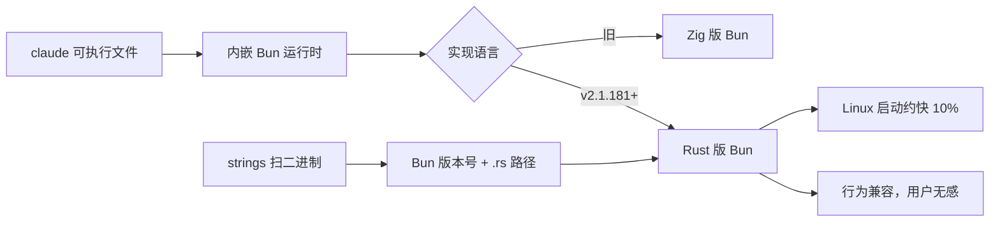

### 结论

Claude Code **v2.1.181**（2026 年 6 月 17 日起）内置的 JavaScript 运行时，已从 Zig 实现的 Bun 换成 **Rust 重写的 Bun**。Bun 作者 Jarred Sumner 称 Linux 上启动快约 **10%**，其余体验几乎不变——Simon Willison 用 `strings` 扫本地 `claude` 二进制，找到了 `Bun v1.4.0` 和数百条 `.rs` 源文件路径，坐实这件事已在数百万台设备上静默运行。**对日常写代码的人，这是好消息：底层大换血可以像修水管一样 boring 地上线。**

### 要点

- **Claude Code 不是「调用系统里的 Bun」。** 它把 Bun 打进自己的可执行文件里，当嵌入式 JS 运行时用（跑插件、脚本等）。换实现语言等于换整套工具链地基，但 API 面尽量保持不变，所以用户侧很难察觉。

- **Rust 版 Bun 尚未在 GitHub 正式发布。** Willison 的机器上 `strings` 打出 `Bun v1.4.0`，而 Bun 官方最新公开 release 仍是 **v1.3.14**（2026 年 5 月）。说明 Anthropic 可能提前打包了预览版运行时——大厂工具链常比开源主线超前半步。

- **`strings` 是合法的「黑盒验尸」手段。** 可执行文件里往往嵌着版本字符串、错误信息、源码路径。不用反汇编，两条 grep 就能判断「跑的是不是 Rust 版」——对关心供应链、合规或性能归因的工程师很实用。

- **「Boring is good」是产品工程目标。** 启动快 10%、行为不变、没有 breaking change 公告——说明迁移验收标准是**兼容 + 可度量收益**，而不是换技术栈博眼球。AI 终端工具越成熟，越会走这条路。

- **和你直接相关的边界。** 除非你给 Claude Code 写 Bun 原生插件或依赖特定 Bun bug 行为，否则这次切换**不必改工作流**。若你维护依赖 Bun 版本的 CI 镜像，别把「本机 Claude 里的 Bun 版本」当成团队标准——那是另一套打包产物。

### 怎么做

1. **确认 Claude Code 版本。** 运行 `claude --version`，若在 **v2.1.181** 及以上，按官方说法已走 Rust 版 Bun。

2. **本地验证（macOS / Linux）。** 在终端执行：
   ```bash
   strings ~/.local/bin/claude | grep -m1 'Bun v'
   strings ~/.local/bin/claude | grep -Eo 'src/[[:alnum:]_./-]+\.rs' | head
   ```
   第一条应出现 `Bun v1.x.x`；第二条若列出 `src/runtime/.../*.rs` 一类路径，说明二进制里嵌的是 Rust 重写代码树，而非旧 Zig 构建。

3. **Windows 用户。** 把路径换成 Claude Code 安装目录下的 `claude.exe`（具体位置因安装方式而异），同样用 `strings` 或等价的字符串提取工具。

4. **性能问题怎么归因。** 若只关心「开 Claude 快不快」，在 Linux 上可对比升级前后冷启动；日常编码体感多半不变。别把 MCP、网络、模型延迟误判成「Bun 换了所以卡」。

5. **跟踪上游。** 关心 Bun 本身演进可读 Jarred Sumner 的《Rewriting Bun in Rust》；关心 Claude Code 行为仍以 Anthropic 发布说明为准，别单靠二进制字符串猜未文档化的语义。

### 关键图表



*Claude Code 把运行时打进单一二进制；用 `strings` 可从「黑盒」反推实际打包的是哪一代 Bun*
