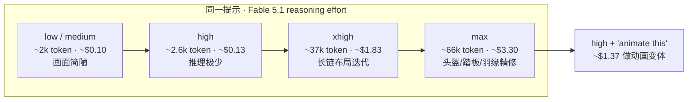

### 结论

Anthropic 发布 **Claude Fable 5.1** 后，Simon Willison 用他熟悉的「鹈鹕骑车」固定提示（`Generate an SVG of a pelican riding a bicycle`）做了对照实验：**同一模型、同一提示，推理档位（reasoning effort）从 low 拉到 max，输出质量与账单呈断崖式分化**。low/medium 约 2 000 token、不到 11 美分，画面简陋；**max 档约 6.6 万 token、近 14 分钟、$3.30**，才画出带蓝帽、鱼筐、踏板对齐的精细 SVG。对工程师来说，这比官方 Science benchmark 更直接：**Fable 5.1 不能关推理，但你可以选「花多少钱想多久」**。

### 要点

- **Fable 5.1 有五档推理，且无法完全关闭。** 档位为 low、medium、high、xhigh、max。与早期模型不同，这里没有「零推理」选项——即使用 low，底层仍可能消耗推理 token（Claude 的 output token 计数包含推理部分）。

- **low/medium 看似「没推理」，实则成本差不多。** 两档均无可见推理摘要，各约 1 998 / 1 977 output token，耗时约 24 秒、花费约 10 美分，鹈鹕造型几乎无差别。说明对简单生成任务，**升一档不一定多花钱，但也不一定更好**。

- **high 是「轻推理」甜点区的反面教材。** 约 2 612 token、13 美分，推理摘要仅一句布局规划，画面与 low 几乎一样。若你只开到 high，可能**多付了推理钱却看不到质量跃迁**。

- **xhigh / max 才是「认真画」的分水岭。** xhigh：约 3.7 万 token、近 8 分钟、**$1.83**，开始纠结翅膀弧度、鹈鹕与车架比例；max：约 6.6 万 token、近 14 分钟、**$3.30**，出现头盔与喙的位置碰撞检测、辐条 vent 线是否出界等细节迭代——这是长链「想 → 改 → 再检查」的典型轨迹。

- **鹈鹕 benchmark 已不能代表综合能力，但适合比同族档位。** Simon 自 2025 年起用该提示观察模型；到 2026 年它与真实工程能力的相关性已减弱，**族内对比、同提示不同 reasoning effort** 仍很有参考价值。官方 Terminal-Bench-Science 0.1 上 Fable 5.1 从 24.7% 涨到 52.6%，那是另一类任务；**日常选型要看你的任务更像「快答」还是「长想」**。

- **二次加工可以省一点 max 的钱。** HN 有人要动画版；Simon 把 max 档 SVG 管道进 high 档：`llm logs -cx | llm -m claude-fable-5.1 -s 'animate this'`，约 2.6 万 output token、**$1.37**，得到可播放的动画 SVG——**重活用 max 生成底稿，轻量变体用低档跟进**。

### 怎么做

1. **把 reasoning effort 当成显式参数，写进脚本或 Agent 配置。** 调用 Anthropic API 或 `llm` CLI 时，不要只改模型名到 `claude-fable-5.1` 就完事；为「格式化、补全、小改」设 **low/medium**，为「架构草图、复杂 SVG/前端、多轮自修」预留 **xhigh/max**，并在团队文档里写清默认档。

2. **用固定探针任务标定账单。** 选一条你们常做的代表性提示（代码生成、数据清洗、UI 片段均可），对 low / high / max 各跑一遍，记录 **output token（含推理）、耗时、美元成本、主观可用性**。Simon 的鹈鹕就是模板——不必真的画鸟，关键是**同一输入下的档位曲线**。

3. **长任务开 max 前先问：能否拆步。** max 档 14 分钟、$3 画一张 SVG 在演示里成立，但若你的 CI 或聊天产品默认 max，账单会失控。能拆成「high 出骨架 + medium 填细节」时，往往比单次 max 便宜。

4. **管道复用已有高质量输出。** 需要「在成品上加动画/改配色/换文案」时，像 Simon 一样把上一轮日志或文件 stdin 进低档模型，提示词尽量短（如 `animate this`），避免为变体再付一遍 max。

5. **记录推理轨迹便于排错。** Simon 修了 `llm-anthropic` 里推理 trace 未正确落盘的问题；若你自建观测，应能在日志里看到「模型在纠结什么」——当 high 与 max 画质无差但 token 差一个数量级时，trace 能解释钱花在哪。

### 关键图表

*档位越高，推理 token 与耗时陡增；重底稿用 max，轻量变体可管道到低档——避免「默认高档」烧预算*
