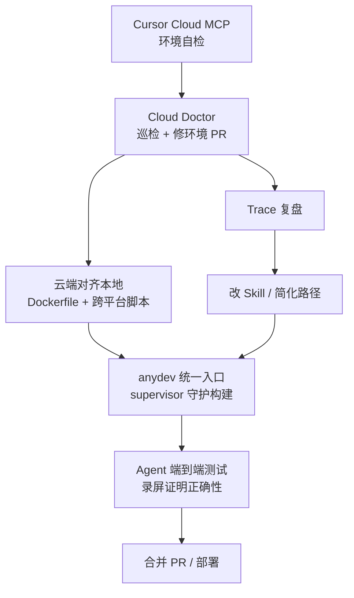

### 结论

Cursor 让云 Agent 拥有自己的虚拟机后，发现瓶颈不在模型，而在**开发环境是否能让 Agent 独立跑通、测通代码**。他们把环境当成独立产品来打磨：云端对齐本地、命令足够简单、环境能自我诊断修复。结果是 Cursor 单体仓库里，云 Agent 合并的 PR 占比从去年 12 月约一成涨到如今过半——工程师常可直接合并云 Agent 的改动，甚至不必本地 checkout。

### 要点

- **环境用户是 Agent，不是人。** 单体仓库要能让 Agent 在没有「口口相传」的前提下启动服务、跑测试。本地 Mac 与云端 Ubuntu 不一致时，要把 Dockerfile、安装脚本做成跨平台；否则 Agent 在云上反复踩环境坑，浪费 token 和时间。

- **Skill 写命令不够，命令本身要简单。** Cursor 曾为各子系统写 Skill，但构建命令带隐藏坑、要多步串联时，文档只能边际改善。他们做了 **anydev** CLI：一条入口启动全部服务，常用脚本也走 anydev，子命令带 `--help`；另有 **supervisor** 守护长时构建，模型不必盯着进程是否挂掉。

- **有电脑才能端到端验改动。** 环境跑通后，云 Agent 配合 computer use、`recordScreen` 等能力，能自测 UI/流程并把录屏发到 Slack 或 PR。很多修 bug 的任务，Reviewer 看演示即可合并，不必自己拉分支。

- **环境会变，需要自愈。** 依赖、密钥、出口策略随时变化。Cursor 建了 **Cursor Cloud MCP**（动态可发现工具，改接口不必重编 Agent 循环），让 Agent 自查环境故障；**Cloud Doctor** 定期巡检、区分偶发与真问题、做根因分析，高置信度时直接开 PR 修环境。

- **还要优化「Agent 体验」。** 即使环境健康，Agent 也可能走错 Skill、走弯路。Cloud Doctor 也会读 trace，找出误导性 Skill、慢路径，然后改 Skill、简化流程或调环境——形成「Agent 用的 devex」持续改进闭环。

### 怎么做

若你想让云 Agent（Cursor Cloud Agents 或自建远程 Agent）真正产出可合并代码，可按 Cursor 的三问自检，并落地下面几步：

1. **对齐本地与云端。** 列出开发者本地必备：系统包、Node/Go 版本、私有依赖、环境变量。用 Dockerfile 或 devcontainer 固化基线镜像；Mac/Linux 差异（路径、脚本）显式处理，别让 Agent 在 VM 里试错。

2. **把复杂 devex 收成一条入口。** 不要指望 Agent 记住 `pnpm -F xxx build --flag` 组合。仿 anydev：统一 `start` / `test` / `lint` 子命令，每个带 `--help`；长时任务交给 supervisor，失败自动重试或明确报错。

3. **写 Skill，但先简化命令再写 Skill。** Skill 应描述「调用 anydev 的哪条子命令」，而不是复制粘贴十行 shell。命令简单后，Skill 才有用。

4. **给 Agent 与开发者同等的工具与数据。** 测试数据库、fixture、内部 API mock、CI 同款 linter——缺一样，Agent 只能改代码却无法自证正确。

5. **规划密钥与安全。** 需要密钥时：网络出口限制、Git 走 scoped/代理、提交与 commit message 扫密钥、工具结果里脱敏（Agent 即使想读也读不到明文）。安全到位，团队才愿意把真实 secret 注入云环境。

6. **加可观测与自愈。** MCP 或内部 API 暴露「环境健康检查」；定期任务（Cloud Doctor 思路）跑检查、记历史、对稳定失败开修复 PR。Agent trace 定期审：哪条 Skill 总误导、哪条路径总是慢。

7. **验收三问（原文自检清单）。** ① Agent 能否拿到开发者同款的工具与数据？② 能否找到描述真实工作流的 Skill？③ 能否测试并验证核心业务流程？三问都过，再谈扩大云 Agent 使用范围。

### 关键图表

*环境产品是主线：跑通 → 自测 → 合并；MCP + Cloud Doctor 让环境自愈，trace 复盘让下一轮 Agent 更少踩坑*
