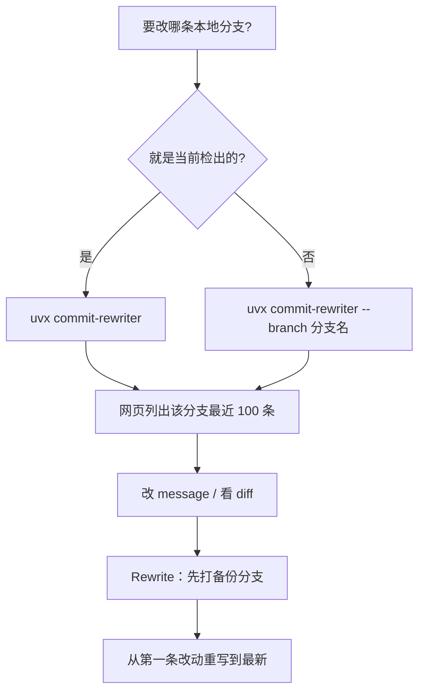

### 结论

[commit-rewriter 0.2](https://pypi.org/project/commit-rewriter/) 只加了一件事，但正好补上 0.1 的坑：**不再假定仓库里一定有 `main` / `master`。** Simon 在 [9 月 24 日的发布说明](https://simonwillison.net/2026/Sep/24/commit-rewriter) 里写明：用 `uvx commit-rewriter --branch other` 就能对着另一条本地分支改提交说明。对刚用 Agent 在 feature 分支上堆了一串套话 message、又还没合并进默认分支的人，这才是日常路径。

### 要点

- **0.1 默认只认默认分支。** 有人在 [#3](https://github.com/simonw/commit-rewriter/issues/3) 反馈：仓库里根本没有 `main` / `master`，工具就没法用。0.2 的回答是两层：启动时默认跟着**当时检出的分支**；需要改别的本地分支时，显式传 `--branch`。

- **默认改「当前分支能走到的最近 100 条」。** 官方 README 写的是：服务器启动时，编辑当前检出分支上可达的最新 100 条提交。不是整仓历史，也不是「相对 `main` 的独有提交」。你看到的列表，就是这条分支 tip 往回数的那一段。

- **`--branch` 省掉「先 checkout 再开工具」。** 你人还停在 `main`，也能写 `uvx commit-rewriter . --branch my-feature`。整理 Agent 刚写完、还没准备合并的功能分支时，不必把工作区切走。

- **提交后的安全网没变。** 网页里点 Rewrite 时，工具仍会先打一条备份分支，再从你改过的第一条重写到最新。改 message 会换哈希——共享远程上别人已经拉走过的历史，不要硬推。

- **本机网页，默认 `127.0.0.1:8000`。** 和 0.1 一样用 `uvx` 临时拉包；端口冲突时加 `-p/--port 8002`。界面仍是卡片改字、按说明 / 作者 / 哈希搜索、展开 formatted diff。

### 怎么做

1. **先确认要改的是哪条本地分支。** `git branch --list` 看名字。没有 `main` 也没关系：停在当前分支直接开工具，或把目标名传给 `--branch`。远程跟踪分支要先 `git fetch` 再在本地有对应分支。

2. **0.2 启动**（已在仓库目录可省略路径）：

```bash
uvx commit-rewriter --branch my-feature
# 或指定仓库路径、换端口
uvx commit-rewriter /path/to/repo --branch my-feature -p 8002
```

3. **在浏览器里按卡片改。** 私有 issue 号、Agent 套话、内部代号都改掉。不确定是不是那次提交时，展开「View full formatted diff」。还不想动历史，用 Discard drafts。

4. **点 Rewrite 前记下备份分支名。** 工具会先备份当前状态，再从第一条被改的提交重写到 HEAD。回退回到那条备份分支，不要在 reflog 里碰运气。

5. **只在「还没人基于这些提交继续干活」时推送。** 未公开的整理分支、即将发布的安全补丁适合这么做。别人已经拉走的共享 `main`，改 message 等于强迫所有人变基；那种情况用发布说明或 `git notes`，不要重写。

### 关键图表



*0.2 的增量很短：默认跟当前分支；要改别的本地分支，加 `--branch`，不必先 checkout*
