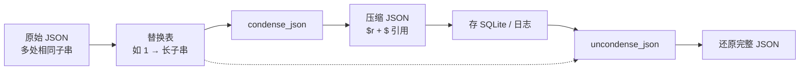

### 结论

LLM 应用里，日志、上下文快照常常是嵌套 JSON，同一段提示词或工具输出会在多处重复出现，直接存 SQLite 或打日志会浪费空间。Simon Willison 发布的 **condense-json 1.0** 用一张「替换表 + 可逆编码」把重复子串抽出去：扫描 JSON 里与替换表匹配的字符串或子串，改成 `{"$r": ...}` 引用；需要原文时再 `uncondense_json` 还原。他在 LLM 生成的 SQLite 日志里已落地使用。

### 要点

- **问题不是「整段 JSON 相同」，而是「子串重复」。** 嵌套结构里，同一句提示、同一段错误信息可能出现在多个字段或数组元素中。gzip 能压整体，但结构化存储时你往往仍要按 JSON 查询；condense-json 在保持 JSON 结构可读的前提下，专门对付这种局部重复。

- **替换表是显式字典，键是短 ID。** 例如 `{"1": "with foxes in it"}` 表示 ID `1` 对应这段子串。库会扫描输入 JSON 中所有字符串值，若包含替换表里的内容，就把匹配部分换成 `{"$r": ["前缀", {"$": "1"}, "后缀"]}` 这种形式——前缀、后缀仍保留明文，只有重复段变成引用。

- **`{"$r": ...}` 是可逆标记，不是随意约定。** `$r` 表示「这一段是由替换拼接出来的」；`{"$": "1"}` 指向替换表里的键。`condense_json` 编码、`uncondense_json` 解码，往返不丢信息。注意：只有出现在替换表里的子串才会被替换，未登记的重复不会自动发现。

- **1.0 代表「可依赖」，不是功能大爆炸。** 库已维护约一年半，作者趁 1.0 做了些不破坏兼容的修复。对工程侧来说，意味着可以放心 pin 版本用在生产日志管线里。

- **典型场景：LLM 管线日志。** 一次对话可能把 system prompt、工具 schema、中间结果多次写入不同字段；先建替换表（把长且重复的片段登记为 ID），再 condense 后入库，体积明显下降。Simon 在 LLM 相关 SQLite 日志的 PR #1586 里持续迭代这套做法。

### 怎么做

1. **安装**（PyPI 包名 `condense-json`）：

```bash
pip install condense-json
```

2. **准备替换表**：列出你预期会反复出现、且值得抽离的子串，用短键编号。键越短、重复越多，节省越明显。

```python
replacements = {"1": "with foxes in it"}
```

3. **压缩**：传入原始 JSON（dict/list）和替换表。

```python
from condense_json import condense_json

condensed = condense_json(input_json, replacements)
```

输出中，原字符串 `This is a string with foxes in it` 会变成类似 `{"$r": ["This is a string ", {"$": "1"}]}` 的结构；数组里第二处重复也会用同一个 `{"$": "1"}` 引用。

4. **还原**：读库或下游消费前，用同一替换表解码。

```python
from condense_json import uncondense_json

original = uncondense_json(condensed, replacements)
```

替换表必须与压缩时一致；丢了替换表，引用段无法还原。

5. **接入日志管线时的习惯**：
   - 在写入 SQLite / 对象存储**之前** condense，读出后 uncondense。
   - 替换表可单独存一份（或版本化），与压缩后的 JSON 成对保存。
   - 先统计哪些字段重复率高（长 prompt、重复 error message），再决定登记哪些子串——盲目登记短串可能反而增大结构开销。

### 关键图表



*同一替换表贯穿压缩与还原；重复子串只存一次，多处用 $ 引用*
