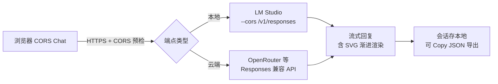

### 结论

Simon Willison 发布 [CORS Chat](https://tools.simonwillison.net/cors-chat)：一个**纯浏览器**聊天界面，用来调试任何支持 **CORS 头**、且兼容 **OpenAI Responses API** 的推理端点。他用它测 M5 MacBook 和 NVIDIA DGX Spark 上 LM Studio 跑的 Qwen 3.8 27B，也验证过 OpenRouter——**不用写 curl、不用搭后端代理**，配置 Base URL 和可选 Header 就能在网页里发消息、看流式回复。

### 要点

- **CORS 是浏览器调本地模型的门槛。** 浏览器默认禁止网页 JS 跨域请求（比如 `localhost:1234`）。LM Studio 需加 `--cors` 开关，服务端才会返回允许浏览器访问的 CORS 头；没有它，再强的本地模型网页也调不通。

- **Responses API 不是老的 `/v1/chat/completions`。** OpenAI 较新的对话接口，支持 reasoning effort、verbosity、工具调用等字段。CORS Chat 按 Responses 规范发请求，并调用 `/models` 拉模型列表——所以端点必须实现这套协议（LM Studio 新版本、OpenRouter 等已支持）。

- **配置存在浏览器本地，可分享 URL fragment。** Base URL、自定义 HTTP Header、会话列表都保存在本机；Header 值会编码进 URL 的 `#` 片段（不会随 HTTP 发出），但**含 API Key 的链接别随便分享**。

- **多会话 + 可调推理参数。** 每个会话可单独设 system message、reasoning effort（none 到 max）、verbosity、temperature、max output tokens 等；改完即固定在该会话的每次请求里。

- **流式 SVG 渐进渲染是小亮点。** 模型在回复里生成 SVG 图片时，工具会在 token 还在流式输出时就逐步把图画出来，不用等整段回复结束——调试「模型画图」类能力时很直观。

### 怎么做

1. **启动带 CORS 的本地服务。** LM Studio 示例：`lms server start --cors`（或 UI 里等价选项），记下 API 根地址，通常是 `http://127.0.0.1:1234/v1`。

2. **打开** [tools.simonwillison.net/cors-chat](https://tools.simonwillison.net/cors-chat)，在 Endpoint configuration 里填 Base URL，需要的话加 `Authorization: Bearer …` 等 Extra HTTP headers，点 Save & connect。

3. **New conversation** 里可选 system message，按需调 Reasoning effort / verbosity / temperature，Start conversation 后开始聊天；Enter 发送，Shift+Enter 换行。

4. **测云端端点**（如 OpenRouter）：Base URL 换成 `https://openrouter.ai/api/v1`，Header 里放对应 API Key；流程与本地相同。

5. **导出与排错。** 用 Copy JSON 把整段对话拷出来做回归测试；若连不上，先在浏览器 Network 面板看是否被 CORS 拦截——多数是服务端未开 CORS 或 URL 少写了 `/v1`。

### 关键图表

*浏览器直连推理端点的最短路径——前提是服务端开放 CORS 并实现 Responses 协议*
