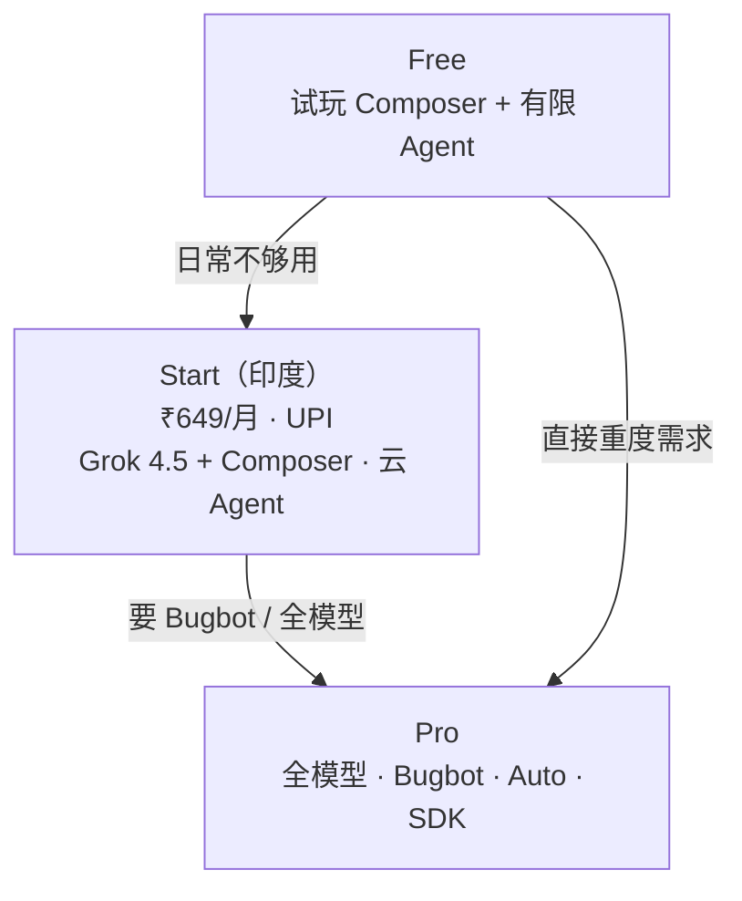

### 结论

Cursor 在印度上线 **Start** 套餐：每月 **₹649**（含税），支持 **UPI** 等本地支付，提供 Grok 4.5、Composer 及比 Free 更多的 Agent 用量。它卡在 Free 与 Pro 中间——够日常写代码和跑云 Agent，需要全模型、Bugbot、Auto 时再升 Pro。对中国读者而言，这是 Cursor 按地区定价与产品分层的样板：用低价档留住高频用户，用 Pro 承接重度需求。

### 要点

- **印度已是 Cursor 第三大市场。** 过去一年用户量增至约 300 万，人均 Agent 请求量全球最高——说明当地开发者不是「试用一下」，而是把 Agent 嵌进日常开发流程。

- **Start 解决的是「能付、够用」。** 长期呼声是本地定价和 UPI。Start 用 INR 标价、月付，比 Free 多模型权限与 Agent 次数，又不必立刻买 Pro 的全套能力。

- **Start 含什么。** Grok 4.5（Cursor 侧最强模型）与 Composer（性价比编码模型）；桌面、Web、iOS、CLI 上比 Free 更多的 Agent 请求；常驻 **云 Agent**（后台构建、测试、开 PR）；iOS 上启停 Agent；插件、MCP、hooks、skills 等扩展能力。

- **三档怎么选。** **Free**：零门槛试 Composer + 有限本地 Agent。**Start**：日常构建，核心模型 + 云 Agent。**Pro**：各实验室顶尖模型、Bugbot、Auto、Automations、Cursor SDK，以及超额按需计费。Start 用户需要更多时，可在控制台直接升档。

- **云 Agent 是 Start 的差异化之一。** 长任务在云端跑完测试、开 PR，你继续写别的代码——对「每天都要用 Agent」的开发者，比只靠本机 Agent 次数更实用。

### 怎么做

**若你在印度：**

1. 打开 [cursor.com/pricing](https://cursor.com/pricing) 查看 Start 与 Free、Pro 的对比表。
2. **已有 Free 账号**：在 Dashboard 里升级至 Start，用 UPI、信用卡或借记卡月付 ₹649。
3. **新用户**：在 [cursor.com/signup](https://cursor.com/signup) 注册时直接选 Start 计划。
4. 日常用 Composer 写代码、用 Grok 4.5 处理复杂推理；长任务交给云 Agent，手机 iOS 端可启停任务，回到桌面继续。
5. 若需要 Bugbot、Auto、全模型或 SDK，再升 Pro——不必一开始就买最高档。

**若你不在印度（参考产品逻辑）：**

1. 认清自己处在 **试玩（Free）→ 日常（Start 类档位）→ 重度（Pro）** 哪一段，避免为用不到的能力付费。
2. 关注官方是否在其他地区推出类似本地定价；分地区套餐往往先于全球统一价上线。
3. 评估云 Agent + 多端（CLI、iOS）是否已覆盖你的工作流——Start 档的价值在「每天都用」，而非偶尔点一次 Agent。

### 关键图表

*Free、Start、Pro 三档定位：试玩 → 日常构建 → 全能力重度使用*
