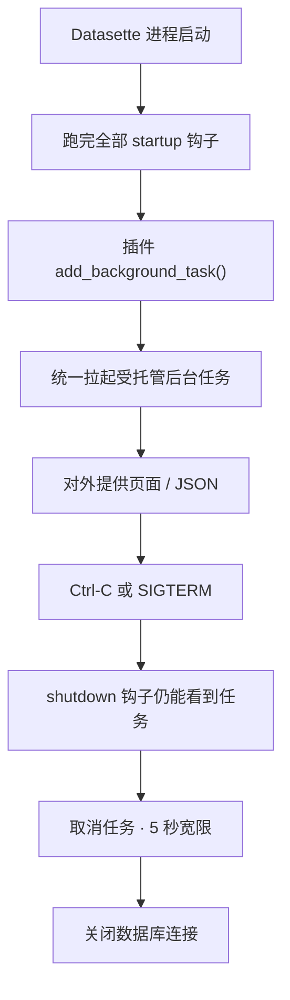

### 结论

Simon Willison 发布 **[Datasette 1.0a40](https://github.com/simonw/datasette/releases/tag/1.0a40)**：这是把 SQLite 数据库变成可浏览、可发布网站的开源工具，目前仍在 1.0 预发布。这次和稳定线 **[0.65.5](https://simonwillison.net/2026/Sep/16/datasette-2/)** 同一天出，核心是同一条安全补丁——请求里的表名如果带尾随换行，可能绕过**表级权限**、读到本不该看的行。公开网上用表权限保护私有数据的实例应立刻升级。同一版还给插件补上了受托管的后台任务 API，并把内部 HTTP 客户端迁到 **httpx2**。

### 要点

- **先分清两条发行线。** `0.65.x` 是当前稳定版；`1.0a*` 是冲 1.0 正式版的 alpha。Simon 原文写明：1.0a40 带的是「和 0.65.5 一样的安全修复」，外加新功能和一批为 1.0 清 issue 时修掉的 bug。跑稳定线的人装 `0.65.5` 即可，不必为了补丁跳进 alpha。

- **漏洞是「权限检查的名字」和「真正执行的表」对不上。** 公告 [GHSA-h547-rmjf-5m2m](https://github.com/simonw/datasette/security/advisories/GHSA-h547-rmjf-5m2m) 写的是：请求的表名末尾多一个换行时，Datasette 可能按带换行的名字做授权，SQLite 却把它当成普通表名。受影响版本是 `<= 0.65.4` 以及 `1.0a0`–`1.0a39`；补丁版是 `0.65.5` 和 `1.0a40`。即使关掉任意 SQL，只靠表权限挡私有行的站点也中招。官方临时办法是：含私有表的数据库，用**库级权限**限制到可信用户——只关 SQL、只关建表都不够。

- **插件后台任务终于有官方入口。** 新 API 是 [`datasette.add_background_task()`](https://docs.datasette.io/en/latest/internals.html#datasette-add-background-task)（感谢 [Alex Garcia](https://alexgarcia.xyz/)）：在 `startup` 钩子里登记一个 `async` 函数，**等所有 startup 钩子跑完**再启动，进程退出时先跑新的 `shutdown(datasette)` 钩子，再给任务 5 秒宽限期取消。`/-/tasks` 列出任务状态，需要 `permissions-debug` 权限，风格类似已有的 `/-/threads`。发行说明点名：以前靠 `asgi_wrapper` 在「第一个请求」里偷偷起后台任务的插件，应迁到这个 API；`datasette-cron` 和 `datasette-enrichments` 正在迁。

- **内部客户端从 httpx 换成 httpx2。** [httpx2](https://github.com/pydantic/httpx2) 是 Pydantic 接手维护的 httpx 续作。`datasette.client.get()` 这类对自身 JSON API 的内部调用，返回的现在是 `httpx2.Response`。插件如果写了 `isinstance(..., httpx.Response)` 要改；如果用了 httpx 却没在 `pyproject.toml` / `setup.py` 里声明依赖，现在要显式加上，或改用 httpx2。对外行为没变，变的是类型和依赖图。

- **其余是冲 1.0 的小修，但能碰到日常页面。** 新的 POST 计数接口给「count all」按钮用；列 facet 对 `column__exact=` 也能点「去掉筛选」；`request.headers` 大小写不敏感了；CSV 流式导出 SQL 视图时不再把第二页结果循环到体积上限；数值比较筛选能正确处理小数、负数和科学计数法。这些大多来自给 1.0 稳定版清 backlog，不是新功能秀。

### 怎么做

面向在跑 Datasette、或给它写插件的工程师：

1. **先看自己装的是哪条线，再升级。** 稳定线：`pip install -U 'datasette==0.65.5'`（或你们锁文件里的等价写法）。已经跟 1.0 alpha 的：升到 `1.0a40`。公开互联网、又用认证插件挡私有表的实例，把这当成安全发布，不要等下次常规升级。

2. **升级后用权限页面抽查私有表。** 用一个不该看到该表的账号打开表页 / JSON / CSV：应继续 403。不要靠「关了 SQL 查询框」当补丁；公告写明任意 SQL 关闭并不能挡住这条。临时加固：对含私有表的数据库改成库级拒绝匿名，而不是只在单表上 deny。

3. **写插件时，后台循环改走 `add_background_task()`。** 在 `startup(datasette)` 里登记，例如轮询外部源、跑 enrichments。函数签名是 `async def job(datasette): ...`；`name=` 会出现在 `/-/threads` 风格的 `/-/tasks` 里。需要在关服前刷盘或停队列时，实现 `shutdown(datasette)`——它在任务被取消、数据库连接关闭之前调用。`datasette serve --get` 这种一次性 CLI **不会**拉起后台任务，测试里要自己 `await datasette.start_background_tasks()`。

4. **不要再靠 `asgi_wrapper` 的「第一个请求」启动长任务。** 1.0a40 保证 `asgi_wrapper` 中间件一定在 startup 完成之后才接到请求。以前那个「等有人点进来才 `create_task`」的技巧，时序已经变了，也没有关闭时的 5 秒宽限。

5. **插件依赖和类型检查跟着 httpx2 改。** 搜一遍 `httpx.Response` / `httpx.AsyncClient`。测内部 API 用 `datasette.client`，不要自己 `AsyncClient(app=app)`（1.0 升级指南里这条已经单独写过）。CI 镜像里如果以前「碰巧」装着 httpx，现在要写进依赖。

### 关键图表

*后台任务不再绑在「第一个 HTTP 请求」上：startup 全部结束后才启动，优雅退出时先通知插件再取消*
