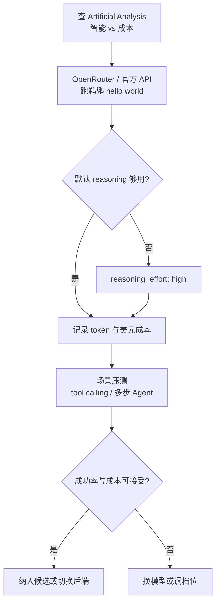

### 结论

DeepSeek 发布 **V4 Flash 0731**，主打增强的 **Agent 能力**（多步推理、工具调用等）。Artificial Analysis 把它排在 428B 的 MiniMax M3 前面，输入 $0.14/百万 token、输出 $0.27/百万 token，在「智能指数 vs 单次任务成本」散点图里落在左上角 **性价比最优区**。Simon Willison 用 OpenRouter 实测：默认 reasoning 档位画「鹈鹕骑车」翻车，把 `reasoning_effort` 调到 `high` 后质量明显提升——接入时别只看榜单，要按你的任务档位测一遍。

### 要点

- **参数量不等于体感能力。** V4 Flash 有 304B 参数、Hugging Face 权重约 167GB，但 benchmark 表现超过更大的 MiniMax M3（428B）。选型时看第三方 **Intelligence Index** 和自家场景测试，别被参数数字唬住。

- **当前可能是「每美元最聪明」的 API 模型之一。** 同档或更低智能的模型（MiniMax-M3、Kimi K3 low、GLM-5.1 等）单次任务成本往往是它的十倍；能压过它的（Grok 4.5、Gemini 3.6 Flash、Claude Opus 5 等）则远在 $0.4–$3/任务。做批量 Agent、脚本调用时，这条成本曲线值得单独记账。

- **reasoning 档位会 dramatically 改变输出质量。** DeepSeek V4 Flash 支持可调 **推理强度（reasoning effort）**。Simon 用同一提示「画鹈鹕骑车 SVG」：默认档车轮脱节、车架散架；`reasoning_effort high` 后鹈鹕握把、踩踏板、鱼在喙里，几何基本可用。多步任务若结果飘忽，先查有没有「低档省 token」在拖后腿。

- **「鹈鹕骑车」仍是最快的 hello world，但不能替代 Agent 压测。** 它帮你验证鉴权、计费、输出格式是否走通；长对话 tool calling、失败重试还得用你自己的集成测试补一遍。

- **OpenRouter 是 Simon 的接入路径。** 模型 ID 为 `openrouter/deepseek/deepseek-v4-flash-0731`；若你用 `llm` CLI，加 `-o reasoning_effort high` 即可对比档位差异。

### 怎么做

1. **先查榜单再算账单。** 打开 [Artificial Analysis](https://artificialanalysis.ai/) 看 Intelligence Index vs Cost；把 V4 Flash 与你现在在用的模型放在同一张成本表里，按日均调用量估月费。

2. **用固定提示跑通 API。** 例如 Simon 的 `llm` 命令：
   ```bash
   llm -m openrouter/deepseek/deepseek-v4-flash-0731 -t pelican \
     'Generate an SVG of a pelican riding a bicycle' \
     -o reasoning_effort high
   ```
   默认档和 `high` 各跑一遍，对比 output token、推理 token（若有）和美元成本。

3. **Agent 场景务必开够 reasoning。** 若任务涉及规划、多工具串联或复杂 SVG/代码生成，把 `reasoning_effort` 设为 `high`（或 provider 文档里的等价档位），再观察成功率；别用默认档的结论否定整个模型。

4. **记录 usage 字段。** 保存 `prompt_tokens`、`completion_tokens` 及单独的 reasoning token（若 API 返回），方便和 Kimi K3、GPT-5.6 等「推理单独计费」的模型横向对比。

5. **上榜之后补你自己的压测。** 鹈鹕通过后，跑与你产品相关的：多轮 tool calling、JSON 结构化输出、超时重试。V4 Flash 的 Agent 增强是发布卖点，只有集成测试能验证是否值得替换现有后端。

### 关键图表



*从榜单到档位实测——高性价比模型也要按任务开够推理强度*
