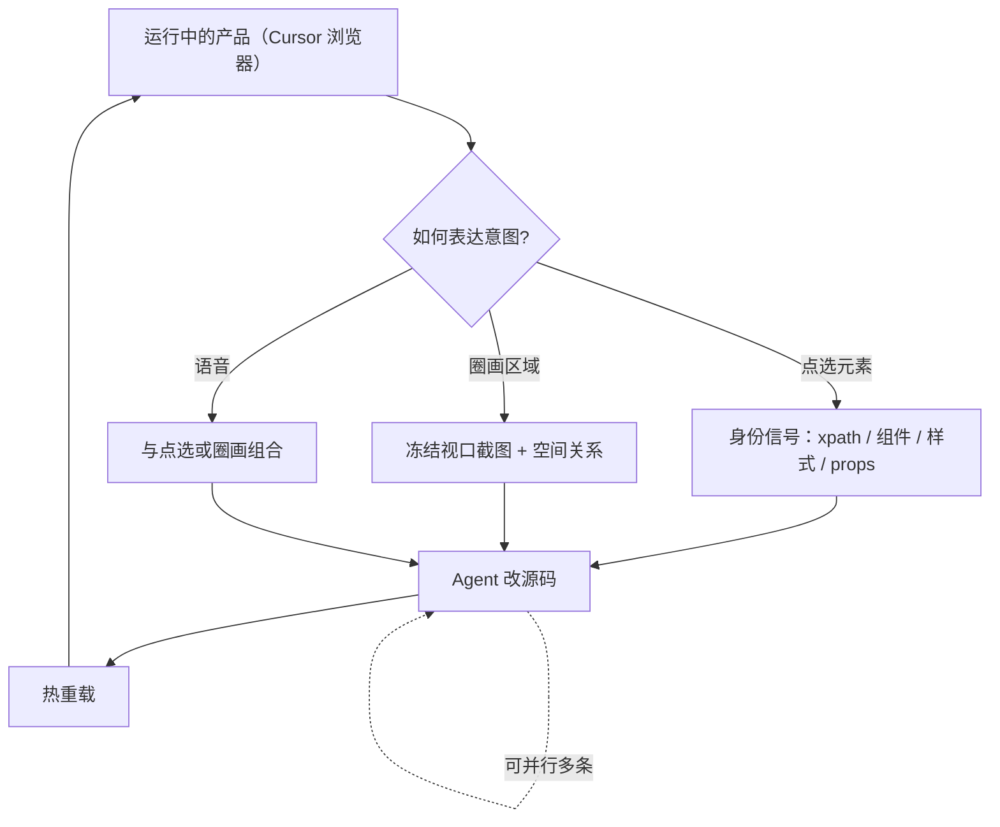

### 结论

Cursor **Design Mode** 把「你看到的界面」和「Agent 要改的代码」拉近：在 Cursor 内置浏览器里，对着**正在运行的产品**点元素、圈区域、或语音说需求，指令不再只是一句话，而是带上选中元素、背后组件、布局关系和页面截图。改 UI 时不必在聊天框里反复描述「左边那个按钮」，发现哪里不对就指哪里，Agent 在底下改代码，页面热重载后你继续下一轮——**观察和编辑的循环更短**。

### 要点

- **聊天适合逻辑，UI 工作是空间性的。** 设计师、PM、前端常靠标注指元素、区域或页面状态沟通。Design Mode 让你在**产品上下文里**编辑，不用离开运行中的页面去猜 Agent 理解没理解。

- **三种表达意图的方式：点选、圈画、语音。** 单击元素即可针对该元素下指令；在界面上画圈、框选，适合说明「这一片区域」要改什么；语音可和圈画组合，像正常改稿一样口述。新版还加强了定位精度与响应速度。

- **多选用于「元素之间的关系」。** 一次选中两个组件，可以让其中一个对齐另一个、去掉重复内容，或把一组组件一起调整。单句 prompt 很难说清楚「让 A 跟 B 一样」，多选把关系直接放进上下文。

- **圈画会冻结当前视口帧。** 动画或复杂页面里，你在某一帧上标注，Agent 看到的是**你回应时的确切页面状态**，不会和动效错位。适合拥挤区块、局部区域或动效某一瞬间。

- **底层上下文是「身份 + 截图」两路信号。** 点选元素会注入：DOM 路径（xpath）、组件名、属性、**计算后样式**（computed styles）、React **Fiber 树**上的 props 等；同时附一张截图提供空间关系。Agent 既能定位源码，也能理解「它旁边是什么」。

- **可并行发任务，不必等上一改完。** 指着一个元素发一条、再移到别处发下一条，多条编辑可同时跑，便于管理多个子 Agent。官方推荐 **Composer 2.5**——快且擅长界面小改；完成后应用热重载，你在运行产品里立刻验收。

### 怎么做

1. **打开 Agents Window，进入 Design Mode。** 在 Cursor 内置浏览器里跑起你的前端项目（需支持热重载），确保改动能即时反映在页面上。

2. **优先用点选，而不是纯文字描述。** 看到间距不对、颜色偏了，直接点那个元素，用一句话说目标（如「padding 改成 16px」「和右侧卡片对齐」）。比描述「导航栏下面第二个 div」省回合。

3. **关系型修改用多选。** 需要「这个按钮样式跟主按钮一致」「这两块重复了删掉一块」时，选中相关元素再下指令，避免 Agent 猜错对象。

4. **区域模糊时用圈画或语音。** 列表太密、动效卡在某一帧、或一时说不清选哪个节点——在页面上框出区域，或边指边说。圈画附的是冻结帧，动效场景记得在**你要改的那一帧**上标注。

5. **利用并行，但保持任务粒度小。** 改完导航可以继续改页脚，不必等第一条结束；每条指令仍建议**单一、可验收**（一处间距、一个对齐），方便热重载后马上判断对不对。

6. **验收在运行产品里完成。** Agent 改的是代码，你的眼睛看的是页面。一条链改完（组件 → 周围间距 → 邻近组件对齐）再发下一条，比一次塞十个需求更稳。

### 关键图表

*Design Mode 闭环：视觉意图 → 结构化上下文 → 改代码 → 热重载后继续指下一处*
