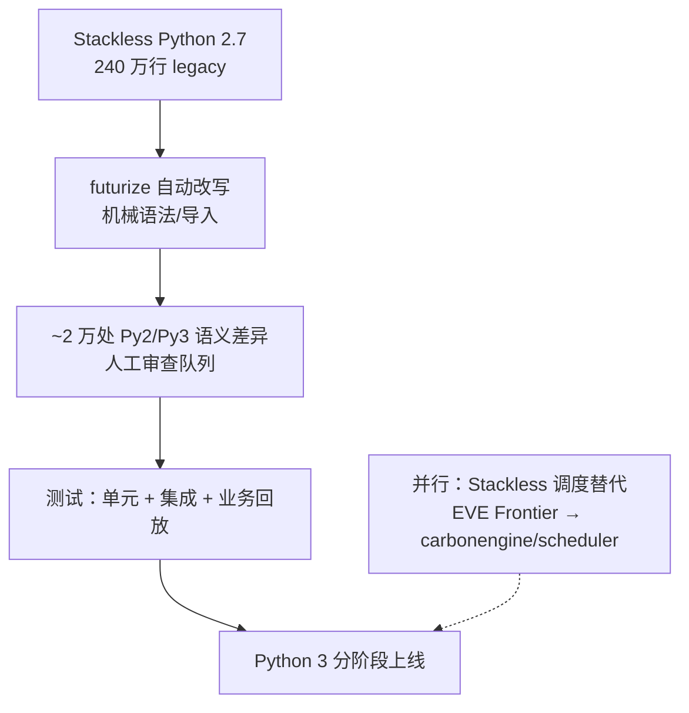

### 结论

《EVE Online》是 Python 大规模落地的经典案例：自 2003 年上线起一直跑 **Stackless Python**（无栈协程版 CPython，适合游戏服务器高并发），2010 年停在 **Stackless Python 2.7** 后再未大版本升级。如今团队正式启动 **Python 3** 迁移——对 **240 万行** 代码跑 `futurize` 自动改写，再人工审查约 **2 万处** Python 2/3 语义不一致。对仍卡在 Py2 或老旧运行时的团队，这是可复制的「自动化打底 + 人工兜底」路线图。

### 要点

- **长跑 legacy 并不罕见。** EVE 已运营超二十年，上次语言大升级是十六年前的 2.7。业务能跑、风险可控时，团队往往推迟迁移；但一旦安全补丁、依赖库、招聘都倒逼升级，债务会一次性放大。

- **`futurize` 是第一步，不是终点。** 它是 `python-future` 项目提供的脚本，用 AST 把常见 Py2 写法改成 Py2/3 兼容或 Py3 写法（如 `print` 语句、`unicode`/`str` 混用）。能批量处理机械差异，但无法覆盖所有语义变化。

- **整数除法是典型「静默翻车点」。** Py2 里 `1 / 2` 结果是 `0`（整数除法）；Py3 里是 `0.5`。游戏经济、坐标、伤害公式里若大量用 `/`，自动工具可能改语法却不改业务意图，必须逐处确认该用 `/` 还是 `//`。

- **约 2 万处需人工审查。** 官方估计 Py2/Py3 行为不同的位置约两万处——比例不高（约 0.8%），但每一处都可能影响线上逻辑。审查重点：除法、字符串/字节边界、`dict.keys()` 等返回视图而非列表、异常语法、`__future__` 未覆盖的库行为。

- **Stackless 替换是另一条线。** 本次公告未说明如何替代 Stackless。CCP 在去年大会上已介绍《Scheduling in Carbon: Leaving Stackless Python Behind》：新作 **EVE Frontier** 的 Carbon 引擎已用开源 **[carbonengine/scheduler](https://github.com/carbonengine/scheduler)** 换掉 Stackless 调度。主游戏迁 Py3 时，协程/任务调度方案可能要单独设计，不能假设「升到 Py3 就自带 Stackless」。

### 怎么做

1. **盘点范围与冻结面。** 列出仓库行数、入口服务、关键依赖是否仍只支持 Py2。EVE 的规模是 240 万行——你的项目可先 `cloc` 或 `git ls-files '*.py' | xargs wc -l` 摸底，再划分子模块分批迁。

2. **在分支上跑 `futurize`。** 安装 `pip install future`，对目标目录执行 `futurize --stage1`（只加 `from __future__ import ...`）再 `--stage2`（安全改写）。每阶段跑完整测试；diff 要进 Code Review，别一次性合并全库。

3. **建「语义差异清单」做定向审查。** 从官方 porting guide 和团队历史 bug 提炼检查项：除法、bytes/str、`range`/`xrange`、`iteritems`、元类、`reload` 等。用静态搜索（如搜 ` / `、`unicode(`）补 `futurize` 漏网之鱼。EVE 的做法是把约 2 万处当工单队列，按模块 owner 分摊。

4. **测试策略要偏业务而非只跑单元测试。** 游戏/金融/计费类代码，集成测试与回放线上流量片段比「绿灯但语义错了」更可靠。Py2/Py3 并行环境（或同一套测试双解释器跑）能尽早暴露除法类问题。

5. **运行时与调度单独评估。** 若依赖 Stackless、gevent 定制 fork 等，先查 Py3 替代方案。可参考 EVE Frontier 的 scheduler 库，或标准 `asyncio`/多进程模型；不要默认「语言升了，协程模型原样保留」。

6. **分阶段上线，保留回滚。** 先非核心服务、再核心路径；特性开关 + 金丝雀。十六年未大升级的系统，风险在「看不见的依赖」，而不是 `print` 语法。

### 关键图表

*迁移主路径是 futurize 打底、人工兜语义；协程/调度（Stackless）需与语言升级分开规划*
