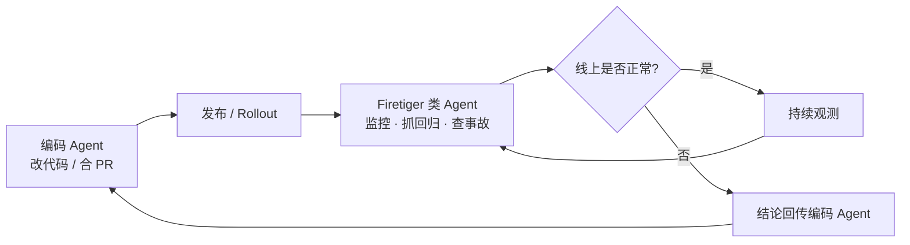

### 结论

Cursor 宣布 Firetiger 团队并入。Firetiger 做的是**上线后的 Agent**：盯发布、抓回归、查事故，再把结论回传给写代码的 Agent。Cursor 的意图很明确——编码 Agent 不能只负责「合 PR」，还要能判断改动在**生产环境**里是否真跑通；写代码与运维观测这两套系统，今后会越走越近。

### 要点

- **Firetiger 管的是「代码写完之后」。** 很多工程时间花在上线、观测、排障上，而不是写 diff。Firetiger 的 Agent 监控 rollout（分批发布）、发现 regression（功能回退/指标变差）、调查 incident（线上事故），并把根因与上下文交给编码 Agent 去修。

- **创始团队偏大规模生产经验。** Rustam Lalkaka、Achille Roussel 曾在 Cloudflare、Twitch、Segment、Twilio 等搭建和运维大型线上系统。Firetiger 2024 年成立，出发点是用 Agent 减掉运维 toil（重复、低价值的值守与手工排查），让生产更稳。

- **编码 Agent 变强后，缺口在「上线后」。** 模型让生成和合并代码更容易，但「安全上线 → 看懂线上行为 → 出事能响应」仍常靠人和独立监控栈。Cursor 认为：能写代码的 Agent，理应也能回答「这次改动在线上好不好」。

- **并入后会融入 Cursor 产品路线图。** 官方提到与 **Cursor Origin**（面向 Agent 时代的 Git 托管）以及即将推出的 **Change Monitors**（盯已部署变更、及时标问题）同属一条线：长期运行、自主、懂上下文的团队级 Agent。

- **对工程师的含义是闭环，不是替代 SRE。** 短期你不会少看监控大盘；中长期 Cursor 想把「改代码 → 发布 → 观测 → 再改」串进同一套 Agent 工作流，减少编码与运维之间的信息断档。

### 怎么做

若你已在用 Cursor 写代码、或团队正在推 Agent 辅助开发，可以按下面思路提前对齐——不必等 Firetiger 功能全量上线：

1. **把「上线后验收」写进 Agent 任务。** 让 Agent 改完代码后，附带：要盯哪些指标、哪些日志/告警、回滚条件是什么。不要只要求「测试通过」，要说明生产里什么叫「正常」。

2. **观测数据要对 Agent 可读。** 编码 Agent 要判断线上行为，需要能访问（或经 MCP/工具封装）部署状态、错误率、trace、最近变更列表。先梳理团队现有的监控、CI/CD、事故记录入口，哪些能安全暴露给 Agent。

3. **区分「写代码 Agent」和「运维 Agent」的职责，但统一上下文。** Firetiger 的模式是运维侧 Agent 调查后把结论交给编码 Agent。你可以在流程上模仿：事故单、回归描述、相关 commit/PR 用同一套链接和摘要格式，避免编码 Agent 从零猜现场。

4. **关注 Cursor 的 Change Monitors 与 Origin。** 若你们用 Cursor 做主力 IDE/Agent，留意官方后续是否提供「部署后自动盯变更」能力；新 Git 托管若与 Agent 深度集成，变更与观测的关联会更顺。

5. **团队规范仍要有人兜底。** Agent 能盯发布、能开调查，合并与发布权限、密钥、生产写操作仍应有人审。把 Agent 当成加速闭环的助手，而不是无人值守的生产开关。

### 关键图表

*目标闭环：写完能发、发了能看、坏了能修——写代码与盯生产不再各干各的*
