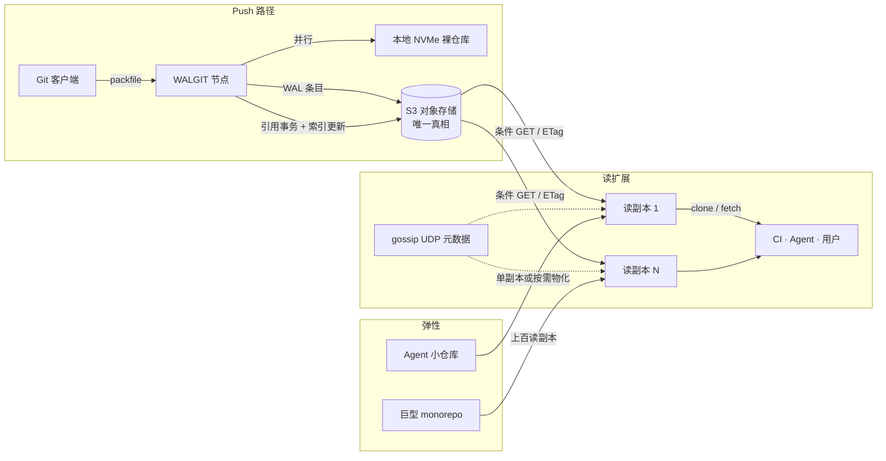

### 结论

托管 Git 仓库远比「磁盘上放一份裸仓库、前面挂 HTTP」难得多：数据以 **packfile**（压缩打包的二进制块）在网络上传输，仓库内部又是 **DAG**（有向无环图，commit→tree→blob 层层指针），读写都伴随大量随机跳转。GitHub 的 **Spokes** 用三副本 + 三阶段提交（3PC）保强一致，撑了十几年，但在 2026 年的巨型 monorepo 与 Agent 海量小仓库面前，副本数「地板太高、天花板太低」。Cursor 的 **Continuity** 把 **写前日志（WAL）** 存进 S3 作为唯一真相，节点本地只保留可重建的 NVMe 缓存，读写副本数可按仓库体量自由伸缩，并承载对外产品 **Origin**。

### 要点

- **分布式设计 ≠ 公司真的去中心化。** Git 为 Linux 内核的多维护者流程而生；多数团队仍依赖单一中心化托管。离线提交、延迟 push 的好处留着，但可用性与扩展性全压在托管方身上。

- **packfile 是托管瓶颈。** push/fetch 传的就是 packfile；服务端虽可自定存储格式，但协议仍要求收发 packfile。大块二进制文件必须能被 Git 快速随机读，简单「HTTP + 单机磁盘」很快触顶。

- **对象级 KV 存储走不通。** 对象用 SHA 寻址，看似适合分布式 KV；但列最近提交要沿 DAG 一步步走，下一步指针只有拿到上一步才知道。每步一次远程往返，延迟爆炸——Google 用 JGit + DHT 试过，日常操作尚可，`git clone` 仍太慢而放弃。

- **分布式文件系统也救不了 GitHub。** 早期试过 NFS、GFS、DRBD：Git 假设本地盘语义（锁、撕裂读等），pack 内对象为省空间随机摆放且大量 delta 压缩，逻辑图遍历还要在 pack 里物理乱逛。网络文件系统无法整库缓存时，性能与可靠性都崩。

- **Spokes 的三条正确选择。** 不动 Git 本身、在 pack 层复制；副本放本地 **NVMe** 裸仓库；**强一致** 复制——Git 客户端 push 后立刻 fetch 读不到会懵，CI 百台 runner 克隆缺 commit 更是灾难。实现上：pack 并行扇出，对更小的 **引用事务**（更新分支指针）跑 3PC 达成共识。

- **Spokes 在 2026 的硬伤。** 3PC 每步等最慢节点：副本越多 push 越慢；巨型 monorepo CI 要上百读副本却推不动。Agent 又造出海量几乎空闲的小仓库，仍被迫三副本才能防丢数据——运维还要维护「哪个仓库在哪台机」的路由表与校验和，仓库是 **宠物** 不是 **牲畜**。

- **Continuity：S3 WAL 为真相，磁盘是暖缓存。** 每次 push 写成 WAL 条目上传 S3，**持久化后才 ack**；可见性靠本地 bare repo 准备引用事务并更新 WAL 索引。无路由表、无外部数据库；缺盘可从 WAL **物化** 仓库。多副本用 gossip UDP 通知 + 读前对 S3 做带 ETag 的条件 GET（304 即已同步），丢包无所谓。Compaction 只在 primary 做，副本从 S3 拉已压实 pack，省 CPU。

### 怎么做

1. **理解 CI 慢有时在托管层，不只在 runner。** monorepo 上百并行 clone/fetch 时，托管侧读副本数与 pack Compaction 节奏直接决定吞吐；换更快 runner 未必根治。

2. **Agent 批量建仓会放大托管成本。** 每个临时仓库若底层仍强制三副本，空闲成本线性上涨。选型托管或自建时，问清「小仓库最少副本数」和「闲置能否回收本地副本」。

3. **强一致对开发体验不是玄学。** push 后立刻 CI、立刻 fetch 是常态；最终一致或副本滞后会在「刚推的 commit 找不到」上显性翻车。评估平台时把这条写进 SLA 心智。

4. **关注 Origin 若你在用 Cursor 企业级托管。** 文章末尾推出的 **Origin** 即 Continuity 产品化：目标是无痛迁移、更高可靠与弹性。内部压测：最多约 100 读副本线性扩展；S3 Standard 约 120 push/s，S3 Express One Zone 超 300 push/s（瓶颈逐步转到 Git 本地 compaction）。

5. **本地仍要管好 pack。** 每次 push/fetch 都会产生 pack；本地 `git gc` / repack 与远端 compaction 是同一类问题。仓库 pack 过多时，连 `git status` 都会变慢——这和云端规模化是同一机理。

### 关键图表

*Continuity 核心：push 先落 S3 WAL 再可见；读副本任意增减，一致性由 S3 校验兜底；大仓扩读、小仓缩副本*
