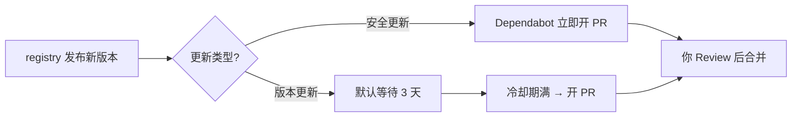

### 结论

GitHub 宣布：**Dependabot 的版本更新 PR 默认会等新包在 registry 上架满 3 天再开**，无需改配置即生效。目的是给社区和维护者留出发现恶意或损坏版本的时间，降低「一发布就合并」带来的供应链风险。安全漏洞修复不受此限制，仍会立即开 PR。

### 要点

- **冷却期（cooldown）是什么。** 依赖包在 npm、PyPI 等 registry 发布新版本后，Dependabot 不马上提 PR，而是等满指定天数再动手。相当于给自动更新加一道「观察窗」，避免你成为坏版本的第一个合并者。

- **只影响版本更新，不影响安全更新。** `version updates`（日常 semver 升级）走 3 天等待；`security updates`（已知漏洞修复）仍即时开 PR。关键补丁不会被故意拖慢。

- **默认开启，全生态生效。** github.com 上所有 Dependabot 支持的包管理器（npm、pip、Cargo 等）都适用；GitHub Enterprise Server 将在 3.23 版本跟进。你没写过 `dependabot.yml` 也会自动带上这条规则。

- **为什么值得关心。** 供应链攻击常见手法是劫持维护者账号、发布带后门的 patch 版本。新版本上线头几小时往往是风险窗口——社区还没反应过来，自动合并流水线可能已经把它拉进生产。

- **你仍可完全掌控。** 觉得 3 天太长、或团队有自己的发布节奏，可以在 `.github/dependabot.yml` 里用 `cooldown` 调天数、按 major/minor/patch 分级，或设 `default-days: 0` 退回旧行为（立刻开 PR）。

### 怎么做

1. **先确认仓库是否用 Dependabot 版本更新。** 看有没有 `.github/dependabot.yml` 且配置了 `updates` 段。只有版本更新 PR 会等 3 天；若你只开了安全更新，行为与以前一致。

2. **观察近期 PR 节奏。** 升级后你会发现：某包 7 月 10 日发布，Dependabot 大约 7 月 13 日才开 PR。合并队列和 CI 排期可按这个延迟做预期，不必以为是 Dependabot「坏了」。

3. **需要自定义时，编辑 `dependabot.yml`：**

```yaml
version: 2
updates:
  - package-ecosystem: npm
    directory: /
    schedule:
      interval: weekly
    cooldown:
      default-days: 7          # 全局等 7 天
      semver-major-days: 14    # major 更谨慎（可选）
      semver-patch-days: 3     # patch 可单独设（可选）
      exclude:                 # 内部包不等（可选）
        - "@myorg/*"
```

4. **想恢复「一有新版就开 PR」：** 在同一 `cooldown` 块里写 `default-days: 0`。显式写 0 表示关闭等待；不写 `cooldown` 则沿用平台默认 3 天。

5. **非安全类的紧急修复要自己跟。** 若某次发布是性能或兼容性热修（不是 CVE），Dependabot 仍会等满冷却期。需要立刻升级时，手动 bump 依赖或临时缩短 `cooldown`，别指望机器人抢跑。

### 关键图表



*版本更新多一道观察窗，安全补丁仍走快车道*
