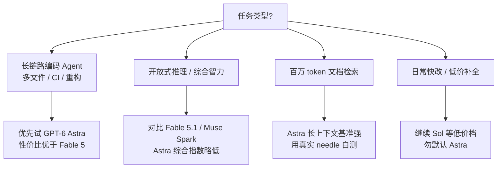

### 结论

OpenAI 发布 **GPT-6 Astra**，定位是直接对标 Anthropic **Claude Fable** 的旗舰推理模型：API 定价同为 **$10/M 输入、$50/M 输出**，将陆续向 Plus/Pro/Business/Enterprise、OpenAI API 与 AWS 开放。官方基准里它在 ARC-AGI、长上下文与安全攻防上很抢眼，但第三方 **Artificial Analysis** 显示综合智力仍略低于 Fable 5.1；真正值得工程师关注的是 **Coding Agent 性价比**——同等分数下成本约为 Fable 5 的一半。选模型时别只看 headline 分数，要按任务类型和 harness 条件对照。

### 要点

- **上线节奏是分阶段，不是一夜全员可用。** 先向少量组织灰度，随后几天覆盖 ChatGPT 付费档与 API。Simon 本人尚未实测，API 模型名预计为 `gpt-6-astra`——集成前先在控制台确认是否已到你的账号。

- **定价锚定在 Fable 档，不是 Sol 档。** $10/$50 per million tokens 与 Claude Fable 5、5.1 对齐，说明 OpenAI 把它当「深度推理旗舰」而非日常快模型。日常小改码仍可用 GPT-5.6 Sol 等低价档，别把 Astra 当默认 autocomplete。

- **ARC-AGI 99.9% 要看 harness，不能当裸分。** 在 2026 年 3 月发布的 ARC-AGI 3 上，Astra 用 OpenAI 自研 **Provider Adapter harness** 做到 99.9%，花费约 $19K；换默认 harness 只有 62.7%、约 $26K。Adapter 会在请求间保留**不透明推理状态**并对长对话做 **compaction（压缩）**，让模型复用先前工作——这说明高分部分来自「评测脚手架 + 模型」组合，复现到你的 Agent 要自建类似状态管理。

- **长上下文是实打实强项。** 在 OpenAI 八针（eight-needle）检索测试里，256K–512K token 区间 100% 命中，512K–1M 仍有 96.3%。若你的场景是「整仓代码 + 长文档一次塞进上下文」，Astra 比多数前代更值得试；仍建议用真实业务文档做 needle test，别只信厂商曲线。

- **安全/逆向任务分数极高，但要联系行业背景。** ExploitBench 100%、ExploitGym 42.4%、SRE-Bench 二进制逆向四次尝试 99.2%，均明显高于 GPT-5.6 Sol。结合近期 Hugging Face 安全事件，这类能力对**防御方红队、漏洞审计**是利器，也意味着接入时要更严地管工具权限与沙箱——能力越强，误用面越大。

- **综合智力未全面碾压 Fable。** Artificial Analysis 的 Intelligence Index 上，Astra 与 Sol 并列约 61 分，比 Fable 5.1（max + fallback）低约 5 分，也落后于 Meta Muse Spark 1.3。即：**不是「所有维度最强」**，而是「在特定赛道（编码 Agent、长上下文）更划算」。

- **编码 Agent 指数领先性价比前沿。** 同 max effort 下，Astra 与 Sol（max）成本相近但指数高约 2 分；达到与 Fable 5 相同分数时，单任务成本不到 Fable 5 的一半。多步改码、CI 修复、跨文件重构这类**长链路编码 Agent** 是优先试用场景。

### 怎么做

1. **等 API 标签落地再改生产路由。**  rollout 完成前，在 OpenAI Playground 或 AWS 控制台搜 `gpt-6-astra`；未出现则继续用现有默认模型，避免脚本写死导致 404。

2. **按任务分叉，不要一刀切升级。** 开放式研究、复杂推理、需要 Fable 级「智力天花板」→ 仍对比 Fable 5.1；**编码 Agent、百万 token 级上下文、安全审计** → 优先给 Astra 开试点配额。

3. **复现高分要抄 harness 思路，不是只换 model 名。** 若你做长时 Agent，参考 Provider Adapter：跨轮保留推理摘要或结构化状态、对历史做 compaction，避免每步从零开始——否则 ARC-AGI 式「裸调 API」分数会大幅缩水。

4. **用第三方指数 + 自有评测双验证。** 把 Artificial Analysis 的 Intelligence / Coding Agent 指数当筛选器，再用你们仓库里 3–5 个固定任务（修 bug、加测试、读长 spec）测 latency、美元/任务、一次通过率。厂商自报 benchmark 与第三方指数经常打架，**以你的工单为准**。

5. **管成本与权限。** Fable 档定价意味着长推理链账单可观；同时拉高 ExploitBench 类能力时，限制 shell、网络、文件写权限，审计工具调用日志。新模型上线首周适合小流量 A/B，别直接把全量 Cursor/CI Agent 切过去。

### 关键图表

*选型看任务而非榜单：Astra 的主战场是编码 Agent 与超长上下文，不是全面替代 Fable*
