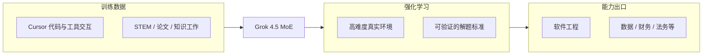

### 结论

Cursor 与 SpaceXAI 联合发布了 **Grok 4.5**——官方称这是 Cursor 侧**第一款不只面向软件工程**的旗舰模型。相对专攻编码的 Composer 2.5，Grok 4.5 用更宽的数据混合（高质量 STEM、论文、知识工作）和**高难度真实环境上的强化学习**，擅长需要**长时间、创造性用工具**的任务：写代码只是其中一类，数据分析、财务、法务等桌面工作也在射程内。个人与团队订阅已纳入首方模型池，**首周双倍用量**。

### 要点

- **MoE 架构 + Cursor 真实交互数据。** Grok 4.5 是 mixture-of-experts 模型，训练纳入**数万亿 token** 的 Cursor 用户与代码库、工具交互数据——既学现有软件形态，也学「开发者怎么工作、Agent 怎么和环境互动」。Composer 2.5 走「编码专家」路线；Grok 4.5 刻意把数据面拉宽。

- **RL 练的是「难题 + 真实环境」。** 强化学习场景横跨软件工程与更广知识工作：调查问题、调工具、从错误恢复、验证结果。题目要难到**连前沿模型也会挂**，否则模型学不到新东西；以前要大量推理的任务变 routine 后，就得换新题——这是持续训新模型的常态。

- **用 Agent 系统规模化造训练环境。** 工程师定义「问题 + 如何验证解」，大规模 Agent 群负责构建、测试、打磨环境——有些环境人工团队要数月；上一代模型（Composer 2.5）也被用来**加速造下一代的训练场**，形成飞轮。

- **产品面已全端上线。** Desktop、Web、iOS、CLI、SDK 可选 Grok 4.5。定价：标准版 **$2/M 输入、$6/M 输出**；快速版 **$4/M 输入、$18/M 输出**。Composer 2.5 **继续保留**——两个不同 weight class，不是替代关系。

- **安全与评测要一起看。** 因模型网络安全能力更强，Cursor 加了新 safeguards。博客也坦诚：Grok 4.5 在 CursorBench 上可能因**训练集误含早期 Cursor 代码快照**而有优势，该数据已剔除，CursorBench 也在做大版本更新——读 benchmark 分数时要带这份上下文。

### 怎么做

1. **按任务选模型，别默认「最新 = 写代码最好」。** 长链路、多工具、跨领域推理（例如既要读论文又要写脚本又要查数据）可试 Grok 4.5；日常 IDE 内快速改码、补全向工作流，Composer 2.5 仍可能是更轻的选择。

2. **关注用量与首周促销。** 订阅内已含 Grok 4.5 额度，首周双倍；按 token 计价时，长上下文、多轮工具调用任务先估成本再开 Agent 长跑。

3. **长任务交给「会恢复」的 Agent 流程。** 模型强项在 investigate → tool → recover → verify；配合 Cursor Agent、Rules、明确验收标准（测试、lint、diff review）比裸聊更能发挥 RL 训出来的习惯。

4. **敏感环境留意新增安全策略。** 更强 cyber 能力意味着产品侧会收紧部分行为；在企业/团队场景确认策略更新，别假设和 Composer 2.5 完全一致。

5. **benchmark 当参考不当真理。** 第三方 SWE-Bench、Terminal-Bench 与 Cursor 自报分数混排时，注意 Grok 4.5 与 Cursor 生态的特殊关系；选型最终以你自己的 repo 和任务类型为准。

### 关键图表

*宽数据打底 + 难题环境 RL → 长时、多工具、跨领域任务；与专攻编码的 Composer 2.5 形成互补产品线*
