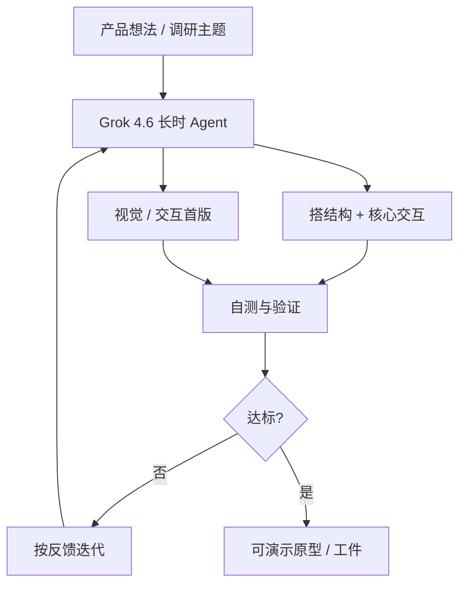

### 结论

Cursor 与 SpaceXAI 联合发布 **Grok 4.6**，在 4.5 的宽知识工作基础上，重点强化**长时 Agent** 与**交互、视觉类项目**。模型能在调研、跨代码库分析、把产品想法落成可用原型等**多步任务**里持续跟进，而不是几步就断档。官方称其在多项 Agent 编码与知识工作基准上达到前沿水平，综合指数与 GPT-5.6 Sol 持平。已在 Cursor 与 Grok Build 上线，**首周订阅内双倍用量**。

### 要点

- **长轨迹是核心卖点。** 「长时 Agent」指模型在几十步工具调用、多轮反馈里仍能保持目标一致——研究陌生领域、搭应用骨架、实现核心交互、再按你的反馈迭代，整条链路一次会话内完成，比「写一段函数就停」的短任务模式更吃模型耐力。

- **首版原型明显强于 4.5。** 给定具体产品想法，4.6 往往能在**一轮**里定好信息架构和视觉语言，产出可点的初版；适合「先有一块像样的东西，再在循环里改」的工作流，而不是从空白页一行行抠 UI。

- **长任务里开始自测。** 在更长轨迹上，模型会更主动做**自检与验证**——例如跑测试、核对输出再继续下一步。这对 junior 工程师是利好：Agent 少犯「以为写对了其实没跑过」的低级错，但仍需你定验收标准。

- **训练侧重 Agent 化 RL。** 相对 4.5，4.6 做了更长的补充预训练，并用 4.5 重生 SFT 轨迹（推理强度、Agent 脚手架、STEM/软工/知识工作等多域），再用模型过滤问题轨迹。强化学习覆盖内核优化、Web 开发、CAD 等**领域环境**，而不只是通用聊天。

- **定价与渠道与 4.5 同档。** 标准版 **$2/M 输入、$6/M 输出**；快速版价格翻倍。除 Cursor 外，也可经 SpaceXAI API、OpenRouter、Vercel、Cloudflare 等接入；安全策略随能力上调做了校准与更广的上线前评测。

### 怎么做

1. **把「大想法」拆成可验收的里程碑，再开 Agent。** 4.6 擅长从宽泛需求到可运行 v0；提示里写清：目标用户、核心页面/交互、技术栈偏好，并约定「完成 = 能本地跑 + 哪些功能必须可见」，避免模型在无关细节上耗步数。

2. **视觉/交互类任务优先试 4.6。** 落地页、仪表盘、带状态的小应用等，先用 4.6 出一版结构和样式，再用 Composer 2.5 等模型做局部精修或性能优化——按博客表述，这是 4.6 相对 4.5 最直观的体感差异。

3. **长会话要管上下文与成本。** 多步调研 + 实现会吃掉大量 token；首周双倍额度适合试跑，之后按任务长度选标准版或快速版，必要时用 Rules / 文档把约束写死，减少反复解释。

4. **利用自测，但保留人工闸门。** 模型会更常「先验再往下走」；你仍应在合并前跑 CI、看 diff、点关键路径——自测是减负，不是免责。

5. **与 4.5 / Composer 分工。** 跨领域长链路、原型冲刺选 4.6；日常 IDE 内小步改码可继续用 Composer 2.5；需要极宽知识工作底座时 4.5 仍在池内——按任务选模型，不必追新单一档。

### 关键图表

*宽想法 → 多步持续执行 → 自检验证 → 迭代或交付；4.6 的定位是「一版像样」再在人机循环里打磨*
