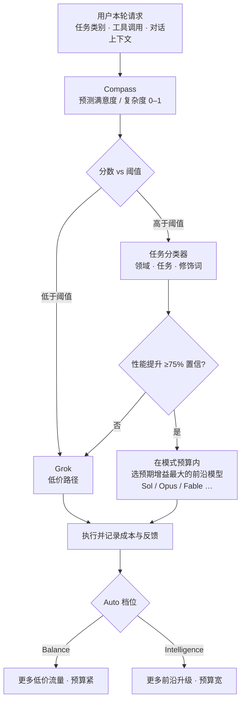

### 结论

Cursor Router 不靠公开 benchmark 猜模型强弱，而是从 **数十万轮真实对话** 里学：用户接着做下一项是正信号，反复纠正 Agent 是负信号，再叠上 token 成本（含换模型导致的 cache miss）。每条请求先经 **Compass** 判断复杂度——简单活走低价模型 Grok，难题才进 **任务分类器**，按领域/任务/修饰词匹配最擅长的前沿模型。上线后 Auto Intelligence 满意度已超 Fable、成本再降 18%（累计省 68%）；Auto Balance 满意度超 Opus 4.8 3%、成本再降 8%（累计省 41%）。

### 要点

- **路由信号来自当前轮次 + 近期对话。** 包括任务类别、工具调用记录、工作上下文等结构化特征，而不是只看一句 prompt 长度。

- **Compass 是「满意度预测器」，不是规则表。** 它给每轮打 0–1 的复杂度分，本质是预测用户会不会满意。高分轮次 96% 收到正反馈，低分仅 71%——简单任务（如提交 commit）很少被纠错，复杂任务更容易引发追问。

- **阈值决定省钱还是上前沿。** Compass 分数低于阈值 → Grok（推理成本低）；高于阈值 → 进入任务分类器选前沿模型。阈值越低，越多流量留在低价路径；Auto Balance 阈值更低、预算更紧，Auto Intelligence 更愿意为预期质量增益付前沿价。

- **任务分类器用三维标签描述每一轮。** **领域**（后端、数据库、前端）、**任务**（修 bug、跑命令、写测试）、**修饰词**（小范围编辑、产品问答、视觉改动）。没有模型通吃所有类别：Grok 擅 Git/库表例行操作，Sol 擅规划与读代码，Opus 擅 DevOps/性能/复杂查询，Fable 擅调试与 UI 实现。

- **选前沿模型有两道闸。** 候选模型须在该任务标签上相对低价模型有 **75% 置信度的性能提升** 才入围；再在入围者里按 **模式预算** 做流量加权，最大化性能增益。不是「难题就上最贵」，而是「有统计把握才升级」。

- **离线调参 + 线上验真。** 交叉验证定 Compass 阈值与预算，留出测试集防过拟合；最终仍要在生产流量里测满意度与真实成本——token、缓存、换模型开销，benchmark 很难复现。

### 怎么做

1. **日常优先开 Auto，按场景选档位。** 大多数开发用 **Auto Balance**：官方数据已优于单挂 Opus 4.8 且更便宜。发布前架构推演、复杂调试可切 **Auto Intelligence**，接近 Fable 级体验、成本仍远低于全程 Fable。

2. **把任务写清楚，帮 Compass 判对复杂度。** 模糊需求容易被低估复杂度、分到偏弱模型后反复纠错，反而更费轮次。边界清晰的「改这个函数签名」「补这三个单测」最适合走低价路径省钱。

3. **按任务类型选手动模型时，可参考官方分工。** 读大仓、拆需求 → Sol；跑 CI、写 SQL、做性能优化 → Opus；调样式、追 UI bug → Fable；批量 Git/库表机械操作 → 交给 Auto 让 Grok 处理即可。

4. **评估路由效果看行为，不只看单次账单。** 若团队总在纠正 Agent，说明路由或 prompt 有问题；结合「是否进入下一任务」「生成代码留存率」判断，而不是只对比单次 API 单价。

5. **管理员 rollout 时设默认档位。** 业务线默认 Balance 控成本，平台/基建组可对关键成员开放 Intelligence；屏蔽个别高价模型可避免成员手动绕开路由。

### 关键图表

*两阶段路由：Compass 决定「要不要上前沿」，分类器决定「上哪一个」；档位调节阈值与预算在成本–质量曲线上的位置*
