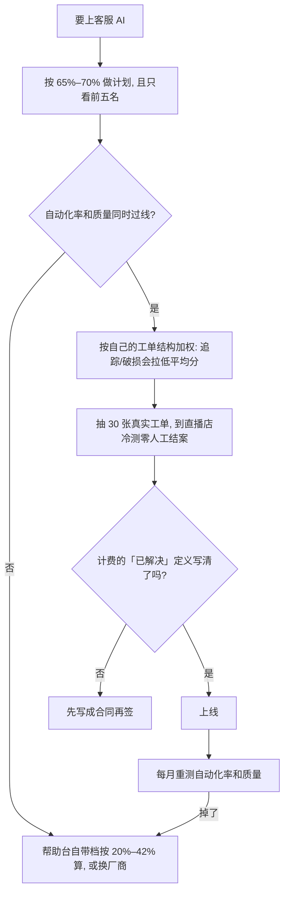

### 结论

SaaStr 创始人 **Jason Lemkin** 写的是电商店主怎么挑客服 AI，不是再发一篇「Agent 能替代客服」的口号。SaaStr Fund 投过种子的 Gorgias（约 **$1 亿** ARR 的电商客服平台）公开了一份基准：13 家厂商、**212** 家带真实库存的中型电商店，没有沙箱、没有合成目录、没有厂商演示。同一批顾客消息发给每家 Agent，评判模型对厂商匿名，按 **26** 条是否题打分；价格、政策和 SKU 再跟直播店对一遍。结论很硬：**最好的 Agent 大约 70% 的对话能完全结案；典型厂商不到一半，中位是 48%。** Zendesk、Intercom、Klaviyo 是多数品牌已经在付钱的平台，这份数据里它们的自动化率都不超过 **42%**。帮你省人的，往往不是帮助台里顺带打开的那一档。

### 要点

- **这里的「自动化」= 零人工。** 基准只把「AI 独自处理完、没有转人、也没有把顾客推出这个渠道」算结案。「给我们发邮件」、联系表单、「打电话」都算失败。超过一半回复在赶人走，整段对话记未解决。审计员从不主动找人，每一次转接都是 Agent 自己的决定。产品后台通常更松：Gorgias 面向客户的报表里，AI 处理完再过 **72 小时**没人接手，就算自动化——顾客放弃不再来，那里算成功，这里算失败。这会进 P&L：Gorgias AI Agent 按「已解决对话」收 **$0.90**。签约前先把对方的计费定义写成字。

- **自动化率高、答得差，会自己制造下一张工单。** 最近四周（括号里是对话量）：Rep AI 75%（120）、Decagon 73%（34）、Yuma 71%（118）、Ada 68%（420）、Gorgias 64%（388）；中位 Sierra 48%（408）；Zendesk 37%（467）、Klaviyo 21%（309）。按对话量加权，全场约 **46%**。同时过 **64% 自动化** 和 **65 质量分** 的只有三家：Yuma（71 / 72）、Decagon（73 / 70）、Gorgias（64 / 66）。Rep AI 自动化最高，质量只有 55；Ada 结案比 Gorgias 多，质量低 **27** 分（39）。Sierra 质量和 Yuma 并列第一，却解决不到一半。一张标成已解决、却写错退货窗口的工单，第二次联系比第一次更贵。

- **试点数字不是下个月的数字。** 有四周历史的 10 家里，9 家自动化率在跌：Siena -23、Kodif -13、Klaviyo 和 Sierra -11。质量同样 9 家下跌，Ada -17、Zendesk -15。基准没解释原因——模型更新、店铺配置漂移、题集变难都可能。Lemkin 的用法是：SaaStr 自己线上跑 **20 多个** Agent，包括看起来正常的，也按日程复核。

- **先看你的工单结构，再看平均分。** 全场按主题的质量：退货政策 77.4、物流政策 74.4、改单/取消 63.5、物流追踪 60.1、破损 59.7、顾客自己也说不清 49.3。最容易的和最难的差 **28** 分。政策页能答的最高；要查直播系统或做判断的最低。物流追踪通常是售后最大头，却靠近底部。售后对话大约只有三分之一能走完。工单若以「我的货到哪了」为主，基准总分会高估你上线后的结案率。

- **最常见的失败不是胡编，是不肯办事。** 评判很少抓到捏造事实，经常抓到：身份墙、反复要订单号、澄清循环、整段转人。同一家厂商在这家店很好、在那家店接近零，基准把差距更多算到开通和质检，而不是演示里的模型。它碰到的「AI 聊天」控件里，将近三分之一根本聊不起来。护栏、身份校验和升级规则，往往才是 45% 部署和 70% 部署的差别，而这三样都是品牌自己配的。Gorgias 自己办这份基准，自动化率排第五；量表、方法和逐条记录公开，谁都可以加店。另外 12 家还没有对等的公开数据。

### 怎么做

面向正在给电商店或 SaaS 客服上 AI、或要复核帮助台自带 Agent 的 junior：不必复刻 Gorgias 这套评测栈，按同一组问题挡一遍。

1. **商业计划按 65%–70% 写，而且只对前五名厂商。** 最好的工具在最好的月份，仍有大约 30% 要人、或要一个能更深接系统的第二 Agent。押 Zendesk / Intercom / Klaviyo 自带的那档，按 **20%–42%** 算。

2. **短名单同时看自动化率和质量。** 这个窗口里两道杠都过的只有三家。让每家厂商对**同一批对话**交出这两个数，不要只看首页自动化率。

3. **用自己的工单结构加权。** 政策问答全场都不错；物流追踪和破损不行。把上个月真实工单按主题切开，再去读排行榜。

4. **冷启动测，不要看演示。** 抽上个月 30 张真实工单，开无痕窗口，到厂商现有客户的直播店里自己点，数有几条是零人工结案。量表公开，你现在的 Agent 也可以按同一把尺打分。

5. **每月重测；签约前写下「已解决」的计费定义。** 九成厂商四周内自动化率在掉。Yuma 平均完整回复最慢（16.5 秒）却结案 71%，Envive 最快（5.4 秒）只结案 22%——售后更该看结案，不该只看秒数。

### 关键图表

*SaaStr 原文的用法：Gorgias 公开基准先给出和帮助台首页不同的结案率，再按质量、工单结构和计费定义决定买哪一家*
