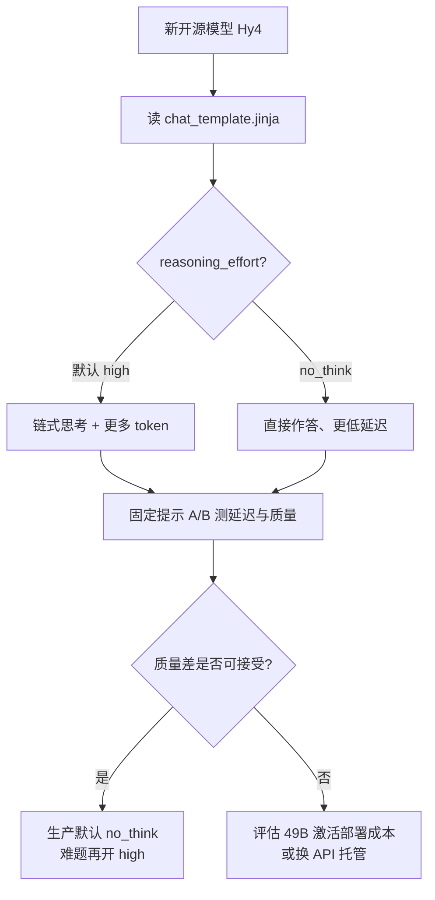

### 结论

腾讯开源了 **Hy4 Preview**：纯文本 MoE 模型，**770B 总参 / 49B 激活**，**100 万 token 上下文**，Hugging Face 权重约 **1.56TB**——相较 7 月的 Hy3（295B / 21B 激活、256K 上下文、598GB）是一次大幅跃升。Simon Willison 的实用建议是：**别只看榜单，先读 `chat_template.jinja`**——Hy4 默认 `reasoning_effort=high`，另有 `no_think` 可关思考；接入 API 前弄清这两档，否则延迟和账单会超预期。

### 要点

- **Hy4 是「大总参 + 大激活 + 超长上下文」。** MoE 每次只跑一部分专家，所以 770B 不等于每次推理都要搬 770B 权重；但 **49B 激活**仍属重型档，1M 上下文适合长文档、多轮 Agent，本地部署门槛远高于 Hy3。选型时看 **activated params + 量化后体积**，别被总参数字吓到。

- **无视觉，专注文本。** 与 Qwen Flash-Next 等多模态预览不同，Hy4 Preview 目前只有文本输入。做图文 Agent 别硬上；长文分析、代码、工具调用才是主战场。

- **chat template 是「隐藏开关说明书」。** 各家把推理档、思考开关写在 Jinja 模板里，不在 README 显眼处。Hy4 模板规定：`reasoning_effort` 只能是 **`high`（默认）** 或 **`no_think`（关闭推理）**；传错值会直接 `raise_exception`。这比猜 API 字段靠谱——Simon 用此法摸清 Qwen、Hy 系列行为。

- **默认 high 会产出可见的 reasoning trace。** Simon 经 OpenRouter 用经典提示「画一只鹈鹕骑自行车 SVG」，模型在思考链里用略破碎的英文纠结「要不要头盔、墨镜」——**隐藏推理不必语法完美，只为省 token**。你若不需要链式思考，应显式设 `no_think`，否则 completion token 会膨胀。

- **和 Hy3 比是代际升级，不是小补丁。** 上下文从 256K → 1M，激活参从 21B → 49B，权重体积约 **2.6×**。已有 Hy3 流水线的团队要重估显存、推理框架兼容性和量化方案，不能假设「换个 model id 就行」。

### 怎么做

1. **在 Hugging Face 打开模型页**，找到 `chat_template.jinja`（或 tokenizer_config 里的 template），搜索 `reasoning`、`think`、`effort` 等关键字，列出合法枚举值和默认值。

2. **用固定短提示做两档对比。** 同一问题各跑一遍默认档与 `no_think`（或你框架里的等价参数，如 OpenRouter / vLLM 的 extra body）。记录：首 token 延迟、总 token、输出质量是否值得多花的思考 token。

3. **评估部署成本再下载 1.56TB。** 若无顶配工作站或专用推理集群，优先走 **OpenRouter、SGLang 托管或官方 API 预览**，用冒烟测试验证 tool calling、长上下文截断策略，再决定是否自建权重镜像。

4. **长上下文场景要测「真 1M」还是 marketing。** 发一条逐步变长的文档摘要任务，看是否在 256K、512K 等处突然截断或质量断崖；百万 token 窗口对 KV cache 和计费都是硬约束。

5. **Agent 接入时把 reasoning 档写进配置。** 交互式聊天可留 `high`；批量脚本、低延迟 API、成本敏感路径默认 `no_think`，仅在难题上按需升档——与 Qwen 3.8 系列「默认过度思考」是同一类坑。

### 关键图表

*接入前五分钟读模板，比事后查账单便宜——Hy4 两档推理，默认就是「多想」*
