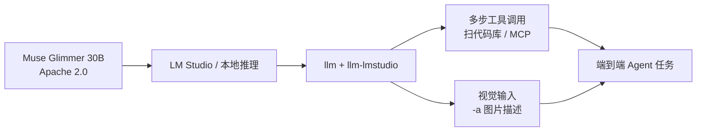

### 结论

Meta 发布 **Muse Glimmer**：约 **30B 参数**的开放权重模型，许可为干净的 **Apache 2.0**（比早年 Llama 系列附加条款更省心）。官方定位不是「聊天更好看」，而是**本地可跑的 Agent 底座**——多步推理、稳定调工具、端到端完成复杂任务。Simon Willison 实测：在 32GB 内存机器上能边跑模型边开其他应用；用 `llm-coding-agent` 插件问 Datasette「auth 怎么工作」，模型能连续调工具扫代码库并给出靠谱回答。它还是**视觉模型**，能看图写描述。

### 要点

- **30B 是「能干活又不占满机器」的甜点。** LM Studio 的量化版约 **18.16 GB**，32GB 内存的机器还能留空间给 IDE、浏览器。比动辄 70B+ 的本地模型更现实；比 7B 小模型在工具链和多步任务上通常更稳。

- **Apache 2.0 降低商用顾虑。** 开放权重（open weight）不等于什么都叫开源，但 Apache 2.0 是业界熟悉的宽松许可，集成进产品、改权重、再分发时比 Llama 自定义条款好读得多。上线前仍要核对模型卡片与 Meta 声明，别只凭博客标题。

- **三条能力线对准 Agent 场景。** 官方强调：（1）**端到端 Agent 任务**——在 DeepSearch QA、MCP-Atlas、τ-Bench、SWE-Bench 等基准上测「从接到指令到交结果」；（2）**可靠工具调用**——长流程里按 schema 调 function；（3）**多步推理**——跨很多轮仍保持计划连贯。选型本地模型时，应优先看这类**全任务基准**，而不是只看 MMLU 选择题分数。

- **代码库问答已可验证。** Simon 用 `llm-coding-agent` 对全新 clone 的 Datasette 问 `how does auth work?`，转录里能看到多轮工具调用探索仓库，最终给出可读解释。说明在「读 repo + 调工具」这条路上，30B 本地模型已经能当日常辅助，而不只是离线聊天。

- **带视觉，一条命令能看图。** 例如 `llm -m lmstudio/meta/muse-glimmer -a <图片URL> 'describe image'`，能对自然场景做较细的结构化描述（物种、构图、光线等）。做本地多模态原型或日志里附图分析时，不必再单独挂一个视觉 API。

- **生态接 LLM 插件，需留意版本。** Simon 用 `llm-lmstudio` 连 LM Studio，并对 LLM **0.32** 打了兼容补丁。本地栈往往是「模型 + 推理运行时 + 客户端插件」三层，升级任一层都要测一轮工具调用是否正常。

### 怎么做

1. **先确认硬件。** 至少 **32GB 系统内存**较稳妥；GPU 可选但能显著加速。磁盘预留量化权重约 **20GB** 量级（以 LM Studio 当前包为准）。

2. **用 LM Studio 拉模型。** 搜索 `meta/muse-glimmer`（或官方 Hugging Face 页），下载量化版，本地起 OpenAI 兼容 API。记下端口与模型 ID，供下游客户端使用。

3. **接 Simon 同款 CLI 栈（可选）。** 安装 [LLM](https://llm.datasette.io/) 与 `llm-lmstudio` 插件，按仓库说明处理与 0.32 的兼容。配置 `lmstudio/meta/muse-glimmer` 为默认或按需 `-m` 指定。

4. **测 Agent，而不只测闲聊。** 克隆一个小型开源项目，装 `llm-coding-agent`（或你现有的 MCP/工具脚手架），问「认证/路由/测试怎么跑」类需要**读文件 + 多轮工具**的问题。看转录：是否乱调工具、是否中途丢上下文、最终答案能否对上代码。

5. **测视觉（若业务需要）。** 用 `-a` 传公开图片 URL 或本地路径（视插件支持），检查描述是否稳定；敏感图不要发到未信任端点。

6. **和云端模型分工。** Glimmer 适合**离线、隐私、高频小任务**；复杂架构决策或超长上下文仍可用云端大模型。在路由层按任务类型切换，避免「本地装了大模型就什么都本地跑」的性能陷阱。

### 关键图表

*同一套本地权重可同时服务「代码 Agent」与「看图」——关键是推理运行时与 LLM 插件版本对齐*
