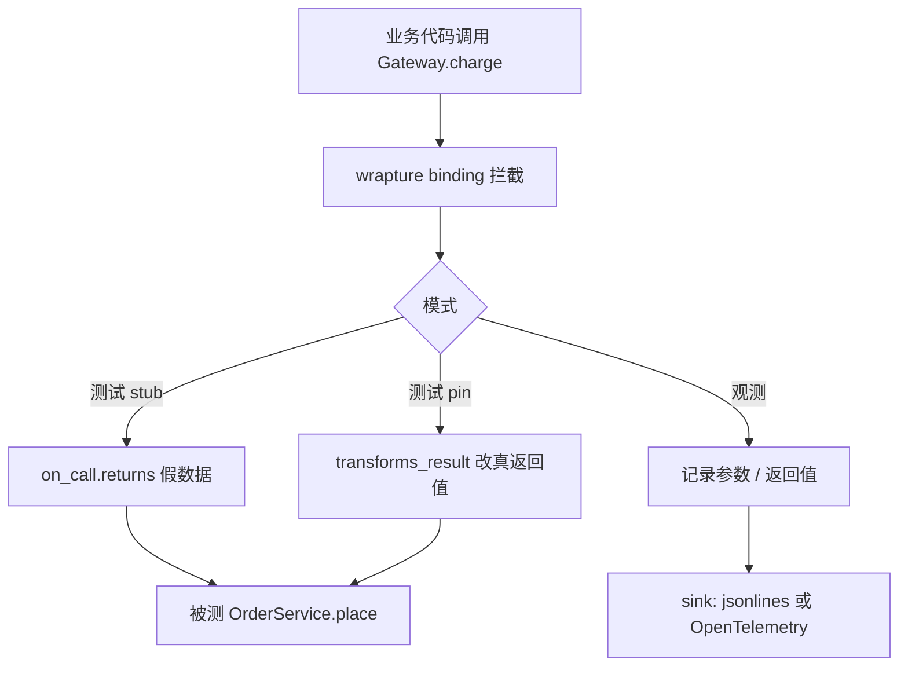

### 结论

**wrapture** 是 Graham Dumpleton（`wrapt`、`mod_wsgi`、New Relic Python Agent 作者）的新库：把 **monkeypatch**（运行时替换函数/方法）从单元测试扩展到**可观测性**。同一套「绑定」机制既能像 `unittest.mock` 一样 stub 返回值，也能在不改业务代码的前提下记录调用、导出 **OpenTelemetry** 或 JSONL 追踪。项目才几周，但方向清晰——尤其适合「第三方库、遗留代码你动不了，却必须测或观测」的场景。

### 要点

- **monkeypatch 是什么。** 在程序运行时把某个函数或方法替换成包装版本，调用方仍走原 import 路径，实际执行的是你的 wrapper。`wrapt` 长期用来安全地 patch 类方法；wrapture 把这套能力同时面向 **测试** 和 **追踪**。

- **一条绑定，三种用途。** `wrapture.binding(Gateway, "charge")` 可对目标方法：`on_call.returns(...)` 直接返回假数据（stub）；`on_call.transforms_result(lambda r: ...)` 先跑真逻辑再改返回值（pin 结果）；或只记录进出参数而不改行为（观测）。Simon 转述 Graham 的核心动机：**给不受你控制的代码挂上观察器，记下流经的数据，且不打乱被监视的程序**。

- **可替代 mock，又不止 mock。** 常见误区是把 mock 只当「假接口」。wrapture 的 `with binding` 上下文管理器让测试里临时 patch，退出后自动还原；同时还能在集成测试里保留真实调用链，只对某一环做变换——例如支付网关真扣款，但把返回的 `id` 改成 `ch_TEST` 便于断言。

- **配置化追踪，零改源码。** 通过 TOML 声明 `observe` 目标（如 `domain:Calculator` 的方法名）和 `sink`（`jsonlines` 文件或 OTEL），无需在业务里插 `print` 或手写 span。适合给已有 Python 服务加「黑盒」调用轨迹，再接到现有可观测性栈。

- **AI 辅助开发的分界线。** Graham 坦言 wrapture 每一行代码和文档都由 AI 在指导下写出，但强调这不是 **vibe coding**（一发提示词、看不懂产出就赌运气）。他在 Python 动态代理这块有多年积累，**设计来自人，AI 是执行手段**——对团队评估「Agent 写基础设施库」是否可信，这是个可参考的样本。

### 怎么做

1. **安装并读文档。** `pip install wrapture`，从 [wrapture.readthedocs.io](https://wrapture.readthedocs.io/) 入手；OpenTelemetry 导出见 [otel-export](https://wrapture.readthedocs.io/en/latest/otel-export.html)。

2. **单元测试：先 stub 再 pin。** 对外部依赖（HTTP、支付、数据库客户端）用 `binding(Class, "method").on_call.returns({...})` 包在 `with` 里跑被测代码。需要部分真实行为时，用 `transforms_result` 在真返回值上改字段，而不是整段替换。

3. **观测：从小范围 TOML 试点。** 复制文档里的配置形态：`capture = "summary"`，用 `[[observe]]` 点名类或模块，`[[sink]]` 指向 `trace.jsonl` 或 OTEL endpoint。先包一条关键路径（如订单 `place` → 网关 `charge`），确认 JSONL 或 Jaeger 里能看到调用再扩大。

4. **与现有 mock 栈并存迁移。** 不必一夜换掉 `pytest-mock`；对「跨模块、要同时测+ trace」的用例，优先试 wrapture binding，mock 仍可用于纯隔离的细粒度断言。

5. **评估成熟度。** 项目很新，生产全量接入前在 staging 跑一轮负载与退出时是否干净卸载 patch；Graham 另有 [Unit testing with wrapture](https://grahamdumpleton.me/posts/2026/09/unit-testing-with-wrapture/) 可对照测试模式。

### 关键图表

*同一层 monkeypatch：测试里可 stub 或变换结果，生产或集成环境里可只观测并导出，无需 fork 两套工具。*
