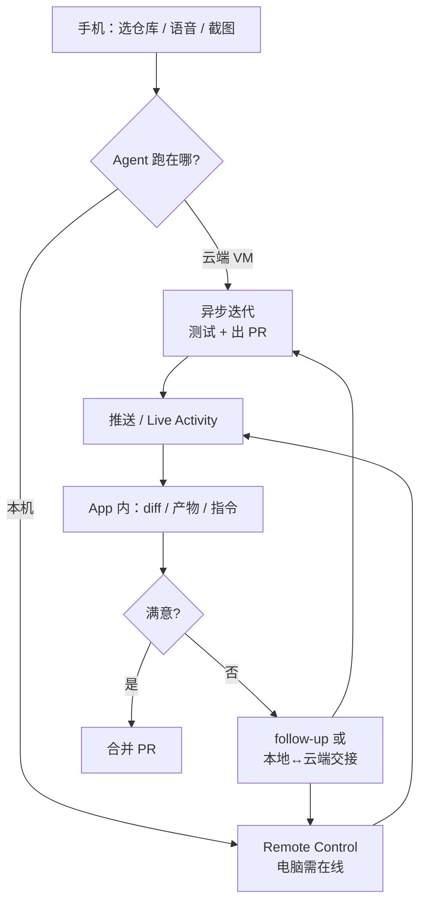

### 结论

Cursor 发布 **iOS 原生应用**（公测），核心是把 Agent 工作从「必须守着笔记本」变成「手机也能推进」。你可以直接在云端启动常驻 Agent，也可以用 **Remote Control（远程遥控）** 指挥跑在自己电脑上的 Agent；任务完成后通过推送和锁屏 **Live Activity** 收到通知，在 App 里看 diff、留后续指令，甚至合并 PR。

### 要点

- **两条路径，同一套操作习惯。** **云端 Agent** 在隔离虚拟机里跑完整开发环境，适合长时间异步迭代；**本机 Agent** 则通过 Remote Control 从手机继续发指令。桌面端怎么选仓库、选模型、用斜杠命令，移动端基本一致。

- **灵感来了就能开工，不必回工位。** 官方举例：on-call 被 pager 叫醒时先让 Agent 查日志、拟修复方案；客户报紧急 bug 时远程复现并改代码；在 X 上看到 UI 反馈，截图标注后丢给 Agent 当视觉上下文——这些场景的共同点是 **先启动、后回电脑验收**。

- **异步不等于失联。** Agent 跑起来后可以切走 App。完成、需要输入、或 PR 待审时，会推通知；锁屏 Live Activity 也能看进度。云端 Agent 还会产出 demo、截图、日志，方便你在手机上先验再决定要不要 merge。

- **本地与云端可以交接，而不是二选一。** 本地先想清楚方案，可把计划交给云端 Agent 继续跑；正在进行的会话也能 **迁到云端** 让它无人值守迭代。反过来，云端改完可以 **拉回本机** 做本地测试再合并——适合「云端写码、本机验环境」的分工。

- **门槛与边界。** 公测面向 **付费计划** 用户；本机遥控需要电脑在线，可开启「保持唤醒」避免离开工位后连不上。团队已在用 MCP 查 Datadog、汇总 Slack 等——移动端继承的是同一套 Agent 能力，不只是「缩小版聊天」。

### 怎么做

1. **安装并登录。** 在 App Store 下载 Cursor for iOS，用与桌面端相同的付费账号登录。

2. **选场景再选运行位置。** 要离开电脑很久、任务可长时间跑 → 直接 **启动云端 Agent** 并选仓库。只是临时离席、代码还在本机 → 桌面先开 Agent，手机用 **Remote Control** 接续；必要时在设置里打开 **保持电脑唤醒**。

3. **用手机补齐上下文。** 语音描述需求、用斜杠命令收窄范围；遇到 UI 类反馈，截图标注后作为附件发给 Agent，比纯文字描述更快对齐预期。

4. **启动后放心切走。** 依赖推送与 Live Activity 跟进；需要你看 diff 或补信息时会再叫醒你。在 App 里检查变更、产物（截图/日志/demo），满意再 merge PR，不满意留 follow-up 指令。

5. **善用本地↔云端交接。** 本地规划太大、想挂机跑完 → 把计划或活跃会话 **移到云端**；合并前若必须连内网或特定硬件 → **迁回本机** 跑测试。别在手机上硬扛需要大 diff review 的重活，把它当成 **发令台 + 验收口**。

### 关键图表

*手机负责启动与验收，重活在云端或本机 Agent 执行*
