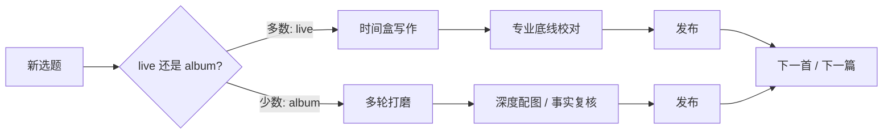

### 结论

John Gruber（Daring Fireball 作者）在回应 Simon Willison 的写博建议时说：**大多数文章按「现场演出」的心态写——专业、紧凑、及时发出去**；只有偶尔才进入「录专辑」模式精雕细琢。若每篇都追求「名人堂级别」，你会永远发不出来。对工程师写技术笔记、周报、对外博客或 AI 辅助起草文档同样适用：**可持续的发布节奏，比单篇完美更重要**。

### 要点

- **「现场」≠ 随便写。** Gruber 强调他不是在车库里瞎 jam（随意涂鸦），而是在观众面前演出：认真、专注，每个音符都要踩准拍子。对应到技术写作，就是语法通顺、事实核对、链接可用——**快发不等于降质**，而是接受「这一版已经够上台」。

- **「专辑」留给少数场景。** 深度架构复盘、重大事故 postmortem、年度总结这类内容，才值得多轮修改、配图、找编辑。若把每篇内部 memo 都当专辑打磨，团队会陷入文档债：写的人累，读的人等。

- **完美主义是产出杀手。** 「每篇都要 hall-of-famer」的直接后果是草稿堆满、公开渠道空白。Gruber 能二十年日更，靠的是**歌与歌之间顺畅切换**——发完一篇立刻进入下一主题，而不是在上一首里无限加轨。

- **专业感来自节奏，不来自篇幅。** 短评、链接摘、工具技巧同样可以「踩准拍子」：一句结论、一个例子、一个行动项。读者要的是可消费的密度，不是字数堆出来的仪式感。

- **和 AI 协作时的误区。** 用 Cursor/Claude 起草时，容易陷入「再润色一轮」循环——本质是把每场演出都当成专辑混音。Gruber 的隐喻提醒：**先定这篇是 live 还是 album**；live 档限定轮次（例如两轮 prompt + 人工扫一遍事实），album 档才放开深度迭代。

### 怎么做

1. **发文前问自己：这是 live 还是 album？** Live：当日或隔日要见读者——设时间盒（如 45 分钟写作 + 15 分钟校对）。Album：可排进日历，允许多天打磨。不确定时默认 live，避免一切文章都进「再改两处」队列。

2. **为 live 文定最低专业线。**  checklist：标题是否说清价值、技术名词是否准确、代码/命令能否复制运行、有无明显事实错误。满足即发布；不在措辞上追求文学级打磨。

3. **album 文单独列 backlog。** 每月或每季度固定 1–2 篇深度文（架构决策记录 ADR 合集、工具选型长文）。其余周报、踩坑笔记、会议纪要保持 live 标准，减轻心理负担。

4. **用 AI 时匹配模式。** Live：给模型明确结构（结论 / 步骤 / 注意点），要求「一稿可发，不要过度展开」；人工只改事实与语气。Album：允许多轮追问、补图表、对照原文；但仍设截止日，防止无限扩写。

5. **建立「歌单」节奏。** 固定栏目（如周五工具短评、月初一篇长文），让读者形成预期，也逼自己从一篇切到下一篇，而不是在单篇里反复混音。

### 关键图表

*默认走 live 快环；只有明确标成 album 的内容才进入长打磨支路——避免每篇都卡在混音台*
