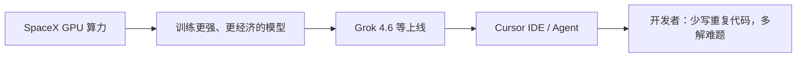

### 结论

Cursor 已**正式被 SpaceX 收购**，四月与 SpaceXAI 的模型训练合作至此落地。对用户而言，变化不在「换了个 IDE」，而在背后：**全球最大规模的 GPU 舰队**将支撑更强、运行更经济的自研模型，再以更低成本放进 Cursor。刚发布的 Grok 4.6 是这条链上的早期样本；产品方向仍是让人少写重复代码、多解决更难的问题。

### 要点

- **收购完成的是四月已启动的进程。** 四月宣布与 SpaceXAI 合作加速模型训练，如今是法律与组织层面的收官。对开发者：Cursor 与 Grok 模型线的绑定会更紧，不是短期营销联名。

- **算力决定模型上限。** SpaceX 侧正在建设规模空前的计算能力；Cursor 能直接用到这套资源来训模型。更强模型往往也更贵——若训练与推理成本能压下去，订阅里的「可用智能」才会持续抬升而不只涨价。

- **产品演进：补全 → AI 队友。** Cursor 从「补下几行代码」走到「把真实工作交给 Agent」。收购后 ambition 是继续往「可托付的多步任务」推，而不是退回纯自动补全。

- **Grok 4.6 是能力预览，不是终点。** 博客把 4.6 当作合并后「能一起做出什么」的早样：长链路 Agent、交互原型等已在 Cursor 上线。后续模型迭代会更快叠上同一套算力与训练管线。

- **界面与使命保持稳定。** 官方强调工作仍熟悉——仍是帮有想法的人减少机械写码时间。组织变大不等于立刻改工作流；但模型池、额度与默认可用能力会随基础设施扩张而变。

### 怎么做

1. **把 Grok 4.6 当「新默认能力」试一轮。** 若你还没用过 4.6，用真实任务（多步调研、搭原型、跨文件改码）跑一遍，对比 Composer 2.5 或 Grok 4.5，建立自己的分工表——收购新闻本身不替你做选型。

2. **长任务留意额度与成本。** 更强模型 + 更大算力背后仍是 token 经济学；首周促销过后，按任务长度选模型档，用 Rules、文档和 `@` 引用收窄上下文，避免在长 Agent 会话里重复解释约束。

3. **Agent 工作流按「可验收里程碑」拆步。** 产品方向是 AI 队友而非单行补全；提示里写清完成标准、自测方式（跑哪些命令、哪些页面必须可点），让模型在长轨迹里自检——这与 Grok 4.6 的训练侧重一致，也降低合并风险。

4. **关注模型与渠道公告，而非只盯收购标题。** 后续新模型、API 定价、Cursor 内默认路由可能随训练管线更新；订阅用户优先看 Changelog 与博客里的「上线 / 额度」说明，再决定是否调整日常默认模型。

5. **合并与合规仍在你这边。** 组织变化不减轻 Review 责任：diff、CI、关键路径人工点一遍；把 Agent 当加速层，不是免责层——这与 Cursor 一贯「junior 要快但你得验」的立场一致。

### 关键图表

*算力 → 模型 → Cursor 产品 → 用户价值；收购是把这条链在组织上焊成一体*
