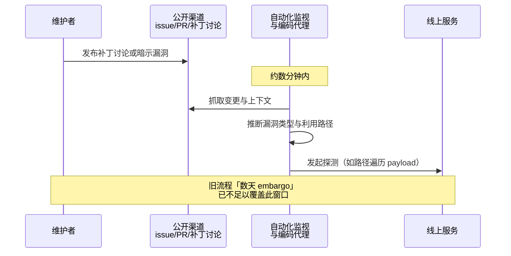

### 结论

剑桥大学教授、OCaml 核心维护者 Anil Madhavapeddy 记录了一个新变化：**安全补丁一旦出现在公开讨论里，几分钟内就会有自动化探测打过来**——他观测到约十分钟内，网站就开始收到针对路径遍历（percent-encoded traversal）的扫描。Simon Willison 转述指出，现代编码代理（coding agent）已强到能从「疑似有 bug」的只言片语里反推出具体漏洞；这与开源社区习惯的**私下披露、 embargo 后再发版**节奏根本对不上，维护者必须换流程。

### 要点

- **「传闻」≈ 攻击面地图。** 过去维护者可以在 issue、PR 或邮件列表里先讨论补丁草案，再花几天修、一两周发版。现在公开仓库一有安全相关改动，就有 bot 盯着扫——Anil 的案例里，补丁讨论上线约十分钟，探测流量就来了。

- **AI 代理会「补全」漏洞细节。** Anil 用自家 agent 验证：只要提示里暗示某类问题，代理就能在代码库里定位并构造利用思路（他文中提到 Claude Fable 拒做后改用 DeepSeek V4 Pro）。攻击方同样在跑这类流水线，所以**讨论补丁本身就可能泄露足够信息**。

- **披露量暴涨，但不少仍值得看。** rclone 维护者 Nick Craig-Wood 在 HN 补充：项目前十年经 GitHub 收到约 20 条安全披露，**最近一个月超过 40 条**；其中约 **75%** 仍含需跟进的真实隐患。AI 既帮攻击者也帮防守，但维护者的 triage 负担陡增。

- **CVE 流程跟不上发版。** 以前 GitHub 分配 CVE 约 2–3 天，现在常要 **3–4 周**。Nick 不得不先发带点版本，changelog 里写 `CVE-PENDING`——用户侧可见，合规侧尴尬。

- **旧 embargo 假设失效。** 「先私下修、再公开」的前提是攻击者需要几天才能利用；当利用窗口缩到分钟级，**任何公开痕迹（分支名、提交信息、讨论帖）都可能被自动化武器化**。

### 怎么做

面向维护开源库或内部公共组件的工程师，可按优先级调整：

1. **默认把安全修复当「零公开窗口」处理。** 能用私有安全 advisory（GitHub Security Advisories 等）就不要在公开 issue 里讨论细节；提交信息避免写清漏洞类型（如 `fix path traversal in upload`），合并前用中性描述。

2. **缩短「知道漏洞 → 发补丁」路径。** 预先写好安全联系人、`SECURITY.md`、on-call 分工；小版本热修流程（cherry-pick、点发布）要能在小时级跑通，别仍按「等下周例行 release」。

3. **用 AI 做防守 triage，但人做终审。** 像 Nick 一样用 AI 归类、草拟修复可以减负，但**合并前必须人工验证**：是真漏洞还是误报？修复是否引入回归？能否 backport 到受支持版本？

4. **对外沟通接受「先修后发 CVE」。** 与依赖方约定：紧急补丁可能暂时没有 CVE 编号；在 README 或 release note 标明严重性与升级路径，比等 CVE 三周更负责任。

5. **监控自家公开面的「泄漏信号」。** 对安全相关 PR、标签、分支设告警；若必须公开讨论，考虑最小权限仓库或延迟推送，并准备好 WAF/速率限制应对突发扫描。

### 关键图表

*从公开讨论到自动化利用尝试的时间线——维护者需在信息出站前完成修复或严格保密*
