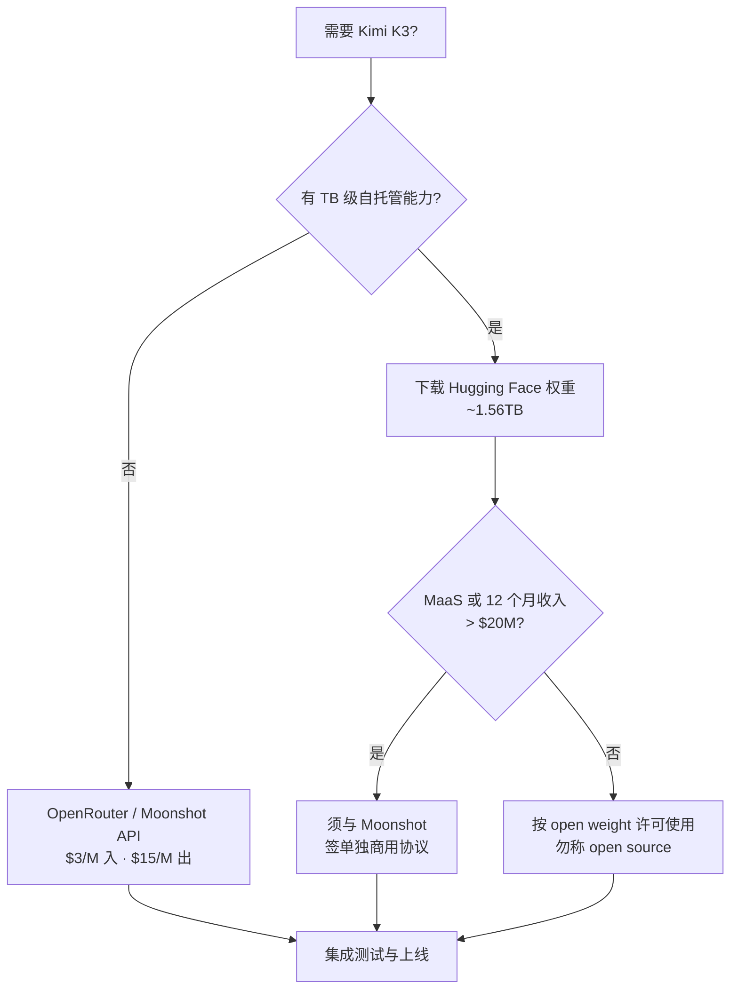

### 结论

Moonshot 如约放出 **Kimi K3 权重**：约 **2.8 万亿参数**，Hugging Face 上整包约 **1.56TB**。这不是「随便商用」的纯开源——许可比 K2 更严，**年收入超 2000 万美元的 Model-as-a-Service（MaaS）业务**须先与 Moonshot 签单独协议。官方也刻意用 **open weight（开放权重）** 而非 open source。对多数工程师更现实的路径仍是 **API**：OpenRouter 已有 7 家托管，价与官方同为 **$3/M 输入、$15/M 输出**。

### 要点

- **体量决定你能不能本地跑。** 1.56TB 意味着单机几乎不可能完整部署；除非你有集群级存储与推理栈，否则「下了权重」≠「能自己跑」。日常选型应优先问：托管 API 够不够、延迟与合规是否满足，而不是先下 TB 级文件。

- **open weight ≠ open source。** Moonshot 在自家材料里不用「开源」一词，而说开放权重——权重可下载，但**使用、再分发、商用**仍受许可约束。读模型卡片时先看 License 段落，别被 Hugging Face 页面上的「开源」标签误导。

- **K3 许可比 K2 更收紧。** K2 曾在 MIT 上附加：月活超 1 亿或月收入超 2000 万美元的商业产品，须在 UI 显著标注「Kimi K2」。K3 不再自称「改 MIT」，并对 **MaaS 业务**加码：被许可方及其关联方在任意连续 12 个月内合计收入超 2000 万美元，**商用前须与 Moonshot 另签协议**——做模型 API 平台或转售推理的要特别核对。

- **API 侧已可即用。** OpenRouter 聚合了 7 个 K3 提供方，多数与 Moonshot 官方同价（$3/M 输入、$15/M 输出）。不想碰权重与许可细节时，用 `openrouter/moonshotai/kimi-k3` 或官方 API 即可做集成与压测。

- **与「探针测行为」是不同一篇。** Simon 早前写过 K3 的 token 探针、鹈鹕 SVG 等接入实测；本篇聚焦**权重发布与许可边界**。选型时要两条线一起看：行为与安全测 API，合规与自托管看 License。

### 怎么做

1. **先定路径：API 还是自托管。** 无 TB 级存储与推理团队 → 直接注册 OpenRouter 或 Moonshot API，用短探针（如固定 hello world）验证鉴权与计费。确有私有化需求再评估权重下载、量化与集群成本。

2. **读 License 三问。** 你的产品是直接面向终端用户，还是 **MaaS（把模型当服务卖）**？过去 12 个月关联方总收入是否可能触达 2000 万美元？若任一为是，在集成前联系 Moonshot 法务或走官方商用通道，别默认 MIT 式自由。

3. **对外表述用「开放权重」。** 若在文档、博客或产品里写「我们基于开源 Kimi K3」，可能被许可条款打脸。更准确的说法是「基于 Moonshot 开放权重的 K3」，并保留来源与许可链接。

4. **比价时看全栈成本。** API 价 $3/$15 per million token 与 Claude Sonnet 同级；自托管还要算 GPU、运维与合规审计。用同一套业务用例（长上下文、推理 token 比例）在 API 与「假想自托管」各估一版 TCO，再决策。

5. **合规清单留痕。** 保存下载日期、许可版本号、是否触发 MaaS 条款的判断依据；团队变大或收入跨阈值时定期复审，避免从「技术试用」滑入「未授权商用」。

### 关键图表

*多数团队走 API；触达 MaaS/收入门槛须先谈许可，再谈部署*
