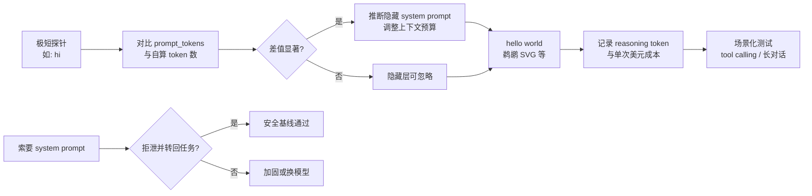

### 结论

Simon Willison 在测 Kimi K3 时发现：一句 10 token 的「hi」，计费却显示 86 input token—— 强烈暗示 Moonshot 在 API 背后塞了约 **85 token 的隐藏系统提示词**。他直接问模型要原文，K3 拒绝并反问：**「今天我能帮你什么？」** 这不是段子，而是两条可复用的工程经验：**用 token 计数做低成本探针**，以及 **拒泄 + 转回任务** 是成熟模型的标准防线。别拿「鹈鹕骑车」SVG 当选型依据，但它仍是接入新模型时最快的 hello world。

### 要点

- **隐藏 system prompt 会污染你的 token 账单。** 你以为只发了用户消息，实际上 provider 可能悄悄拼了一段系统指令。对比同一句话在不同模型上的 input token（OpenAI/Anthropic 计 10，Kimi K3 计 86），就能估算「暗箱」长度，而不用真的套出原文。

- **拒泄本身是能力，不是 bug。** 直接索要 system prompt 属于常见的 **提示注入（prompt injection）** 变体。K3 没有复述内部指令，而是用一句礼貌反问把对话拉回合法用途—— 和 Claude、GPT 等一线模型的做法一致。做 Agent 产品时，这类边界响应值得写进安全测试用例。

- **「鹈鹕骑车」benchmark 已不能代表模型强弱。** Simon 的固定提示 `Generate an SVG of a pelican riding a bicycle` 起初只是玩笑，早期却意外和综合能力相关；如今 GPT-5.6、Claude Fable 5 的画质反而输给 GLM-5.2，关联基本断了。它**测不了**长对话里的工具调用可靠性—— 这才是 2026 年选型的主战场。

- **K3 目前只有 max 档推理，成本体感要单独算。** 画一只鹈鹕：95 input + 16,658 output（其中 13,241 为 reasoning token），约 **$0.25**。简单创意任务也会走满推理，定价 $3/$15 per million（与 Claude Sonnet 同级）时，日常脚本要留意是否值得开 K3。

- **同族纵向对比仍有价值。** K3 的鹈鹕比 Kimi 2.5 明显进步；视觉 alt text 也很准。benchmark 适合回答「我有没有真的跑通 API」「输出 token / 推理 token 比例如何」「SVG 几何是否可用」，不适合回答「能不能上生产 Agent」。

### 怎么做

1. **接入新模型先做 token 探针。** 发极短消息（如 `hi`），看 API 返回的 `usage.prompt_tokens` 与你自己 tokenizer 计数的差值。差值大 → 可能有隐藏 system prompt 或特殊模板，长上下文预算要按「用户消息 + 暗箱」一起算。

2. **用固定 hello world 逼自己真调一次 API。** Simon 用 `llm -m openrouter/moonshotai/kimi-k3 'Generate an SVG of a pelican riding a bicycle'`（或官方 API / OpenRouter 代理）。目标不是比画质，而是确认：鉴权、插件、计费、输出格式都能走通。

3. **记录 reasoning token 与美元成本。** 若模型把推理 token 单独计费（K3 会），同一提示在不同 **reasoning effort** 档位下各跑一遍，建一张小表（可参考他对 GPT-5.6 家族的做法）。只有一档时，把它当「永远满血」来估预算。

4. **安全测试里加「索要 system prompt」。** 期望：拒绝泄露、不复述内部策略、引导回用户任务。通过 ≠ 绝对安全，但失败说明边界太松。

5. **选型别停在这层。** 鹈鹕通过后，补跑与你场景相关的：**多轮 tool calling**、长上下文记忆、失败重试。Artificial Analysis 等第三方榜单可作参考，但 K3 在 Agent 上的表现要靠你自己的集成测试验证。

### 关键图表

*从 token 探针到场景测试—— 低成本摸清新模型，再决定是否上生产*
