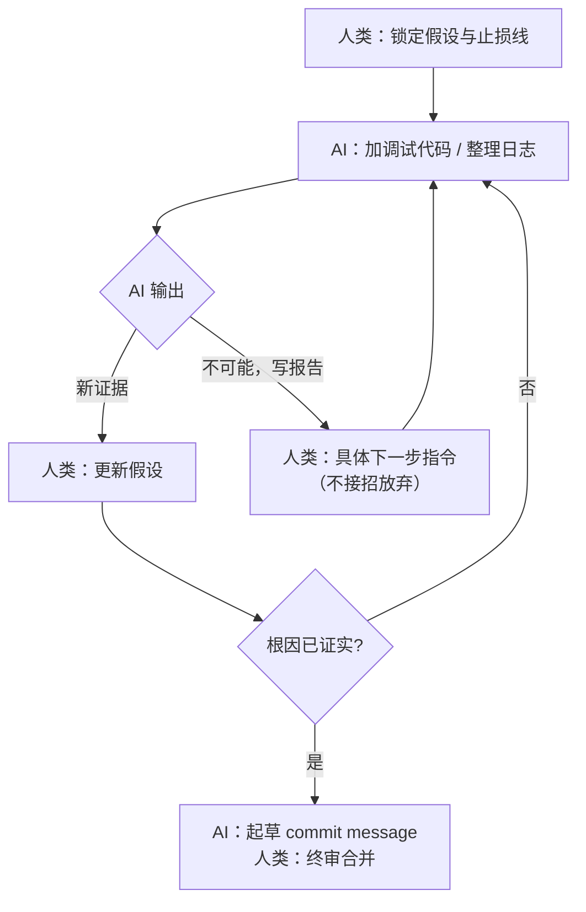

### 结论

Linus Torvalds 在一次 drm/xe 驱动「地狱级」调试里大量借助 AI：加调试代码、分析输出等 grunt work（重复体力活）确实省时间，但 AI **多次直言问题不可能、建议写报告收场**。他判断这多半因为训练数据里工程师不够「倔」；自己持续施压后，AI 仍老实执行每一步。结论很务实：**把探针和日志分析交给 AI，根因判断和「别放弃」留给自己**——功劳该给就给，他甚至让 AI 写了 commit message。

### 要点

- **grunt work 是 AI 当下最稳的调试分工。** 批量插入 `printk`、改探测条件、把千行日志归类、对比多次运行的 diff——这类模式固定、验证快的活，AI 比人更快且不易漏步骤。Linus 明确说 AI「极大地帮助」了这场 session，价值在执行力而非灵感。

- **「不可能」往往是模型的默认止损，不是技术定论。** AI 数次宣称无解、劝人写 incident report 收尾。这通常表示模型在上下文里没看到足够证据，或训练里常见做法是「承认搞不定」以降低幻觉风险——**不等于问题真无解**。Linus 的应对是不接招，继续要下一步调试动作。

- **坚持推 = 给具体指令，而非空喊「再想想」。** 他说 AI 在自己 push 之后「仍忠实地加调试代码并分析」。有效 push 通常是：「在函数 X 入口打这几个字段」「对比 commit A 与 B 的 mmap 路径」「把这段栈回溯解释成人类可读顺序」——把 AI 从泛泛结论拉回可验证实验。

- **倔强是资深工程师的隐性技能，别指望模型自带。** Linus 怀疑训练者「不如我这么倔」——资深调试往往靠多试十轮、拒绝过早收敛。Junior 容易在 AI 说「无解」时停手；应把模型当**会偷懒的实习生**：口头放弃可以听，手别停。

- **功劳与文案可以外包，责任不能。** 他「让 AI 写了上面的 commit message」——说明在问题已收敛后，让 AI 归纳变更、写规范说明很合适。但 session 方向、何时继续何时止损，仍是人类 Owner 的事。

### 怎么做

1. **开工前先划界：哪些交给 AI，哪些自己盯。** 体力活清单示例：加/删调试打印、根据你的假设改 `#ifdef` 分支、把 `/proc` 或 `dmesg` 输出整理成表格、在两次 git 版本间做符号级 diff。根因假设、是否值得再熬一夜、要不要上报——自己保留。

2. **听到「解决不了」时，默认进入下一轮实验。** 不要辩论模型「你能不能行」，直接下达可执行下一步：「在 flat CCS 分配路径前后各打一条 log，字段包含 size 和 flags」。若连续两轮仍无新信息，再考虑缩 scope 或写报告——决策权在你，不在模型的措辞。

3. **用「证据链」代替「感觉」。** 要求 AI 每次分析后列出：观察到的现象 → 支持/反对哪些假设 → 建议的下一个实验。Linus 式 push 本质是逼 AI 产出**可 falsify** 的步骤，而不是再生成一段安慰性总结。

4. **大 session 要分段上下文。** 地狱级调试往往超长；定期让 AI 用结构化摘要（当前假设、已否定假设、待验证点）压缩上下文，避免它因 token 压力更早说「放弃」。摘要由你校对后再继续。

5. **收敛后让 AI 写 commit message 与复盘草稿。** 变更已验证、diff 清晰时，把 patch 要点喂给 AI 生成符合子系统风格的说明（Linus 已示范）。复盘里区分「AI 做的体力活」和「人类坚持的实验方向」，方便团队复用分工模式。

6. **别把「AI 参与」当成质量背书。** 内核 maintainer 用 AI 不等于该 patch 可盲信；你的场景也一样——合并前照常跑测试、code review，AI 只是加速器。

### 关键图表

*调试分工：AI 负责可重复的实验执行；「别放弃」与最终结论始终在人类一侧*
