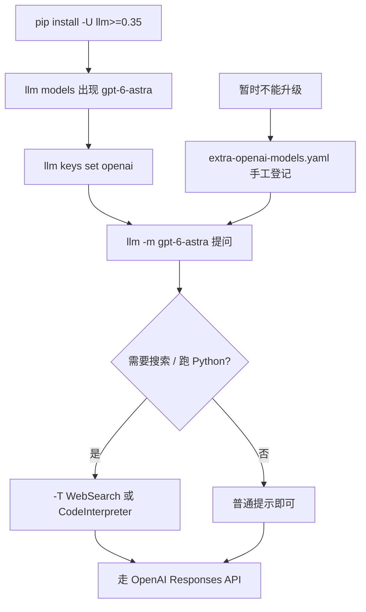

### 结论

Simon Willison 发布 **[llm 0.35](https://llm.datasette.io/en/stable/changelog.html#v0-35)**：内置 OpenAI 模型 **`gpt-6-astra`**（对应 **GPT-6 Astra**）。对已经用 [LLM](https://llm.datasette.io/) 做日常提问、脚本和编码 Agent 的人，这就是一次「升级就能点名新旗舰」的小版本——不必再靠 `extra-openai-models.yaml` 手工登记。官方 Changelog 这一条写得很短，但文档已把它列进 **OpenAI Responses** 模型表，和 `gpt-5.6-luna` / `gpt-5.6-sol` 同一条调用路径。

### 要点

- **LLM 是什么。** [LLM](https://llm.datasette.io/) 是命令行工具 + Python 库：一条 `llm "…"` 就能调 OpenAI、Claude、Gemini、本地 Ollama 等，日志进 SQLite，也支持 embedding、工具调用和结构化抽取。日常用法类似 `llm -m gpt-5.6-luna "写一段 Python"`。

- **0.35 只加了一个内置模型名。** Changelog 原文就一句：`New OpenAI model: gpt-6-astra for GPT-6 Astra.` 没有新的 CLI 子命令，也没有改默认模型——未指定 `-m` 时，默认仍是较便宜的 **`gpt-5.6-luna`**。Astra 要显式写 `-m gpt-6-astra`。

- **`gpt-6-astra` 走 Responses API，不是旧 Chat Completions。** 官方 [OpenAI models](https://llm.datasette.io/en/stable/openai-models.html) 把它标成 **OpenAI Responses**。这意味着它能用 LLM 已经接好的服务端工具（`-T WebSearch`、`-T CodeInterpreter`）和 `service_tier` 等选项，和 `gpt-5.6-*` / `gpt-5.4` 同一套。

- **以前可以自己登记，现在不用了。** 文档一直允许在 `extra-openai-models.yaml` 里提前加新模型。0.35 把 `gpt-6-astra` 写进发行版后，干净安装 / CI 镜像里 `llm models` 就能看到它，少一份本地配置漂移。

- **Astra 仍是旗舰档，别当默认 autocomplete。** 本站 9 月 4 日网摘写过：Astra 定价锚定 Claude Fable 档，编码 Agent 与长上下文更划算，日常小改码仍适合 Luna / Sol。CLI 升级 ≠ 把默认模型改成 Astra。

### 怎么做

1. **升级到 0.35**（任选其一）：

```bash
pip install -U "llm>=0.35"
# 或一次性试用，不污染当前环境
uvx llm==0.35 --version
```

2. **确认模型已出现**：`llm models` 里应能看到 `gpt-6-astra`。若没有，先 `pip show llm` 核对版本，再查是否被旧的 `extra-openai-models.yaml` 别名盖住。

3. **配好 OpenAI Key 后点名调用**：

```bash
llm keys set openai
llm -m gpt-6-astra "用三句话解释 Responses API 和 Chat Completions 的差别"
```

4. **需要联网或算数时，走已有服务端工具**（Responses 模型才支持）：

```bash
llm -m gpt-6-astra -T WebSearch "今天 OpenAI 开发者文档里 Astra 的定价页写了什么"
llm -m gpt-6-astra -T 'CodeInterpreter(memory_limit="1g")' "用 python 工具算 111111 * 333333"
```

5. **脚本 / CI 里 pin 版本，并显式写模型。** `requirements.txt` 写 `llm>=0.35,<0.36`（或你验证过的版本）；生产提示写死 `-m gpt-6-astra`，不要依赖默认模型——默认仍是 Luna，升级后行为不会悄悄变贵。

6. **暂时不能升级时的退路。** 在 `dirname "$(llm logs path)"` 指向的目录建 `extra-openai-models.yaml`，按[文档](https://llm.datasette.io/en/stable/openai-models.html#adding-more-openai-models)加 `model_id` / `model_name: gpt-6-astra` 和 `responses: true`。能升到 0.35 后删掉这段，避免和内置表重复。

### 关键图表



*0.35 的路径很短：升级 → 点名 `gpt-6-astra` → 需要时再挂服务端工具；默认模型仍是 Luna*
