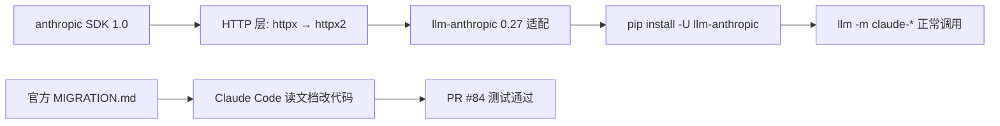

### 结论

**llm-anthropic 0.27** 的核心工作是跟上 **Anthropic Python SDK 1.0**：官方把底层 HTTP 客户端从 **httpx** 换成了 **httpx2**（与两周前 OpenAI SDK v3.0.0 的改动同路）。Simon 把官方 [MIGRATION.md](https://github.com/anthropics/anthropic-sdk-python/blob/v1.0.0/MIGRATION.md) 丢给 Claude Code，一句提示就让测试跑通并开出 [PR #84](https://github.com/simonw/llm-anthropic/pull/84)——对维护 LLM 插件或依赖 Anthropic SDK 的团队，这是「读迁移文档 + AI 改代码」的可复制样板。

### 要点

- **llm-anthropic 是什么。** 它是 [LLM](https://llm.datasette.io/) 的 **Anthropic 插件**，让你在 CLI 里用 `llm -m claude-...` 调 Claude 系列模型。主包 `llm` 管通用能力，各厂商能力靠插件扩展；升级插件版本才能跟上 SDK 大版本。

- **anthropic 1.0 动的是 HTTP 层，不是模型 API 语义。** SDK 把依赖从 `httpx` 迁到 **httpx2**（Pydantic 维护的 httpx 继任者）。若你的项目直接 `import anthropic` 或像 llm-anthropic 一样封装 SDK，大版本升级时首先要查的是 **传输层与客户端初始化**，而不是 prompt 字段。

- **与 OpenAI 生态同频。** OpenAI Python SDK 在 v3.0.0 也做了 httpx→httpx2 切换；若你同时维护 `llm-openai` 与 `llm-anthropic` 类插件，两套迁移模式高度相似，可以共用检查清单（依赖声明、超时/代理配置、测试里 mock 的 HTTP 层）。

- **AI 辅助升级的前提是有权威迁移指南。** Simon 的提示词很克制：指定 `anthropic>=1`、附上 MIGRATION.md 原文链接、要求 **tests passing**。没有官方文档，Agent 容易猜错 API；有文档时，它擅长批量改 import、依赖与测试桩。

- **对你意味着：别卡在旧 SDK。** 生产或 CI 若 pin `anthropic<1` 且用 LLM 调 Claude，应尽快 `pip install -U llm-anthropic`（或 `llm install -U llm-anthropic`）到 **≥0.27**，并确认环境里 **httpx2** 由依赖正确拉取，避免与仍依赖 httpx 的其他包冲突。

### 怎么做

1. **确认当前版本**：`llm --version` 与 `pip show llm-anthropic anthropic`，看插件是否 ≥0.27、SDK 是否已到 1.x。

2. **升级插件**（任选其一）：

```bash
pip install -U "llm-anthropic>=0.27"
# 或 LLM 插件命令
llm install -U llm-anthropic
```

3. **冒烟测试**：设置 `ANTHROPIC_API_KEY` 后执行 `llm -m claude-haiku-4-5 "say hi"`（模型名以你账号可用为准），确认请求能通、日志无 httpx 相关 import 错误。

4. **若你自己维护封装 Anthropic SDK 的代码**：先读 [MIGRATION.md](https://github.com/anthropics/anthropic-sdk-python/blob/v1.0.0/MIGRATION.md)，在 `pyproject.toml` / `requirements.txt` 里把 `anthropic>=1` 与 `httpx2` 写为 **直接依赖**；用同样句式让 Agent 改代码：`Upgrade to anthropic>=1 - read <MIGRATION.md URL> and get the tests passing`。

5. **CI 建议**：在干净 venv 里跑 `pip install llm llm-anthropic && llm -m <你的默认模型> --help`，避免只在「老环境自带 httpx」的机器上以为一切正常。

### 关键图表



*大版本 SDK 迁移路径：跟官方迁移指南，用插件版本与冒烟测试验证 HTTP 层*
