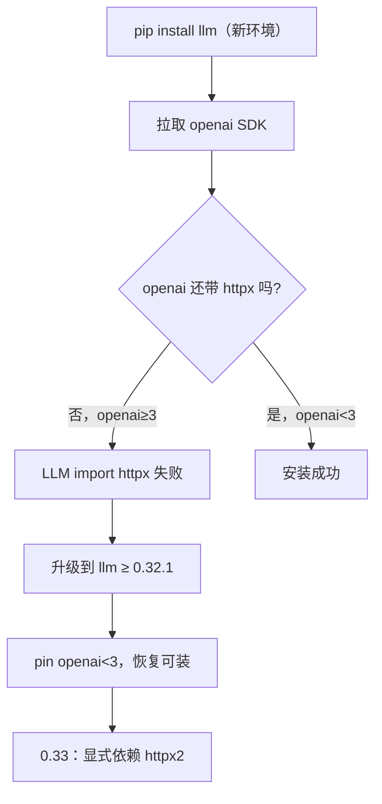

### 结论

Simon Willison 发布 **llm 0.32.1**，修复「全新 `pip install llm` 直接报错」的问题：上游 **OpenAI Python SDK** 不再自带 **httpx**（HTTP 客户端库），而 LLM 内部仍依赖 httpx，却只在 **传递依赖**（通过 `openai` 间接装上）里「蹭」到它——上游一改，新装用户立刻断链。0.32.1 用 **pin `openai<3`** 止血；即将发布的 **0.33** 会把 httpx 换成 **httpx2**，把依赖写进自己的 `pyproject.toml`，不再赌传递依赖。

### 要点

- **LLM 是什么。** [LLM](https://llm.datasette.io/) 是 Simon 维护的命令行工具 + Python 库，一条命令就能调 OpenAI、Claude、Gemini、本地 Ollama/LM Studio 等模型，还支持 SQLite 记日志、embedding、工具调用、结构化抽取。日常用法类似 `llm "写一段 Python"` 或 `uvx llm --version`。

- **传递依赖是隐形地雷。** LLM 没把 `httpx` 写进自己的直接依赖，而是假设装 `openai` 时会顺带装上 httpx。OpenAI SDK 大版本去掉 httpx 后，**老用户**（环境里早就有 httpx）可能无感，**新用户**从零安装就会 `ImportError`——这是 Python 生态里很典型的「升级上游、下游没声明」事故。

- **0.32.1 是临时补丁，不是终局。** 限制 `openai<3` 能立刻恢复可安装性，但长期仍要显式声明 HTTP 客户端。Simon 计划在 **0.33** 迁移到 **httpx2**（httpx 的继任包），把依赖关系写清楚，避免再被上游牵着鼻子走。

- **对你意味着：装不上先升级。** 若 CI、Docker 镜像或新机器上 `pip install llm` 失败，优先 `pip install -U llm` 到 **≥0.32.1**；若你锁了 `openai>=3`，需等 0.33 或暂时自行 `pip install httpx` 应急（非官方长期方案）。

### 怎么做

1. **确认是否踩坑**：在新 venv 或容器里执行 `pip install llm && llm --version`。报错里若出现 `httpx` / `No module named`，多半就是这次依赖断裂。

2. **升级到修复版**：

```bash
pip install -U "llm>=0.32.1"
# 或一次性试用
uvx llm --version
```

3. **CI / 镜像里 pin 版本**：在 `requirements.txt` 或 `pyproject.toml` 里写 `llm>=0.32.1,<0.33`（或你验证过的具体版本），别裸写 `llm` 却在生产环境半年不重建——新镜像会在某天突然装不上。

4. **关注 0.33**：若项目同时依赖 `openai>=3` 与 `llm`，留意 [llm 仓库 Changelog](https://github.com/simonw/llm/releases)；升级后跑一遍你最常用的子命令（`llm keys`、`llm -m ...`、插件工具调用）确认 HTTP 层无回归。

5. **自己写 Python 包时的教训**：凡是你 `import` 的库，都应写进 **direct dependencies**，别指望别的包「顺便」帮你装——尤其是网络、加密、序列化这类基础库。

### 关键图表



*依赖链断裂与修复路径：传递依赖不可靠，最终要在自己包里声明 HTTP 客户端*
