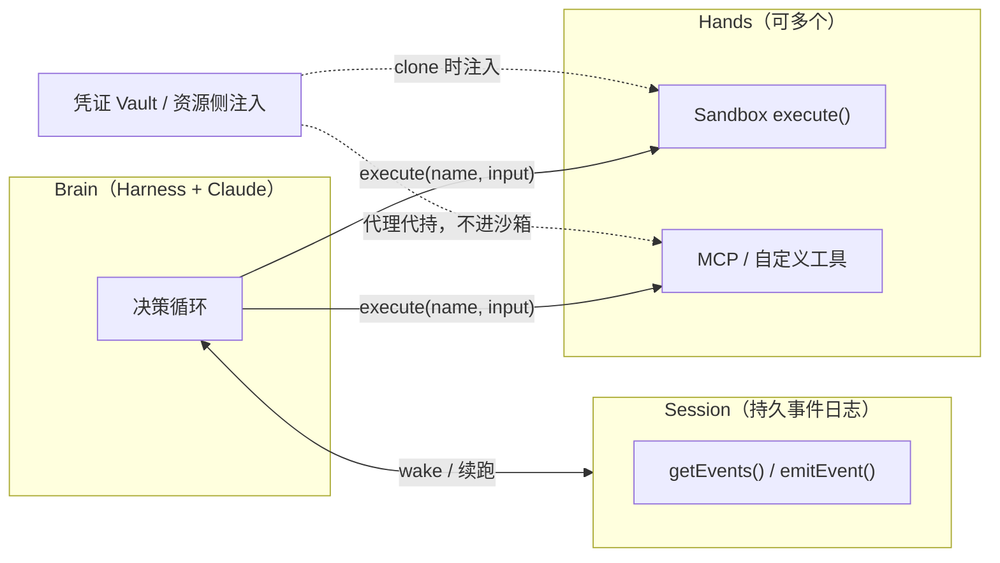

### 结论

Anthropic 的 **Managed Agents**（Claude 平台上的托管长任务 Agent 服务）核心思路是：别把 harness、会话日志、执行环境焊死在同一个容器里。把 **大脑**（模型 + 调度循环）、**手**（沙箱与工具）、**会话**（事件日志）拆成三个可替换接口——就像操作系统用进程、文件抽象硬件一样，底层实现可以换，上层调用方式不变。这样 harness 里「模型做不到所以得写死」的假设不会拖累下一代模型，容器挂了也能换新的，凭证也不会和执行代码共处一室。

### 要点

- **Harness 里的假设会过期。** Harness 是围绕模型转的那层循环：调 Claude、把工具结果塞回去、决定下一步。它往往编码了「模型做不到 X」的补丁——比如 Sonnet 4.5 快到上下文上限时会提前收尾（context anxiety），他们加了 context reset；换到 Opus 4.5 后这行为没了，reset 成了死代码。**接口要稳，实现要敢换。**

- **单容器 = 养宠物（pets vs cattle）。** 早期 session、harness、sandbox 同容器：改文件是本地 syscall，简单，但容器一挂会话就没了；卡死只能靠 WebSocket 流猜原因；要 debug 得进容器 shell，而容器里还有用户数据，运维几乎没法下手。客户要接自己 VPC 时，还得网络打通或把整套 harness 搬到客户环境——**资源位置被写死在架构里。**

- **拆开后各组件可独立失败、独立替换。** 大脑调沙箱统一走 `execute(name, input) → string`：容器死了当工具报错还给 Claude，需要时 `provision({resources})` 起新实例。Harness 也可重启：`wake(sessionId)` + `getSession(id)` 从外部日志续跑，循环里用 `emitEvent(id, event)` 落盘。**会话日志不在 harness 体内，harness 本身也可以是 cattle。**

- **安全边界：凭证不进沙箱。** 耦合设计里，Claude 生成的不可信代码和 API token 同容器，prompt injection 读环境变量就能横向扩张。修法两类：资源自带短期凭证（如 Git clone 时注入 remote，沙箱里能 push/pull 但拿不到 token）；或 OAuth 放 vault，经会话级 MCP 代理代调外部服务——**harness 全程不碰明文密钥。**

- **Session ≠ 上下文窗口。** 长任务必然超 context。压缩、裁剪、写文件都是「不可逆地丢 token」，难保证后面几步还要什么。Managed Agents 把 **session 当日志型上下文对象**：`getEvents()` 按位置切片读历史，harness 再决定怎么整理进当前窗口（含 prompt cache 优化）。**可恢复存储在 session，怎么塞进窗口在 harness——职责分开。**

- **多脑多手带来真实收益。** 大脑不必等沙箱就绪就能推理：不必沙箱的会话直接拉 pending events 开跑。Anthropic 称 p50 首 token 延迟降约 60%、p95 降超 90%。一个大脑可连多个 `execute` 目标（容器、MCP、自定义工具），大脑之间还能交接「手」——**执行环境只是具名工具，不是 harness 的尾巴。**

### 怎么做

如果你在设计或评审**长时运行、可托管**的 Agent 平台，可以对照下面清单：

1. **先画三层，别画一个大盒子。** 明确：哪些是 append-only 事件（session）、谁是决策循环（harness/brain）、谁真正动文件/跑命令/调 API（hands）。三者之间只通过窄接口通信，避免共享进程内全局状态。

2. **工具面统一成「名字 + 输入 → 字符串结果」。** 沙箱、远程 VPC、MCP、内部 API 都走同一形状，harness 不必知道背后是 Docker 还是客户机房。容器/沙箱按需提供，别让每个会话 upfront 付满配启动成本。

3. **会话日志与 harness 进程分离。** 每次决策、工具调用、错误都 `emitEvent`；harness 崩溃用同一 `sessionId` 唤醒并 `getSession` 重放。这样你才能区分「模型决策错了」和「基础设施挂了」。

4. **凭证与执行环境物理隔离。** 生成代码跑的地方拿不到长期 token；需要 Git/第三方 OAuth 时，用初始化注入或 vault + 代理，并定期质疑「有限权限 token」是否仍足够——模型变强后，窄权限策略也要重审。

5. **上下文工程放在 harness，原始历史放在 session。** 需要压缩/裁剪时，保证被裁掉的内容仍可从 session 捞回；用 `getEvents()` 支持「从某事件前几条重读」而不是只在窗口里硬删。

6. **定期审查 harness 补丁。** 换模型或升版本后，问：这个重试逻辑、reset、人工规则，是模型仍需要，还是历史包袱？Managed Agents 的定位就是 **meta-harness**——不赌某一种 harness（包括 Claude Code）永远最优，只赌「状态 + 计算 + 多实例」这几类能力长期需要。

### 关键图表

*大脑、会话、执行环境解耦——任一层的实现可换，接口保持稳定；凭证只出现在沙箱外的代理或初始化路径*
