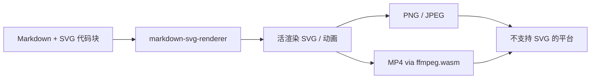

### 结论

Simon Willison 的在线工具 [markdown-svg-renderer](https://tools.simonwillison.net/markdown-svg-renderer) 专门解决一件事：**Markdown 文稿里直接写 SVG 代码块时，如何预览、分享，并导出成社交平台能吃的格式**。最新版在浏览器里用 ffmpeg.wasm 把**带动画的 SVG 编成 MP4**，不用再装桌面转码软件——对写技术博客、发 AI 对话摘抄、分享示意图的人来说，省掉「先截图再手工转视频」的环节。

### 要点

- **问题场景很具体。** 很多平台（微博、部分论坛、旧版 Slack）不支持内嵌 SVG，更别说 SVG 动画。你在 Gist 或 raw 文件里贴 `<svg>` 源码，读者只能看到 XML；需要预览页或转成 PNG/JPEG/MP4 才能传播。

- **两种输入方式。** 打开工具后可直接粘贴 Markdown；或把 Markdown 存到**支持 CORS 的 URL**、**GitHub Gist**，再把链接贴进工具。后者会生成可收藏的书签 URL（hash 里编码了文档地址），例如 `.../markdown-svg-renderer#url=https%3A%2F%2Fgist...`。

- **SVG 代码块会被「活渲染」。** 普通 Markdown 渲染器往往把 SVG 当代码展示；这里会把 `svg` 代码块变成**可交互的矢量图**（含 CSS/SM 动画），并在下方提供格式切换 Tab。

- **PNG / JPEG Tab 在浏览器里栅格化。** 不依赖服务端，把当前 SVG 画到 Canvas 再导出，可一键复制或下载——适合发 Twitter、公众号配图等只认位图的渠道。

- **MP4 Tab 是本次升级重点。** 工具会扫描 SVG 是否含动画、估算循环时长，在浏览器里逐帧渲染，再加载约 30MB 的 **ffmpeg.wasm**（FFmpeg 编译成 WebAssembly）合成 MP4。代价是首次打开 MP4 功能要下载较大 WASM；好处是**全程本地、无上传**，动画示意图也能进只支持视频的平台。

### 怎么做

1. **准备 Markdown。** 在文稿里用 fenced code block 写 SVG，语言标记为 `svg`（与 Simon 的 Gist 示例一致）。可混排普通 Markdown 段落与多个 SVG 块。

2. **打开** [tools.simonwillison.net/markdown-svg-renderer](https://tools.simonwillison.net/markdown-svg-renderer)。临时试效果：直接粘贴全文；要长期分享：把文件推到 Gist 或任意 CORS 友好的静态托管，复制 raw URL。

3. **用 URL 模式生成书签链接。** 在工具里填入文档 URL，地址栏会出现带 `#url=...` 的链接，发给同事即可打开同一渲染结果。

4. **按目标平台选 Tab。** 需要静图 → PNG 或 JPEG，复制/下载；需要动图且平台不认 SVG 动画 → 切 MP4，等待 WASM 加载与合成（动画越长、帧越多，耗时越久）。

5. **注意 CORS 与体积。** 远程 Markdown 必须允许浏览器跨域读取；MP4 合成会占用较多内存，复杂动画建议在桌面浏览器操作。若你自建类似工具，可参考 Simon 的 [tools 仓库](https://github.com/simonw/tools) 里 `markdown-svg-renderer` 的实现思路：预览 + 客户端导出，避免把用户文稿上传到第三方服务器。

### 关键图表

*一条 Markdown 链路：预览 → 按平台选静图或视频导出，无需桌面转码*
