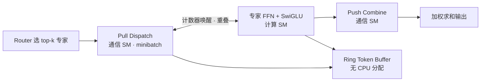

### 结论

Cursor 把训练 Composer（其 agentic 编程模型）时的最大瓶颈——**MoE（Mixture of Experts，混合专家）层**——做成单一 **megakernel** 并开源为 [Mixture-of-Kittens（MoK）](https://github.com/cursor/mixture-of-kittens)。MoE 负责按路由把 token 分给不同「专家」子网络；在专家并行（EP）下，token 要在 GPU 间来回搬运，通信往往和计算一样慢。MoK 把 dispatch、专家 FFN、combine 全部熔进一个确定性内核，在 GB300 NVL72 机架上 MXFP8 前向吞吐比最快公开基线最高快 **2.37 倍**，生产训练端到端 token/s 提升 **1.41 倍**。

### 要点

- **只优化算子不够，通信才是天花板。** 过去 Cursor 自研了 MXFP8/NVFP4 训练核和推理用的 warp decode，但只加速了矩阵乘部分，GPU 间 all-to-all 仍单独走 NCCL 等路径。生产负载里，**通信时间常和 FFN 计算相当**；顺序执行等于白白等链路。

- **Push 与 Pull 没有万能默认。** 业界常默认 push（发送方主动写远端显存）更能打满 NVLink，但 MoK 实测在专家负载不均时，**pull dispatch 的链路利用率可比 push 高 29%**；且 pull dispatch + push combine 能消掉跨 71 个 peer 的完成信号，延迟从约 103 µs 降到 18 µs。结论：**按算子选方向**，前后向四套通信各用不同组合。

- **重叠粒度要卡在中间，不能极细也不能极粗。** 每轮只搬够 tensor core 开一次 MMA 的 token（极细）会让核心吃不饱；一次搬上万 token（极粗）又让核心干等首批数据。MoK 用可调 **minibatch**：经验上让每个专家 grouped-GEMM 至少跑满 **两波 SM wave**，在 Blackwell 上才能把重叠和利用率都拉起来。

- **GB300 的 Grace CPU 逼你少碰 CPU-GPU 同步。** 集成 Grace CPU 相对 GPU 偏慢，GPU 流很容易追上 CPU 侧调度而空转。传统做法把路由结果 token 数送回 CPU 再分配 buffer，或干脆 **token dropping**——前者拖慢整条流水线，后者伤训练质量。MoK 用固定大小的 **ring token buffer（macrobatch）** 在设备端循环复用，调度表也全在 GPU 上生成（<3% MoE 耗时）。

- **Megakernel + 分 SM 专职。** 计算 SM 与通信 SM 通过本地计数器互相唤醒：通信侧 pull 满一个 minibatch 就通知计算侧跑 SwiGLU FFN，算完再 push combine。整段前向/反向尽量不跨 kernel launch，并保证 **bitwise 确定性**——方便内部消融和 on-policy RL 后训练复现。

### 怎么做

面向做大规模训练或读 infra 帖的工程师，可以把 MoK 当成「MoE 层系统调优清单」：

1. **先 profiling 分清瓶颈在算还是传。** 若 MoE 层占端到端训练时间过半，优先看 dispatch/combine all-to-all 是否与 FFN 串行；再对比 NCCL、DeepEP、HybridEP 等基线，而不是只换更快的 GEMM。

2. **通信方向按阶段分别选型。** 前向：pull dispatch + push combine；反向：pull reverse-combine + push reverse-dispatch。同一套 schedule 表可复用于四轮通信，省掉多 lane 信号开销。

3. **调 minibatch 时用「两波 wave」作起点。** 已知隐藏维 `H`、专家中间维 `I`、SM 数 `S` 时，minibatch  token 数 `T` 需满足 `T ≥ 4S·H/I`（up/gate 并行）一类约束；在目标模型 shape 上扫一圈 latency，别迷信「越小越重叠」或「越大越省事」。

4. **在 CPU 弱的平台上消灭 host 同步。** 路由结果、buffer 分配、完成信号尽量留在 GPU；需要动态 token 数时用 ring buffer + dispatch/combine 交错，让槽位算完即复用，避免「等所有 combine 结束才能开下一批 dispatch」。

5. **计算/通信 SM 比例要分前向与反向调。** 本地 token 数、模型 shape、NVLink 带宽都会变；MoK 把 comms SM 数量暴露成可调参数——换 workload 或机架规格后应重新扫，而不是沿用上一模型的比例。

6. **要复现与 RL 后训练时保留确定性。** 浮点累加顺序固定后，同输入同硬件应得 bitwise 相同输出；若你做 on-policy 实验，非确定性 MoE 会把「噪声」混进策略梯度。

### 关键图表

*MoK 核心：通信与计算在同一 megakernel 内流水线重叠，pull/push 按阶段混搭，ring buffer 避免 Grace CPU 参与动态分配*
