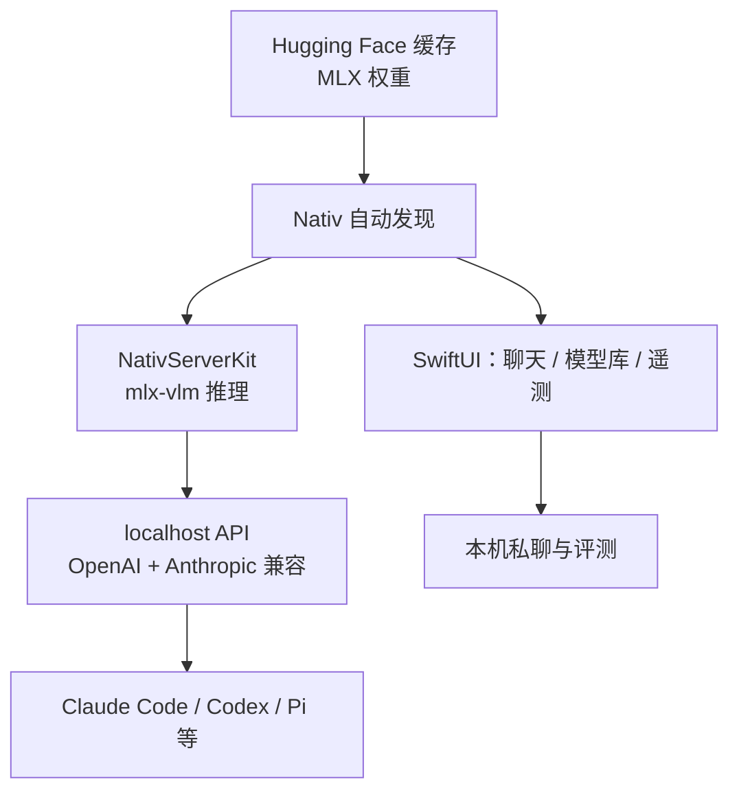

### 结论

MLX-VLM 作者 Prince Canuma 发布了 **Nativ**：一款围绕 Apple **MLX** 推理栈的 macOS 桌面应用。形态接近 LM Studio——既有聊天界面，又在本地起 **OpenAI / Anthropic 兼容 API**，方便把 Claude Code、Codex 等编程 Agent 接到自家 Mac 上跑。Simon Willison 实测时，应用自动识别了他 Hugging Face 缓存里已有的 MLX 模型，免重复下载。若你手上有 Apple Silicon Mac 且想离线试开源模型，Nativ 把「装模型 → 聊天 → 接工具链」收成一步。

### 要点

- **Nativ 不是又一个 Ollama。** Ollama 自带模型格式与运行时；Nativ 走 **mlx-vlm**（Apple MLX 上的视觉/语言模型库），直接从 **Hugging Face 缓存** 发现已下载的 MLX 权重。你以前用 Python 下过 Gemma、Cohere North 等 MLX 模型，打开应用就能看见。

- **一块屏幕干三件事。** SwiftUI 界面覆盖：本地私聊（含图文、推理过程与历史）、模型库（浏览/下载/切换/卸载）、性能仪表盘（延迟、显存等遥测）。底层 **NativServerKit** 内嵌 Python 与推理服务，上层是原生 Mac 体验。

- **API 兼容是为了接现有工具。** 本地 `localhost` 同时提供 OpenAI 风格（`/v1/chat/completions` 等）与 Anthropic 风格端点。内置对接 Codex、Claude Code、Pi、Hermes、OpenCode——不必手改每个 Agent 的 base URL 模板。

- **硬件门槛要心里有数。** 仅 **Apple Silicon（M1+）**，系统要求 **macOS 26+**。模型吃 **统一内存（unified memory）**，选型页会按机器推荐体量（例如 Liquid LFM2.5-VL 约 3 GB，Cohere North Mini Code 约 19 GB）。内存不够会卡或加载失败，这不是应用 bug。

- **开源可审计。** MIT 许可，桌面端与模型加载器均公开。和部分闭源「本地 AI 壳」不同，你可以 fork、看遥测实现、自己打补丁——Simon 看重的正是 Canuma 在 MLX 生态里一贯的工程可信度。

### 怎么做

1. **确认环境。** Apple Silicon Mac + macOS 26 或更新；查一下「关于本机」里的芯片与系统版本。Intel Mac 或旧系统不适用。

2. **安装应用。** 从 [Nativ GitHub Releases](https://github.com/Blaizzy/nativ/releases/latest) 下载 DMG，拖入「应用程序」并首次启动。后续可用应用内 Sparkle 更新。

3. **准备模型（二选一）。**  
   - **已有缓存**：若曾用 `mlx-vlm` 或 Hugging Face CLI 下过 MLX 模型，打开 **Models** 应能直接列出。  
   - **从零开始**：在 **Models** 浏览兼容列表（如 Google Gemma 4、Cohere North Mini Code、Liquid LFM2.5-VL），按推荐选与内存匹配的体量并下载。

4. **先本地聊天验通。** 选语言或视觉模型，发一条短消息，看流式输出与指标面板是否正常。视觉模型可附一张图，确认多模态链路没问题。

5. **需要接 Agent 时再开 API。** 在设置里生成 **API Key**（保护管理端点），记下本地 base URL 与端口。把 Claude Code / Codex 等工具的模型提供商指到该地址；Anthropic 兼容工具走对应路由，OpenAI 兼容工具走 `/v1/...`。

6. **和 LM Studio / Ollama 选型对照。** 要跨平台（Windows/Linux）→ LM Studio 或 Ollama；要 **MLX 原生 + HF 缓存复用 + Mac 一体工作台** → Nativ 更贴。三者都可本地 API，但模型格式与运行时互不通用，换栈通常要重新下模型。

### 关键图表

*一条链路：缓存里的 MLX 模型 → 桌面聊天或编程 Agent 本地调用*
